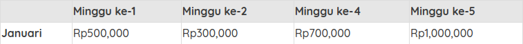
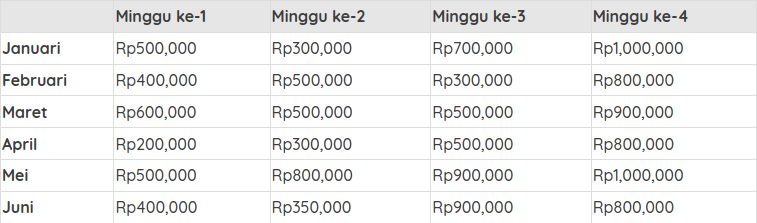

# Apa itu Visualisasi Data?

Pernah mendengar istilah Visualisasi Data? 

Bayangkan kisah seorang raja yang terlampau sibuk. Pada suatu hari ia mendapat informasi bahwa sebuah kerajaan nan jauh di sana berencana untuk menyerang istana. 

Sang raja pun memikirkan langkah apa yang harus ia ambil. Ia menugasi perdana menteri untuk bantu menyusun strategi perang. Raja memberikan waktu dua hari untuk menyiapkan semua itu untuk kembali dilaporkan ke raja. Karena perdana menteri mengetahui betul sang raja sangat sibuk, dan mudah bosan karena itu perdana menteri punya cara menarik untuk memaparkan strategi perangnya, yakni menggunakan visualisasi data.

Semua data digambarkan dengan tampilan visual yang efektif dan kebutuhan perang tersaji dengan data dalam bentuk grafik yang menarik. Raja pun tertarik dan mudah memahaminya.

Bayangkan jika perdana menteri datang dengan membawa setumpuk kertas berisi tulisan tanpa ada visualisasi yang jelas? Dari ilustrasi ini kita punya sedikit gambaran bahwa visualisasi data dapat membuat sebuah data tersampaikan dengan baik dan membuat pembacanya lebih tertarik.

Nah lalu apa sebenarnya visualisasi data itu? **Visualisasi data merupakan cara mengomunikasikan sebuah informasi atau data dalam bentuk visual seperti diagram, grafik, atau representasi visual lainnya**. Dalam kehidupan sehari-hari kita kerap bersentuhan dengan sudah melihat visualisasi data. Speedometer, simbol bensin di mobil, dan tampilan kecepatan di dalam mobil, contohnya.

# Mengapa Menggunakan Visualisasi Data?

“Un bon croquis vaut mieux qu’un long discours” (Napoleon, Kaisar Perancis)

“Sketsa yang bagus lebih baik daripada pidato yang panjang”

Sketsa yang dimaksud ibarat data yang kita visualisasikan dengan baik sehingga bisa dipahami banyak orang. Mungkin ia lebih baik daripada tabel ribuan baris dan kolom. Di sini jelas bahwa visualisasi data diperlukan supaya penyampaian informasi jauh lebih efektif. 

Apa saja pentingnya penggunaan visualisasi data? Kita simak penjelasannya berikut ini.

# Komunikasi lebih efektif

_Let’s say_ Anda ditugasi mempresentasikan hasil keuntungan perusahaan dalam sebuah rapat tahunan. Jika Anda dapat memposisikan diri seolah sebagai Storyteller, pasti Anda selalu berusaha untuk menyampaikan data Anda dengan cara yang menarik seolah sedang bercerita sehingga audiens tertarik mengikuti alurnya. Apalagi jika Anda hanya punya beberapa menit presentasi.

Bagaimana jika Anda presentasi dengan grafik yang menarik, simple, dan detail? Presentasi Anda akan terus diingat, bahkan setelah rapat tersebut. Pada dasarnya setiap orang ingin menangkap sebuah informasi dengan mudah, jelas, dan cepat tanpa menghilangkan poin penting dari informasi tersebut. Maka dari itu visualisasi data sangat penting diterapkan dalam kehidupan sehari-hari.

# Memantau data dengan lebih mudah

Apa yang Anda lakukan apabila ingin memantau pengeluaran mingguan dalam sebulan? Hal yang kerap kita lakukan adalah mencatat semua pengeluaran dalam bentuk teks. Misal pengeluaran di minggu pertama dan berikutnya untuk kebutuhan konsumsi, belanja, ataupun lainnya Anda jumlahkan sehingga menghasilkan sebuah nilai, misalnya Rp. 500.000. Berikut ini visualisasinya dalam bentuk tabel di bawah ini:

Dari tabel di atas dapat dilihat bahwa pengeluaran terbesar ada di minggu ke-4. Sekilas kita dapat melihat perbandingannya dengan mudah karena data yang dihasilkan masih sedikit. Setelah enam bulan kemudian, tiba-tiba Anda ingin melihat perbandingan pengeluaran setiap minggunya dalam sebulan. Catatan pengeluaran setelah 6 bulan seperti di bawah ini:

Cek tabel tersebut dan tentukan minggu dan bulan manakah yang jumlah pengeluarannya terbesar? Cukup sulit, bukan? Coba Anda bandingkan dengan contoh diagram berikut:

Diagram tersebut menunjukkan bahwa pengeluaran terbesar ada di minggu ke-4 bulan Januari dan Mei. Sedangkan terendah ada di minggu ke-I April. Analisa jadi lebih mudah dengan visualisasi data, bukan?

Di atas hanyalah sebuah contoh sederhana. Bayangkan bagaimana untuk data besar seperti sensus penduduk. Pastinya visualisasi data sangat dibutuhkan untuk mempermudah kita membaca dan menganalisis data.