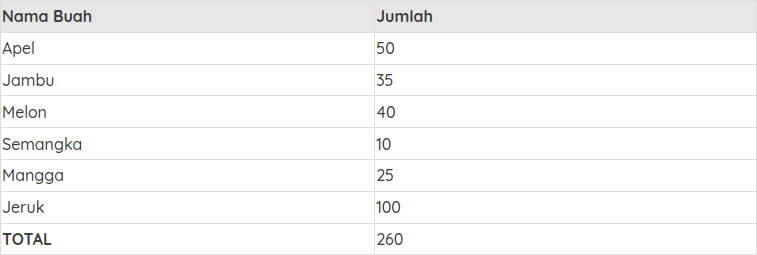
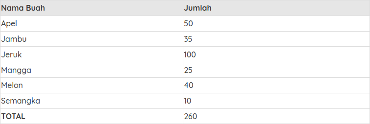
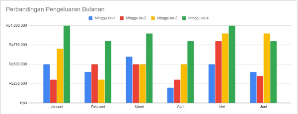
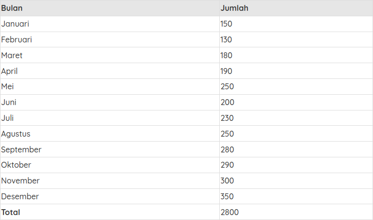
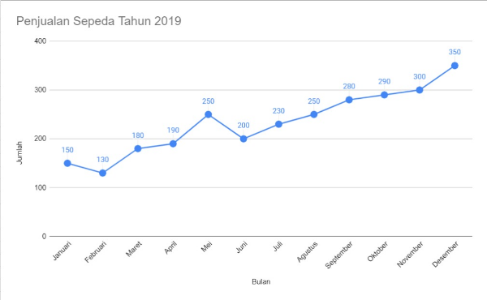
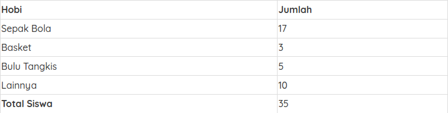
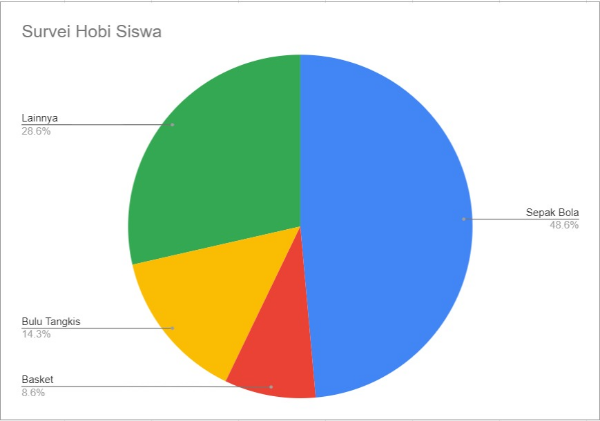

# Media Visualisasi Data

Tahukah Anda macam-macam media yang digunakan dalam visualisasi data? Berikut penjelasannya: 

# Tabel

Ketika Anda menyusun data Anda ke dalam sebuah baris dan kolom, Selamat! Anda berhasil membuat sebuah tabel. Tabel merupakan salah satu media visualisasi data yang sederhana dan sering kita temukan. **Data dalam tabel biasanya dikategorikan dalam baris atau kolom tertentu yang kemudian dapat diurutkan dengan mudah misal diurutkan secara menaik (Ascending) atau menurun (Descending)**. Hal tersebut memudahkan kita untuk menyusun data sesuai dengan perintah yang diinginkan. Bayangkan Anda memiliki data buah-buahan seperti, apel (50 buah), jambu (35 buah), melon (40 buah), semangka (10 buah), mangga (25 buah), dan jeruk (100 buah). Bagaimana Anda mencatatnya supaya lebih mudah dibaca? Salah satu caranya Anda bisa membuat tabel seperti berikut:



Setelah diurutkan secara ascending berdasarkan nama buah sebagai berikut:



Dari tabel di atas, Anda dapat membaca data buah-buahan dengan lebih efektif dan mengetahui jumlah total buah. Dari data tersebut kita juga dapat mengurutkan dari jumlah buah yang paling banyak, paling sedikit, atau mengurutkan nama buah berdasarkan abjad.

Terdapat beberapa aturan dasar dalam penulisan tabel yaitu sebagai berikut:

- Penulisan judul
Dalam menulis judul pastikan telah ia mencakup isi dari tabel kita. Usahakan menggunakan font yang jelas dan mudah dibaca. Pembaca jadi paham tabel apa yang tersaji.  

- Simpel
Simplicity is a must. Jangan terlalu berlebihan dalam mendesain sebuah tabel. Akibatnya pembaca tidak fokus pada data yang disajikan. Penulisan variabel di dalamnya juga singkat saja.  

- Penjelasan Simbol
Apabila dalam tabel Anda terdapat simbol atau istilah tertentu Anda dapat menjelaskannya pada catatan kaki tabel tersebut.

- Penekanan
Penekanan yang dimaksud adalah cara kita memfokuskan perhatian pembaca pada pokok data. Misal, dalam penulisan tabel di atas, nama buah menggunakan warna background biru supaya pembaca bisa mudah membedakan nama buah dan jumlah buah. Jika data Anda dalam kategori yang sama dan dapat dijumlahkan, maka Anda dapat menyertakan total di akhir datanya seperti contoh tabel di atas.

- Sumber Tabel
Apabila tabel yang Anda sajikan bukan milik Anda, maka sertakan sumber di catatan kaki tabel tersebut.

# Diagram

Sering kali kita mendengar kata Diagram. Sebenarnya apa itu diagram? **Chart merupakan sebuah representasi data yang digambarkan dalam bentuk grafik**. Jika Anda memiliki sebuah data dan ingin diproyeksikan dalam bentuk diagram, berikut beberapa tipe diagram yang bisa Anda gunakan.

- Diagram Batang

Pernah membuat diagram batang sebelumnya? **Diagram batang merupakan salah satu jenis grafik yang hampir sering kita jumpai dalam visualisasi data. Sebabnya, ia dapat menunjukkan perbandingan angka pada kategori tertentu**. Jumlah elemen batang dari diagram ini sebaiknya tidak terlalu banyak supaya label dari data tersebut masih bisa terbaca atau tidak terpotong. Sumbu X pada diagram batang menunjukkan kategori data sedangkan sumbu Y menunjukkan skala nilai dari data dalam satuan ukuran tertentu. Pastikan pada sumbu Y nilai awalnya adalah 0 supaya diagram Anda terlihat akurat dan mengurangi kesalahpahaman dalam mengartikan data.

Selain itu, perhatikan pula penulisan label diagram. Hindari penulisan label secara vertikal maupun diagonal supaya tidak menyulitkan pembaca dalam memahami label tersebut. Warna juga penting dalam penyajian data diagram. Usahakan menggunakan warna yang konsisten supaya mudah dipahami. Berikut contoh dari diagram batang yang sudah Anda lihat di penjelasan sebelumnya.



- Diagram Garis

**Diagram garis biasanya menyajikan perubahan data dalam periode waktu tertentu. Secara umum, diagram garis digunakan untuk melihat perkembangan data tertentu yang berlangsung secara terus menerus atau berkelanjutan**. Contoh dari data yang bisa digambarkan dalam diagram garis seperti, perkembangan jumlah penduduk selama 10 tahun terakhir, pertumbuhan ekonomi Indonesia dari tahun 2000 sampai 2019, dan lainnya. Dalam proses penggambaran diagram garis diperlukan sumbu mendatar atau X dan sumbu tegak atau Y. Masing-masing sumbu memiliki fungsinya sendiri-sendiri. Sumbu X berfungsi untuk menunjukkan interval waktu sedangkan sumbu Y menunjukkan kuantitas atau nilai dari data tersebut seperti total penjualan, biaya yang dikeluarkan, jumlah pendapatan, dan lain sebagainya. 

Kemudian, buat tanda titik koordinat yang menunjukkan nilai data berdasarkan waktunya. Setelah semua data ditandai dengan titik koordinat, maka selanjutnya buatlah garis yang menghubungkan titik-titik tersebut. Dari penarikan garis tersebut kita bisa melihat pola perkembangan datanya cenderung naik, stabil, atau menurun. 

Bayangkan Anda memiliki sebuah toko sepeda dan ingin melihat perkembangan penjualan tahun 2019 yang lalu. Anda memiliki tabel seperti berikut:



Untuk mempermudah melihat perkembangan data, maka Anda membuat data dalam tersebut menjadi sebuah diagram garis berikut ini:



Dari data tersebut dapat dilihat tren penjualan sepeda pada toko Anda cenderung naik pada tahun 2019. Walaupun pada bulan Januari sampai Juni sedikit tidak stabil karena terjadi kenaikan dan penurunan, namun pada bulan Juni sampai Desember penjualan cenderung naik. Nah, data diagram garis tersebut lebih mudah dibaca, bukan?

- Diagram Lingkaran

Apakah Anda pernah membuat diagram lingkaran sebelumnya? Diagram lingkaran mirip seperti sebuah pizza yang diiris dengan porsi tertentu. Pada konteks data, irisan pizza tersebut menggambarkan persentase data nilai atau kuantitas. Ada irisan yang besar dan ada yang kecil semuanya bergantung pada data yang ditampilkan. Apabila irisan tersebut dijumlahkan nilainya, maka seharusnya akan menghasilkan 100 persen atau 360 derajat. 

Diagram lingkaran biasanya sering digunakan oleh perusahaan atau dunia pendidikan untuk merepresentasikan data. **Diagram lingkaran tidak hanya menunjukkan jumlah relatif dari kuantitas suatu data satu sama lain, namun dapat menunjukkan keseluruhan data dan kuantitas sebuah kategori data itu sendiri relatif vis a vis keseluruhan data yang ada**. Untuk memperjelas pemahaman tentang diagram lingkaran, berikut terdapat contoh survei terhadap siswa yang memiliki hobi sepak bola, basket, dan bulu tangkis untuk pelatihan menghadapi lomba tingkat kecamatan.



Apabila data tabel di atas digambarkan dengan diagram lingkaran, ini hasilnya:



Dari 35 siswa dalam satu kelas, sepak bola paling digemari dibandingkan dengan hobi lainnya. Hampir separuh dari total siswa menyukainya. Basket dan bulu tangkis masing-masing sebanyak 8,6% dan 14,3%. Sedangkan 28,6% atau sama dengan 10 orang siswa lainnya memiliki hobi lainnya seperti bermain musik, jalan-jalan, dan membaca novel. Nah, bagaimana caranya menjadikan jumlah data tersebut dalam bentuk persen? Ada rumusnya, lho. Berikut ini perhitungan rumus diagram lingkaran dalam bentuk persen dan derajat.

```
Dalam bentuk Persen

(Jumlah data dalam kategori tertentu / Total data keseluruhan) X 100
```

```
Dalam bentuk Derajat

(Jumlah data dalam kategori tertentu / Total data keseluruhan) X 360
```

Dalam proses pembuatan diagram lingkaran terdapat beberapa aturan-aturan dasar yang perlu diperhatikan. Sama seperti diagram garis dan batang, pastikan terdapat judul pada diagram lingkaran yang Anda buat. Apabila Anda membuat diagram lingkaran dalam satuan persen maka pastikan jumlah total datanya adalah 100%, sedangkan untuk satuan derajat totalnya adalah 360 derajat. Kemudian penulisan label juga penting untuk penanda dari suatu data, bisa menunjukkan kategori data, nilai, ataupun keduanya. Selanjutnya buat setiap warna irisannya berbeda untuk membedakan datanya. Yang paling penting, usahakan data yang Anda gambarkan dalam diagram maksimal 5 irisan supaya tidak menyulitkan pembaca. Selain itu juga tidak menimbulkan bias antara data satu dengan yang lainnya.

Referensi pendukung lainnya: https://aatishb.com/covidtrends/

