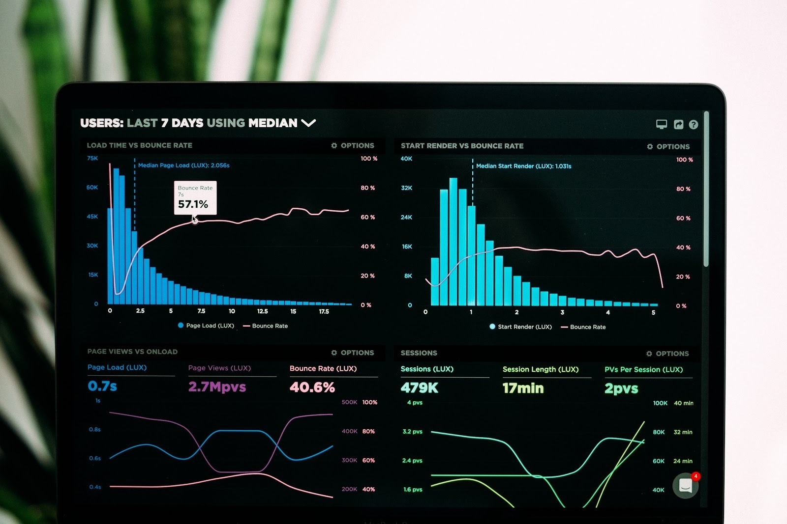
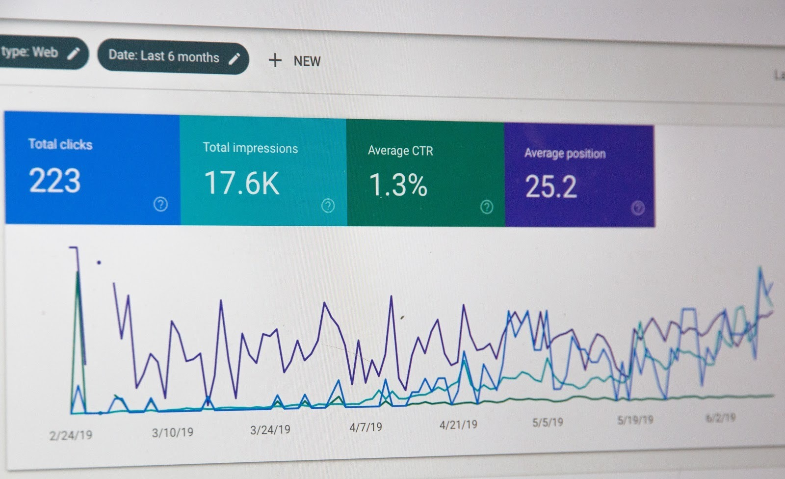
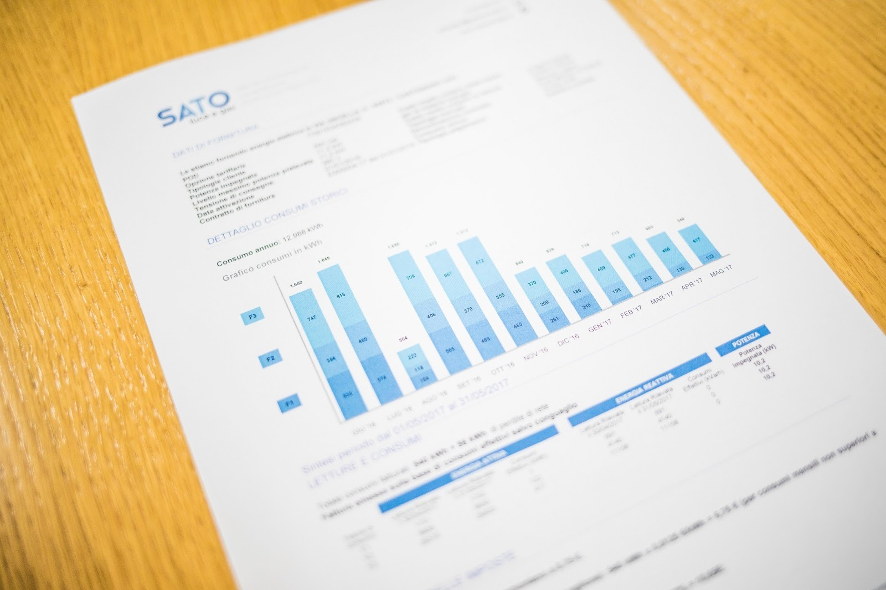

# Visualisasi Data dalam Bisnis

Dalam kehidupan sehari-hari visualisasi data sering kita gunakan, baik di bidang kesehatan, pendidikan, dan lain sebagainya. Bagaimana kalau di bidang bisnis? Pernahkah Anda membayangkan berapa banyak data yang dimiliki perusahaan besar? 

Visualisasi data pasti tidak lepas dari bidang bisnis karena terdapat banyak informasi yang beragam dan kompleks. Dalam bidang bisnis, kita harus bisa menyampaikan data secara benar dan tepat untuk menghindari kesalahan analisis di masa mendatang. Berikut tipe visualisasi data yang dapat diterapkan dalam bidang bisnis.

- Dashboard

**Dashboard merupakan kumpulan dari berbagai visualisasi yang berbeda yang menggabungkan dan merangkum informasi atau data bisnis**. Sebelum mendesain sebuah dashboard, Anda harus menentukan terlebih dahulu apa saja yang ingin Anda ceritakan dalam dashboard itu. Saat kerangka dashboard sudah dibuat, Anda dapat mengisinya dengan berbagai visualisasi yang relevan seperti diagram garis, batang, lingkaran, dan berbagai metode visualisasi lainnya. Biasanya terdapat kombinasi empat visualisasi data yang saling berhubungan satu sama lain. 

- Scorecard

Scorecard merupakan tipe lainnya dalam visualisasi di bidang bisnis. Berbeda dengan dashboard yang terdapat banyak visualisasi di dalamnya, scorecard lebih fokus pada sebuah target tertentu. Visualisasinya berupa jumlah pendapatan, kepuasan pelanggan, dan hal lainnya yang dapat dibandingkan dengan target yang telah ditentukan. Scorecard juga biasanya disajikan dalam salah satu komponen dashboard. **Scorecard menggambarkan tentang Key Performance Indicators (KPI) yang lebih disederhanakan untuk dapat memantau kemajuan progres**.

- Analytic report

**Analytic report atau laporan yang berisi analisis yang digunakan untuk menentukan keputusan**. Jenis laporan ini menggunakan data kualitatif dan kuantitatif untuk menganalisis dan mengevaluasi ide dari suatu bisnis. Analytic report memberikan keuntungan untuk pembaca karena memberi pemahaman yang mudah dipahami. Selain itu hanya dengan membaca sekilas saja. pembaca juga dapat memahami data dalam jumlah yang banyak. 

Analytic report juga menerapkan langkah-langkah umum seperti mengidentifikasi masalah, menentukan metode yang tepat, analisis data, dan mendapatkan solusi terbaik dari masalah yang dihadapi.

- Reports

**Report merupakan bagian dari visualisasi data dalam bisnis yang memuat semua ringkasan dari apa yang terjadi di perusahaan dalam waktu tertentu**. Inti dari report adalah apa yang Anda lakukan untuk mendapatkan dan memahami hal yang sedang terjadi dari suatu perusahaan dengan secepat mungkin.

