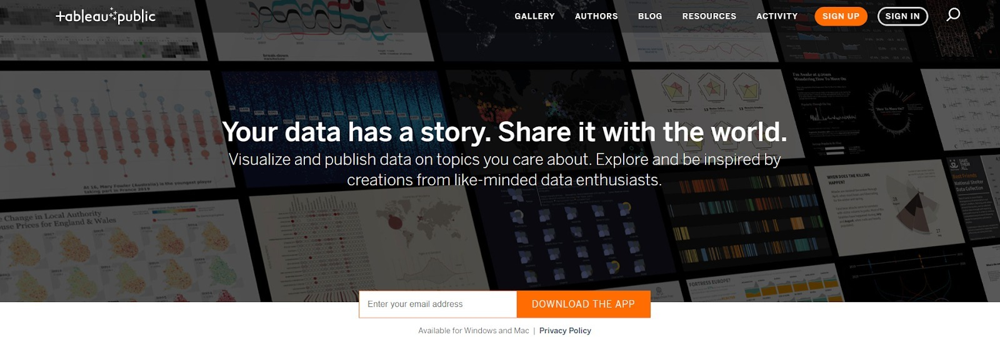
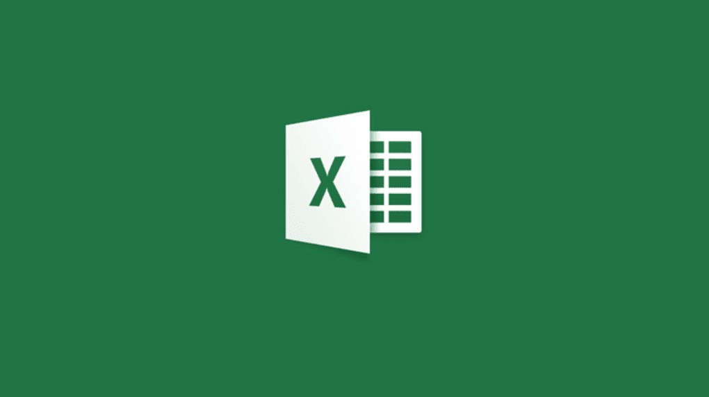

# Tools dalam Visualisasi Data

Dalam membuat visualisasi data kita juga terbantu dengan perangkat lunak atau tools tertentu. Berikut tools gratis yang dapat Anda gunakan untuk mulai belajar tentang visualisasi data.

- Tableau Public

**Tableau Public merupakan sebuah layanan gratis yang memungkinkan siapa saja dapat mempublikasikan visualisasi data ke dalam web**. Visualisasi yang telah dipublikasikan ke Tableau Public ("vizzes") dapat diletakkan dalam halaman web dan blog, dibagikan ke sosial media, dan juga dapat juga diunduh oleh pengguna lainnya. Untuk proses pembuatan visualisasi datanya sendiri menggunakan aplikasi terpisah bernama Tableau Desktop Public Edition. Ingin tahu hal yang menarik dari Tableau Desktop Public ini? Ya, Anda dapat menggunakan aplikasi ini tanpa memerlukan keahlian dalam bidang pemrograman. Keren, bukan? Untuk mengunduh aplikasi Tableau Public dapat klik di sini, ya. https://public.tableau.com/en-us/s/

- Google Sheets

Sudah pernah menggunakan Google Sheets sebelumnya? Anda tidak harus melakukan instalasi aplikasi spreadsheet di laptop Anda, karena dalam Google Spreadsheet semuanya tersedia online. **Google Sheets menawarkan kumpulan fitur dan fungsi standar spreadsheet application seperti yang ada di Microsoft Excel**. Tentunya pada Google Sheets dapat membuat visualisasi sederhana dari data yang kita buat baik dalam bentuk diagram batang, diagram garis, maupun diagram lingkaran.

- Mircrosoft Excel

Pasti Anda familiar dengan Microsoft Excel, bukan? Sebuah aplikasi spreadsheet buatan Microsoft yang memuat banyak fitur powerful. **Microsoft Excel menggunakan spreadsheet yang terdiri dari baris dan kolom untuk manajemen data serta melakukan perhitungan fungsi yang lebih akrab disebut formula. Selain melakukan perhitungan angka yang bersifat numerik, Excel juga dapat membuat visualisasi data sederhana ke dalam bentuk grafik seperti diagram garis, batang, lingkaran, dan lain-lain.**