# Rata-Rata Statistik

Rata-rata statistik merupakan konsep paling sederhana yang paling umum digunakan. Tujuan dari penggunaan rata-rata adalah mendapatkan nilai tengah dari suatu kumpulan data. Berikut tiga jenis rata-rata statistik yang dapat diterapkan:

## Mean

**Mean atau sering kita kenal dengan nilai rata-rata mengacu pada nilai yang dalam statistik kita sebut dengan rata-rata aritmatika atau arithmetic mean**. Masih ingat cara menghitung rata-rata? Dalam menghitung rata-rata kita mulai dengan menjumlahkan semua elemen data yang ada. Selanjutnya hasil penjumlahan tersebut kita bagi dengan total elemen yang ada. Misalnya kita mempunyai data sebagai berikut:

Pada sebuah ulangan matematika, nilai yang didapatkan oleh 10 siswa sebagai berikut:

```
65,70,75,70,80,60,80,90,70,65
```

Berapa rata-rata (arithmetic mean) nilai ulangan matematika dari 10 siswa tersebut?

Apabila kita menggunakan cara perhitungan seperti yang sudah dijelaskan sebelumnya, maka rumusnya seperti berikut:

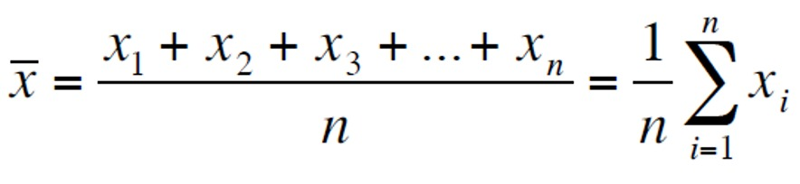

Nah, dari perhitungan di atas kita dapat mengetahui bahwa nilai rata-rata ulangan matematika dari 10 siswa tersebut adalah 72,5.

Contoh di atas disebut dengan rata-rata aritmatika. Lebih lanjut, terdapat jenis perhitungan rata-rata lainnya seperti:
- rata-rata harmonik (harmonic mean)
- rata-rata ukur (geometric mean)
- rata-rata tertimbang (weighted mean)
- rata-rata terpangkas (trimmed mean)

Jangan pusing dulu, ya. Mari kita bahas satu per satu.

## Rata-rata Harmonik

Rata-rata harmonik bisa dikatakan sebagai kebalikan dari rata-rata aritmatika. Kenapa demikian? Karena jumlah data dibagi dengan pecahan data ke-i dengan pembilang 1 (1/xi). Apabila dituliskan dalam rumus matematika menjadi sebagai berikut:

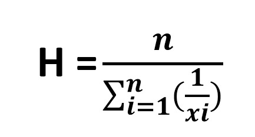

Diketahui bahwa:
H = rata-rata harmonik
n = banyak data
xi = nilai data ke-i

Untuk memperjelas rumus di atas, berikut terdapat contoh beberapa angka:

```
2,3,5,6,6
```

Dari angka di atas apabila ingin didapatkan rata-rata harmoniknya maka penerapannya dengan rumus sebagai berikut:

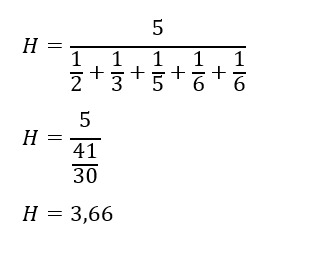

## Rata-rata ukur (Geometric Mean)

**Rata-rata yang didapatkan dengan cara mengalikan semua data yang ada dalam suatu kelompok atau sampel. Kemudian data tersebut diakar pangkat dengan jumlah sampel yang ada**. Karena menggunakan akar pangkat, apabila terdapat data yang memiliki nilai negatif maka perhitungan dengan rata-rata ukur (geometric mean) tidak bisa digunakan. Berikut rumus untuk menghitung rata-rata geometrik. 

Metode pertama:

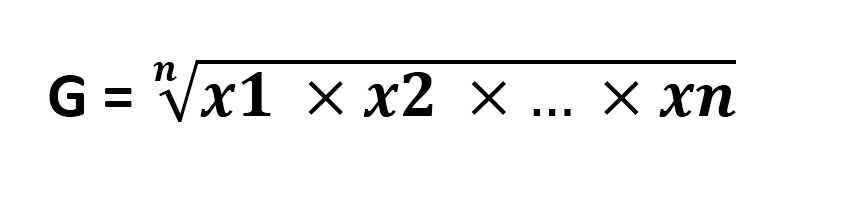

Diketahui bahwa:
G = rata-rata geometrik
x1...xn = data ke-i
n = banyak data

Metode pertama di atas adalah rumus yang bisa digunakan dengan mudah dan efektif apabila jumlah datanya tidak terlalu banyak. Namun, jika datanya sangat banyak mencapai puluhan, ratusan, atau lebih pasti akan terasa sulit apabila menggunakan metode pertama tadi. Maka, terdapat cara kedua yaitu menggunakan logaritma. Hitung log semua data terlebih dulu, kemudian lakukan perhitungan aritmatika seperti biasanya. Lebih lengkapnya simak rumus berikut:

Metode logaritma:

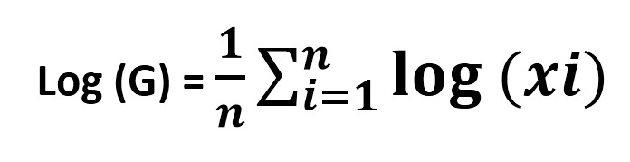

Diketahui bahwa:
Log (G) = rata-rata geometrik
xi = data ke-i
n = banyak data

Berikut contoh soal dari rata-rata ukur (geometric mean):

Hitunglah data di bawah ini dengan rata-rata ukur baik perhitungan biasa maupun logaritma.

```
3,4,6
```

Dihitung dengan perhitungan rata-rata ukur biasa seperti berikut:

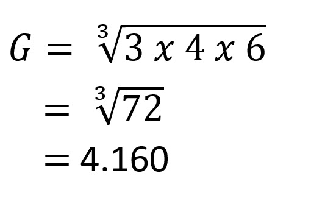

Sedangkan apabila diukur dengan logaritma sebagai berikut:

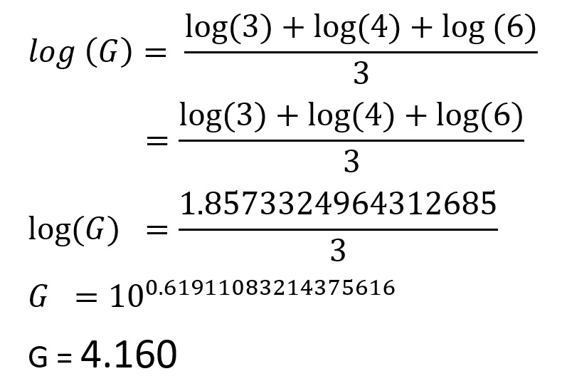

Angka 10 pada 10 pangkat (0.61911083214375616) merupakan default log yang berarti Log(10) = 1.

Sehingga dari data di atas dapat dilihat bahwa apabila datanya sederhana, lebih mudah dihitung dengan metode biasa yang pertama. Namun apabila datanya kompleks lebih baik menggunakan metode logaritma. Manapun pilihan Anda, hasilnya tetap sama.

## Rata-rata tertimbang (Weighted Mean)

Pernah mendengar sebelumnya? **Rata-rata tertimbang dihitung dengan memperhatikan bobot yang ada dalam setiap datanya. Setiap bobot tersebut merupakan pasangan setiap dari data**. Hal ini sangat berguna ketika terdapat bobot tertentu pada suatu data yang bisa mempengaruhi data yang bersangkutan. Inilah perbedaan utama yang membedakan dengan perhitungan rata-rata aritmatika. Apabila dituliskan dalam rumus matematika sebagai berikut:

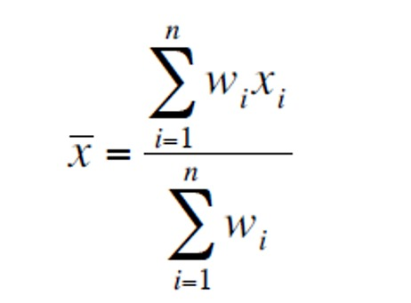

Diketahui bahwa:
x  = rata-rata tertimbang (weighted mean)
xi = nilai data ke-i
wi = bobot data ke-i
n = jumlah data

Sederhananya seperti ini, terdapat sebuah sekolah yang menerima pendaftaran siswa baru. Salah satu penilaiannya adalah angka di rapor. Proses seleksi berfokus pada beberapa mata pelajaran tertentu dan memiliki bobot masing-masing dalam penilaiannya seperti, Matematika memiliki bobot 40, IPA bobot nilainya 30, Bahasa Indonesia bobot nilainya 15, dan Bahasa Inggris bobot nilainya 15. Untuk dapat diterima di sekolah tersebut, calon siswa setidaknya memiliki nilai raport rata-rata 70 berdasarkan bobot yang sudah ditentukan. 

Nah, terdapat dua orang calon siswa, sebut saja Budi dan Toni yang memiliki nilai raport sebagai berikut:

Budi:

Matematika : 80
IPA : 75
Bahasa Indonesia : 70
Bahasa Inggris : 60

Toni:

Matematika : 60
IPA : 70
Bahasa Indonesia 80
Bahasa Inggris 85

Di antara kedua siswa di atas, siapa yang kira-kira berpotensi untuk lolos seleksi?

Apabila dihitung dengan rata-rata tertimbang sebagai berikut:

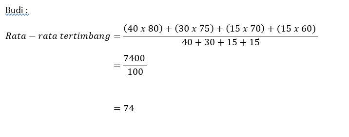

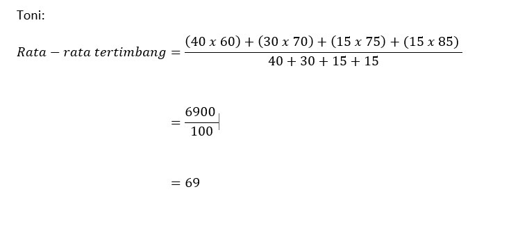

Belum selesai di sana, kita coba hitung rata-rata masing-masing dengan metode rata-rata aritmatika biasa.

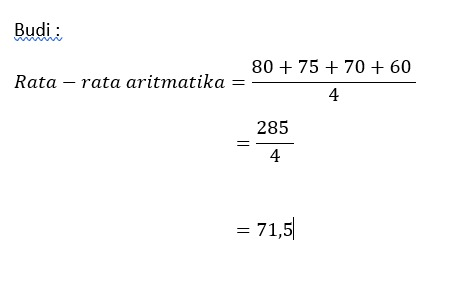

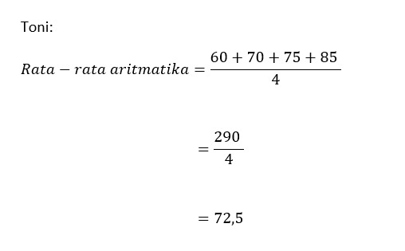

Nah, apabila dilihat dari rata-rata tertimbang yang lolos seleksi adalah Budi. Namun, pada perhitungan rata-rata aritmatika keduanya lolos seleksi. Kenapa hal itu bisa terjadi?

Dari hasil tersebut bisa kita ketahui bahwa nilai rata-rata tertimbang dan rata-rata aritmatika dari Budi masing-masing (74) dan (71,5). Begitu pula dengan Toni rata-rata tertimbang dan aritmatikanya masing-masing (69) dan (72,5). Rata-rata tertimbang Budi lebih besar dari Toni, Namun, rata-rata aritmatika Budi lebih kecil dari Toni. 

Jika kita lihat kembali setiap nilai datanya, bisa kita ketahui bahwa rendahnya nilai rata-rata tertimbang Toni disebabkan nilai matematikanya paling rendah di antara mata pelajaran lainnya. Padahal matematika memiliki bobot penilaian yang paling besar. Sedangkan nilai Bahasa Inggris Toni paling tinggi, tetapi bobotnya paling kecil. Alhasil, ini tak berpengaruh besar dalam meningkatkan rata-rata nilainya.

## Rata-rata terpotong (Trimmed Mean)

**Rata-rata terpotong bisa diartikan dengan memotong atau memangkas data berdasarkan posisi data dengan nilai rata-rata**. Misal, rata-rata terpotong sebanyak 5% berarti terdapat 5% nilai angka (setelah diurutkan dari yang terkecil ke terbesar) yang berada pada ujung kiri data (awal) dan ujung kanan data (akhir) yang harus dibuang. Dengan membuang nilai tersebut diharapkan dapat mengurangi outliers sehingga data yang didapatkan lebih rapi. 

Apa itu outliers? Dalam ilmu statistik, **outlier atau sering disebut “pencilan” merupakan sebuah nilai angka yang berbeda atau menyimpang sangat jauh dari angka lainnya di dalam satu kelompok data**. Tujuan dari perhitungan rata-rata terpotong digunakan supaya data yang dihasilkan lebih akurat dan konsisten.

Apabila ditulis dengan rumus sebagai berikut:

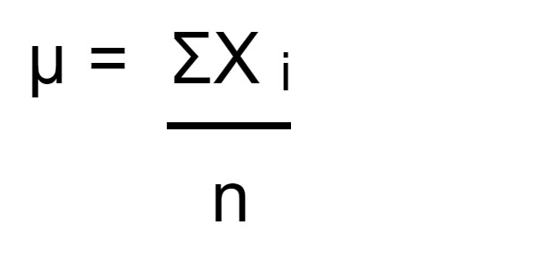

Diketahui dari rumus di atas bahwa:

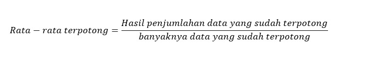

Misal terdapat data sebagai berikut:

```
3,5,7,8,10,15,20,25,40,70
```

Berapa rata-rata terpotong sebanyak 30% dari data di atas?

Sebelum memasukkan data tersebut ke dalam rumus, kita cari dulu data yang harus dihapus atau dipotong. Ibaratkan data yang terpotong dengan g, sehingga perhitungannya sebagai berikut.

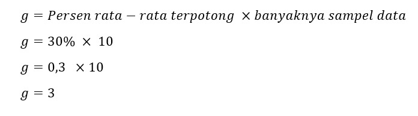

Nah, dari perhitungan di atas kita mendapatkan nilai 3 yang berarti kita menghapus 3 data yang paling kanan dan 3 data yang paling kiri.

Data sebelum dipotong = 3,5,7,8,10,15,20,25,40,70
Data yang dipotong sebanyak 30% = 3,5,7,8,10,15,20,25,40,70
Data yang dihasilkan = 8,10,15,20

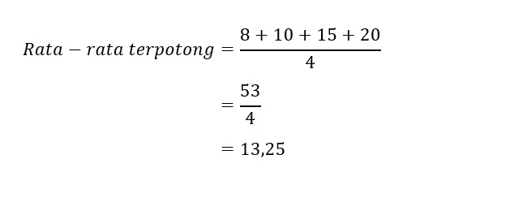

Jadi, hasil rata-rata terpotong 30% dari data di atas adalah 13,25.