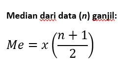
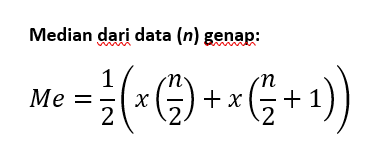
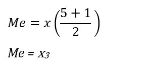
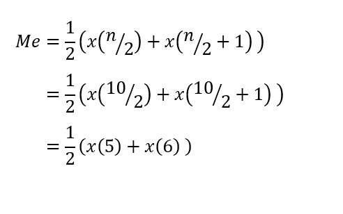
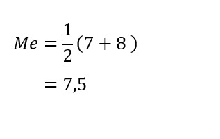

# Median

Pasti Anda sudah pernah mendengar istilah median, bukan? **Median merupakan nilai tengah dari suatu data yang telah diurutkan terlebih dahulu mulai dari yang terkecil hingga terbesar**. Dalam matematika, biasanya Median dilambangkan sebagai **Me** dan dihitung dengan rumus seperti berikut:





Untuk penerapannya perhatikan contoh soal di bawah ini:

## Contoh 1 - Median data ganjil

```
3,2,7,12,10
```

Berapakah nilai median dari data di atas?

Pertama, kita urutkan data di atas terlebih dahulu seperti berikut: 2,3,7,10,12.

Karena data di atas ada 5 (n=5) yang berarti ganjil, maka terapkan rumus median ganjil seperti berikut:



Median menghasilkan x3 yang berarti median data tersebut ada di urutan ke-3. Sehingga dari hasil perhitungan di atas, median dari data di atas adalah 7.

## Contoh 2 - Median data genap

```
3,2,7,12,10,3,5,12,15,8
```

Berapakah nilai median dari data di atas?

Sama seperti sebelumnya, kita urutkan dulu datanya menjadi 2,3,3,5,7,8,10,12,12,15

Karena data di atas berjumlah 10 (n=10) yang berarti genap, maka kita terapkan dengan rumus median genap seperti berikut:



Dari perhitungan di atas didapatkan hasil x5 dan x6 yang berarti kita menjumlahkan elemen data diurutan ke-5 dan urutan ke-6 kemudian dibagi 2.

```
2,3,3,5,7,8,10,12,12,15
```



Sehingga nilai median dari data genap di atas adalah 7,5.