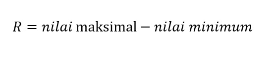

# Range

Dalam kumpulan data yang berbentuk angka pasti ada nilai maksimum dan minimumnya. **Range atau bisa disebut dengan rentang data merupakan selisih antara data maksimum dan minimum tersebut. Rumus dari range sebagai berikut**.



Terdapat kumpulan data dengan nilai sebagai berikut:
```
10, 30, 30, 25, 40, 50, 20
```

Untuk menentukan range dari data di atas, kita dapat mengurutkannya terlebih dahulu mulai dari nilai terkecil sampai terbesar.
```
10, 20, 25, 30, 30, 40, 50
```

Setelah kita mengurutkan data, kita dapat dengan mudah mengetahui bahwa nilai paling kecil adalah 10 dan nilai yang paling besar adalah 50. Sehingga range dari data tersebut bisa mudah dihitung yaitu, 50 - 10 = 40.
