# Kuartil

Apakah Anda familiar dengan kuartil? Kuartil dalam matematika biasanya digambarkan dengan notasi **Q**. **Kuartil merupakan nilai yang membagi data berurutan menjadi 4 bagian yang besarnya sama**. Kuartil terdiri dari 3 bagian yaitu:
- Kuartil pertama (Q1)
- Kuartil kedua (Q2)
- Kuartil ketiga (Q3)

Dalam menghitung nilai kuartil, kita harus memperhatikan jumlah data (n) yang ada.

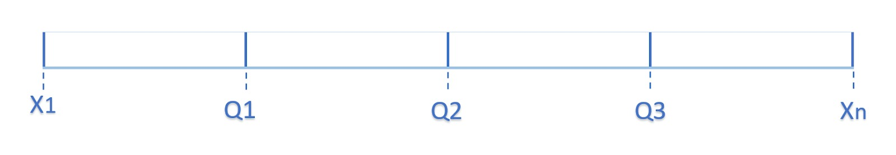

Gambar di atas merupakan ilustrasi letak kuartil terhadap banyaknya data. Dalam penentuan dan perhitungan kuartil terdapat 4 kondisi dan rumus yang berbeda.

- Banyak data (n) ganjil dan nilai (n+1) habis dibagi 4

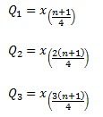

- Banyak data (n) ganjil dan nilai (n+1) tidak habis dibagi 4

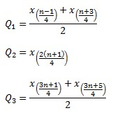

- Banyak data (n) genap dan habis dibagi 4

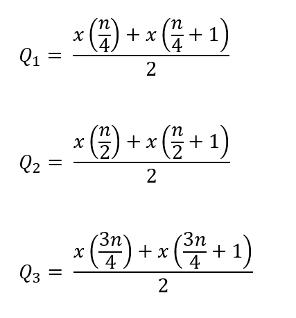

- Banyak data (n) genap dan tidak habis dibagi 4

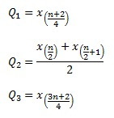

Berikut contoh soal untuk memperjelas tentang kuartil:

## Contoh 1:

Hitunglah kuartil dari data panjang jalan tersebut?

```
7, 6, 8, 3, 2
```

Jawab:

Pertama urutkan dulu datanya mulai dari yang terkecil hingga terbesar.

```
2, 3, 6, 7, 8
```

Karena datanya ganjil dan hasil dari (n+1) adalah 6 maka tidak habis dibagi 4. Sehingga kita dapat menggunakan rumus yang kedua seperti berikut:

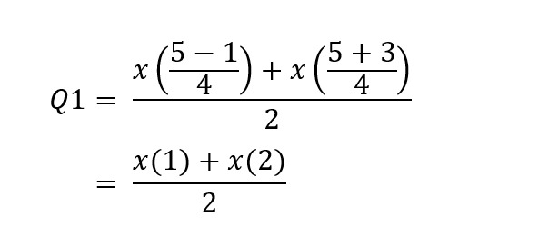

Dari hasil perhitungan di atas diketahui posisi Q1 berada di antara data ke-1 dan ke-2. Untuk menghitung nilainya berarti kita menambahkan x1 dan x2 kemudian dibagi 2 menjadi,

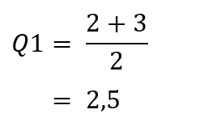

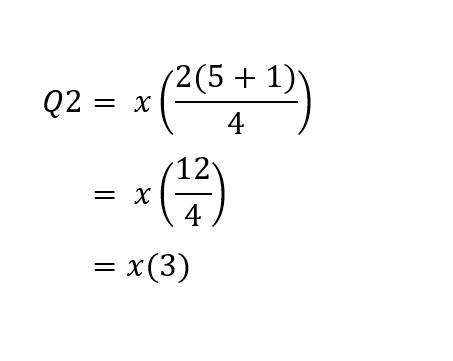

Dari rumus di atas diketahui bahwa letak Q2 berada di data ke-3, sehingga berdasarkan data di atas Q2 = 6.

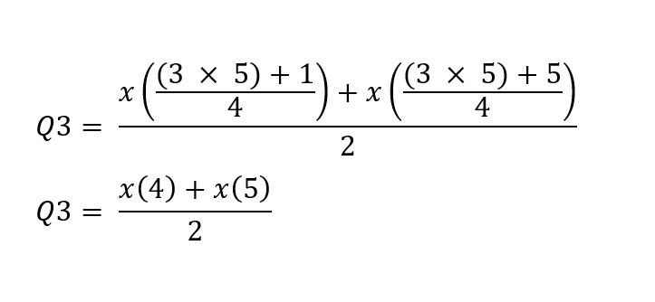

Sama seperti cara sebelumnya, Q3 apabila dilihat dari rumus di atas berarti ada di posisi data ke-4 dan ke-5. Sehingga untuk menghitung nilai dari Q3 menjadi,

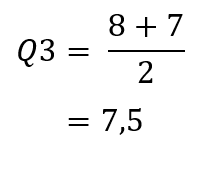

## Contoh 2:

Apabila terdapat data berjumlah 430, di manakah posisi masing-masing kuartilnya?

Jawab:

Diketahui bahwa jumlah datanya genap dan tidak habis dibagi 4 berarti kita bisa menggunakan contoh rumus ketiga seperti berikut:

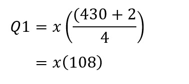


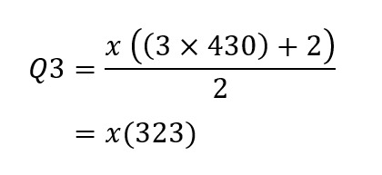

Sehingga dari rumus di atas dapat dilihat bahwa posisi Q1 berada pada data ke-108, Q2 berada di antara data ke-215 dan 216, dan Q3 berada pada data ke-323.