# Standar Deviasi

**Standar deviasi atau disebut dengan simpangan baku adalah ukuran varian atau perbedaan dari nilai sampel terhadap rata-rata suatu data yang sering digunakan dalam statistik**. Standar deviasi sendiri juga digunakan untuk mengukur jumlah variasi atau sebaran dari beberapa nilai data. Maka dari itu rumus dari standar deviasi adalah akar kuadrat dari varian. Apabila salah satu nilai dari varian atau standar deviasi diketahui, maka nilai yang lainnya akan dapat mudah ditemukan. Sehingga rumus dari varian adalah sebagai berikut:

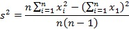

Sedangkan rumus dari varian baku sebagai berikut:


## Contoh 1

Untuk lebih memahami tentang standar deviasi, terdapat data tinggi badan siswa seperti di bawah ini.

```
160, 153, 155, 170, 165, 154, 167, 161, 157, 174
```

Dari data di atas diketahui bahwa jumlah data (n = 10) dan jumlah (n - 1) adalah 9. Untuk mempermudah Anda menghitung variannya, mari kita buat dalam bentuk tabel seperti berikut.

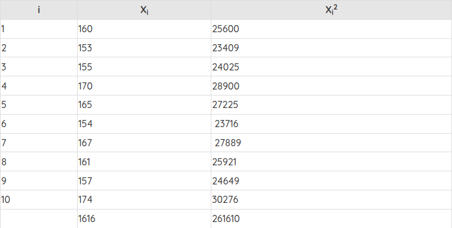

Jika tabel di atas dituliskan dalam bentuk rumus, seperti ini jadinya:


Dari perhitungan yang sudah diketahui dari rumus di atas, apabila angka dimasukkan ke dalam rumus varian. Maka menjadi sebagai berikut:

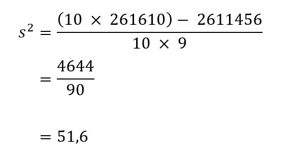

Sehingga kita mendapatkan nilai varian dari data tersebut yaitu 51,6. 

Dari nilai varian di atas, kita juga dapat mencari nilai standar deviasi atau simpangan bakunya dengan cara sebagai berikut:

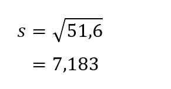

## Contoh 2

Seorang guru matematika ingin menguji pemahaman materi dan metode belajar yang tepat bagi siswanya. Ia membagi satu kelas menjadi 2 kelompok siswa yang masing-masing 10 orang. Anggap saja kelompok A dan kelompok B. Kelompok A diberikan waktu belajar sehari sedangkan kelompok B diberikan waktu belajar tiga hari. 

Pada hari yang ditentukan setelah kelompok A selesai belajar dalam waktu sehari, guru matematika tersebut mengadakan ulangan harian. Singkat kata, hasil dari ulangannya sebagai berikut:


Berselang tiga hari kemudian kelompok B melakukan ulangan matematika yang sama seperti kelompok A. Nilai ulangan matematika Kelompok B sebagai berikut:

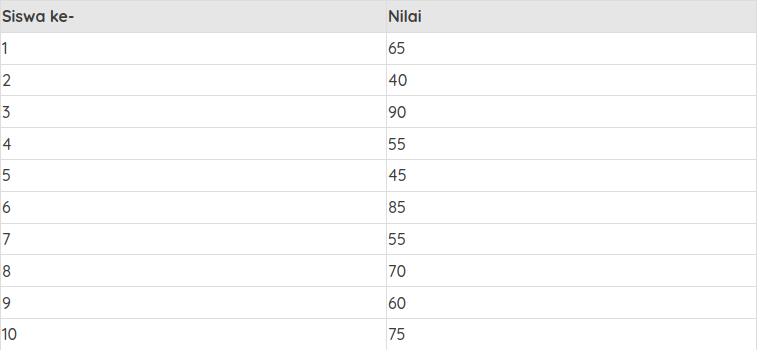

Dari permasalahan di atas, guru matematika tersebut ingin menghitung standar deviasi dari masing-masing kelompok untuk mengukur apakah waktu belajar siswa mempengaruhi hasil ulangan. Bagaimanakah hasilnya?

Jawab:

Pertama kita mulai menghitung dari kelompok A. Sama seperti pada contoh soal sebelumnya, kita tentukan dulu varian sebagai berikut:

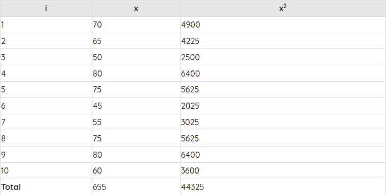

Jika tabel di atas dituliskan dalam bentuk rumus, seperti ini jadinya:

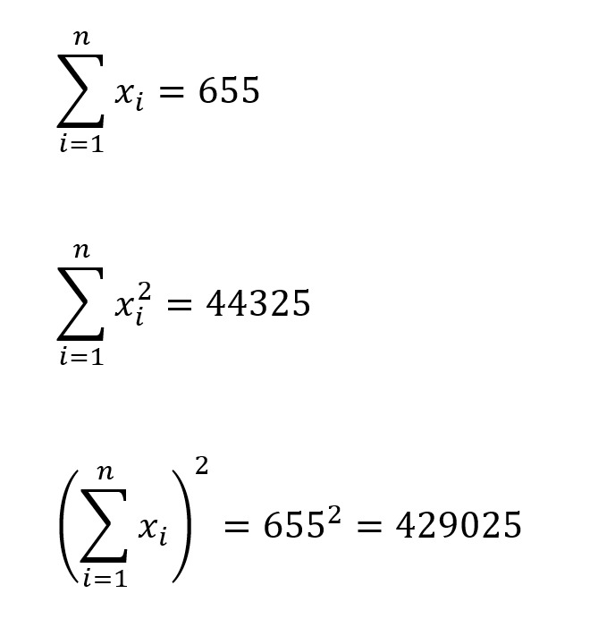

Dari perhitungan yang sudah diketahui dari rumus di atas, apabila angka dimasukkan ke dalam rumus varian. Maka menjadi sebagai berikut:

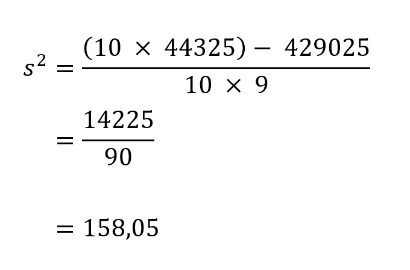

Sehingga kita mendapatkan nilai varian dari data tersebut yaitu 158,05. 

Dari nilai varian di atas, kita juga dapat mencari nilai standar deviasi atau simpangan bakunya dengan cara sebagai berikut:

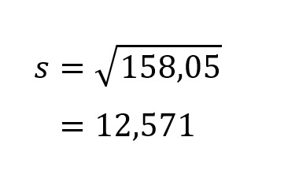

Kita simpan dulu hasilnya perhitungan untuk kelompok A. Selanjutnya kita akan mulai menghitung hasil dari kelompok B.

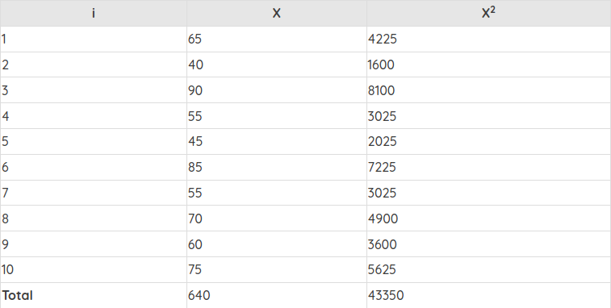

Jika tabel di atas dituliskan dalam bentuk rumus, seperti ini jadinya:

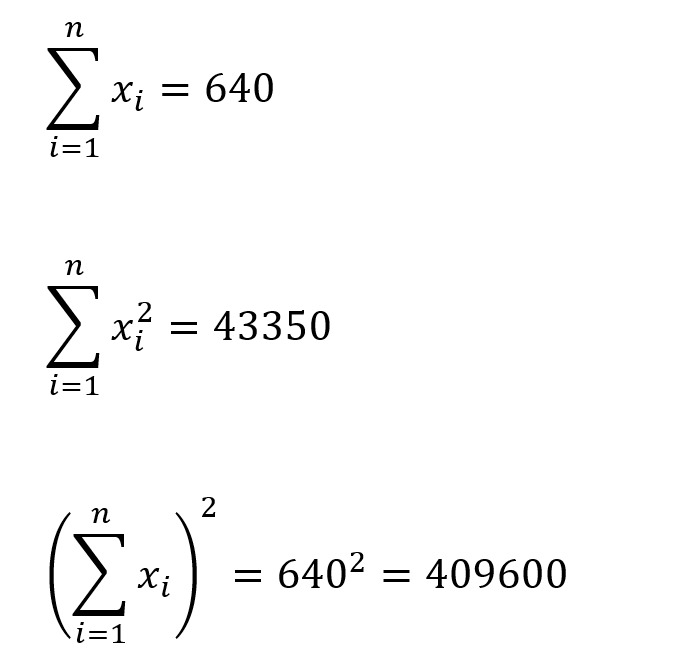

Dari perhitungan yang sudah diketahui dari rumus di atas, apabila angka dimasukkan ke dalam rumus varian. Maka menjadi sebagai berikut:

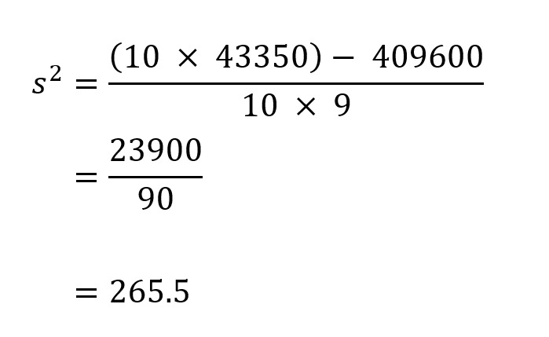

Sehingga kita mendapatkan nilai varian dari data tersebut yaitu 265,5. 

Dari nilai varian di atas, kita juga dapat mencari nilai standar deviasi atau simpangan bakunya dengan cara sebagai berikut:

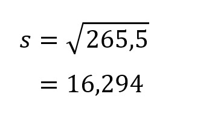

Nah, kita sudah mendapatkan standar deviasi dari kelompok A dengan pola belajar satu hari sedangkan kelompok B tiga hari. 

Kelompok A memiliki standar deviasi 12,571, angka tersebut lebih kecil dibandingkan kelompok B yaitu 16,294. Tapi belum berhenti di sana. Bukan berarti memiliki standar deviasi tinggi membuktikan pola belajar 3 hari itu efektif. Karena jika dilihat kembali terdapat siswa dari kelompok B yang mendapat nilai di bawah 60 sebanyak 4 walaupun ada yang memiliki nilai tinggi yaitu 90. Sedangkan kelompok A yang mendapat nilai di bawah 60 hanya ada 2 orang walaupun nilai tertingginya hanya 80. Hal ini membuktikan bahwa standar deviasi tinggi belum tentu efektif. Sebaliknya, semakin kecil standar deviasi maka rentang datanya lebih kecil sehingga hasilnya lebih baik.

Dari contoh kasus di atas dengan waktu belajar yang lama ada kemungkinan murid tidak fokus belajar, lupa, dan faktor lainnya. Sedangkan yang belajar dalam waktu 1 hari bisa memaksimalkan waktunya dengan baik walaupun faktor lainnya juga bergantung pada kemampuan siswa itu sendiri.