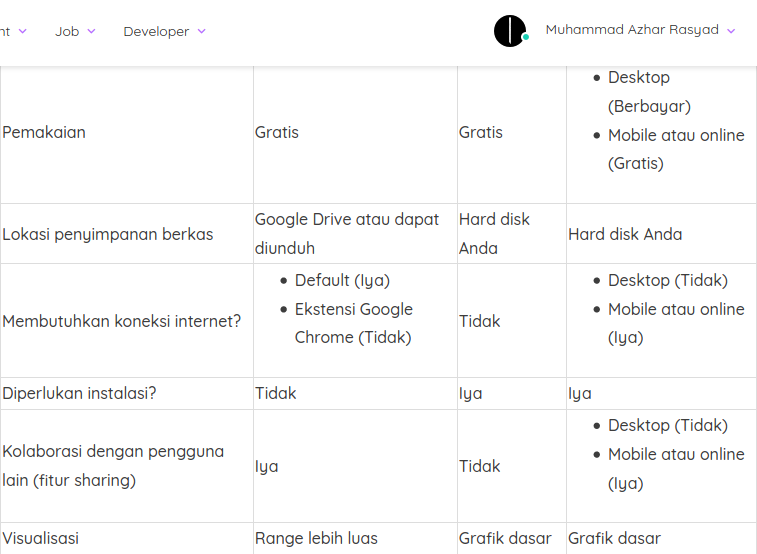

# Apa itu Spreadsheet?

Seberapa familiarkah Anda dengan Spreadsheet? Penyebutan spreadsheet sangat sering kita kaitkan dengan pengolahan suatu data berupa angka atau mungkin Anda lebih familiar mendengar Microsoft Excel dan Google Sheets. Iya, itu memang benar. Namun, tahukah Anda arti dari Spreadsheet itu sendiri? Spread yang berarti penyebaran atau menyebar dan sheet yang berarti lembaran. Sehingga, **spreadsheet merupakan sebuah lembaran berisi baris dan kolom yang dapat kita gunakan untuk analisis data**.

Data yang terdapat pada spreadsheet terlihat lebih terstruktur. Proses memilah serta mengurutkan data pun terasa lebih mudah. Selain itu, hasil data dari spreadsheet akan lebih mudah dibaca oleh program komputer yang berkaitan dengan pengolahan data lainnya. Jika Anda memiliki ribuan data penjualan produk alat tulis kantor (ATK) dan ingin mengetahui berapa jumlah pensil yang terjual, maka aplikasi spreadsheet sangat membantu Anda. Hal tersebut karena spreadsheet memiliki fitur untuk mengelompokkan data berdasarkan parameter tertentu. Bayangkan jika Anda menuliskan data tersebut pada aplikasi pengolah kata atau dokumen biasa, pasti Anda akan mengalami kesulitan dalam mengelompokkan dan menghitung jumlah datanya.

# Fungsi Spreadsheet

Wah, tentunya banyak sekali manfaat dari Spreadsheet, dari jaman dahulu spreadsheet digunakan sebagai alat untuk mencatat data yang berupa angka. **Berikut ini adalah banyak kegunaan spreadsheet:**

- Menyimpan informasi secara detail seperti sebuah Id nasabah bank bisa memiliki banyak atribut seperti nama, jenis kelamin, usia, jumlah uang masuk, jumlah uang keluar, saldo, dan lainnya.
- Membuat tabel data dengan lebih mudah.
- Membantu dalam perhitungan statistik.
- Memvisualisasikan data ke dalam bentuk grafik.
- Lengkap dengan rumus-rumus yang membantu dalam perhitungan data.

Wah, ternyata banyak juga fungsi dari spreadsheet. Apakah Anda dapat menambahkan fungsi lainnya? Apabila dilihat dari beberapa penjabaran di atas, spreadsheet kadang disebut mirip dengan database. Namun, bedanya spreadsheet tidak dilengkapi query sehingga data spreadsheet tidak bisa disebut dengan database.

# Macam-Macam Aplikasi Spreadsheet

Berbicara tentang aplikasi spreadsheet, apa nama aplikasi pengolah data yang pertama kali muncul di benak Anda? Meskipun banyak aplikasi pengolah data tetapi secara fungsinya dan kegunaannya sama. Yang berbeda hanya fitur yang ditawarkan setiap pengembangnya. Berikut adalah aplikasi spreadsheet populer yang sering digunakan untuk pengolahan data.

1. Microsoft Excel
Pasti Anda sudah tidak asing lagi dengan aplikasi pengolah data yang satu ini. Excel merupakan aplikasi Spreadsheet besutan Microsoft yang berada dalam satu paket Microsoft Office. Saat ini versi paling barunya adalah Microsoft Office 2019. Pengguna Microsoft Office juga bisa dikatakan sangat massal dan berasal dari berbagai kalangan. Bahkan bagi penggunanya yang memiliki mobilitas tinggi, Microsoft Office hadir dalam versi khusus yang dapat dijalankan di Smartphone dan dapat diunduh secara gratis termasuk Excel di dalamnya. Fitur yang ditawarkan di dalamnya terhitung lengkap dan powerful. Salah satunya adalah penggunaan rumus untuk menghitung data atau sering disebut formula merupakan hal yang tidak bisa dipisahkan dari Excel.
    
2. LibreOffice Calc
Meski tak sepopuler Excel, LibreOffice Calc memiliki sisi fungsionalitas yang kurang lebih sama dengan Excel. Namun, perbedaannya adalah LibreOffice Calc lebih bersifat open source sehingga dapat diunduh secara gratis sedangkan versi desktop dari Excel berbayar. Fiturnya tidak kalah dengan Excel. Bahkan dalam LibreOffice Calc Anda bisa membuka berkas yang dibuat di Microsoft Excel, lho. Fungsi dasar spreadsheet mulai dari perhitungan, analisis, grafik, dan lainnya dapat Anda temui juga pada LibreOffice Calc ini.

3. Google Sheets
Pernahkah Anda membayangkan ingin mengerjakan tugas pengolahan data menggunakan aplikasi spreadsheet namun ruang kosong pada harddisk kian menipis? Nah, Anda juga bisa menggunakan Google Sheets dalam melakukan pengolahan data. Google Sheets dapat diakses secara online dan berkasnya dapat diunduh atau disimpan dalam Google Drive. Fitur yang ditawarkan di dalamnya memang tidak selengkap Excel atau Calc. Tapi tidak perlu khawatir karena fitur dasar spreadsheet sudah terpenuhi serta visualisasi grafik yang ditawarkan lebih luas cakupannya.

Nah, pada modul ini, kita akan membahas dasar-dasar spreadsheet menggunakan Google Sheets. Hal ini dilakukan supaya lebih fleksibel dan lebih praktis penggunaannya karena tidak memerlukan instalasi tambahan lain.