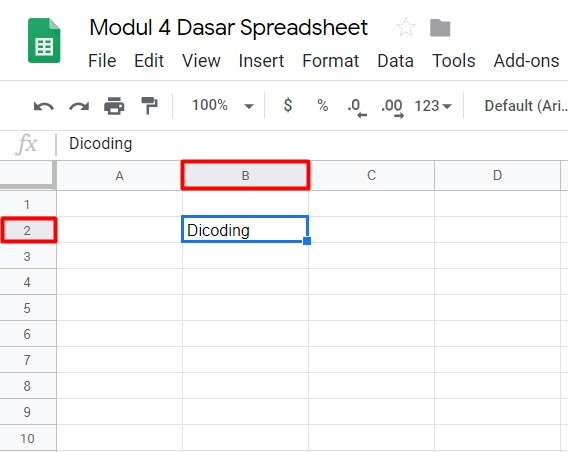

# Navigasi Dasar pada Google Sheets

Spreadsheet pada dasarnya sama karena kita selalu dihadapkan pada baris dan kolom. Baris dan kolom ini tersusun dari kumpulan sel. Dalam sel inilah kita memasukkan data yang ingin diproses.

Data yang dapat dimasukkan dalam sel tersebut dapat berupa,

- Angka: Anda dapat memasukkan angka yang nantinya dapat dihitung secara matematis.
- Teks: Anda juga dapat memasukkan teks untuk penanda yang mewakili keterangan dari angka-angka yang dimasukkan. Misal judul tabel di bagian atas, kemudian setiap bagian kolom yang berisi data terdapat kategori untuk mengidentifikasi tentang angka apa yang Anda masukkan pada sel tersebut. Misal, Anda memasukkan teks “Jumlah barang” maka di bawahnya memiliki data angka seperti 5,7,9,dst yang menandakan jumlah barang tersebut.
- Rumus: Digunakan untuk melakukan perhitungan dari angka dalam kolom atau deretan sel. Misal, kita ingin mengetahui total barang maka kita dapat memasukkan rumus yang menjumlahkan sel yang diinginkan.

Biasanya baris dan kolom memiliki label sendiri-sendiri. Kolom dilabelkan dengan huruf yang membentang secara horizontal ke kanan. Sedangkan baris dilabelkan dengan angka-angka yang tersusun secara vertikal ke bawah. Misal seperti ini, Anda menulis nama Anda di posisi B2. Berarti posisinya berada pada kolom B dan baris ke-2 sehingga letak nama Anda dalam sel menjadi seperti berikut:

Supaya lebih efektif dalam memasukkan data pada setiap sel, berikut beberapa tombol pintasan keyboard yang memudahkan Anda dalam proses navigasi spreadsheet.

Tombol pada Keyboard | Fungsi
-------------------- | ------
Tab | Mengakhiri masukan data pada sebuah sel dan bergeser ke sel selanjutnya secara horizontal (ke kanan)
Enter | Mengakhiri sebuah masukan data dan berpindah satu baris ke bawah
Panah ke atas | Berpindah satu sel ke atas
Panah ke bawah | Berpindah satu sel ke bawah
Panah ke kanan | Berpindah satu sel ke kanan
Panah ke kiri | Berpindah satu sel ke kiri
Ctrl + arah panah | Berpindah ke sel paling luar berdasarkan arah yang dimasukkan. Misal data tertulis dalam kolom A1 sampai J1. Apabila diberikan perintah Ctrl + arah kanan maka sel akan berpindah ke kolom J1.
Shift + arah panah | Untuk menyorot sel berdasarkan arah yang diberikan. Misal terdapat data yang berada pada A1 sampai A10, jika ditekan Shift + arah bawah mulai dari A1 maka akan menyorot data pada sel A2, A3, dan seterusnya.
Ctrl + Shift + arah panah | Untuk menyorot sel yang berisi data. Misal terdapat data yang berada pada A1 sampai A10, jika ditekan Ctrl + Shift + arah bawah maka data yang dimulai dari A1 sampai A10 langsung otomatis tersorot.
Ctrl + C | Untuk menduplikasi isi data dari suatu sel
Ctrl + X | Untuk memindahkan isi data dari suatu sel
Ctrl + V | Untuk menampilkan data hasil duplikasi atau pemindahan yang dilakukan sebelumnya
Ctrl + Z | Untuk mengembalikan ke kondisi perubahan data terakhir (Undo)
Ctrl + Y | Untuk membatalkan perintah undo atau kembali ke kondisi sebelum perintah Undo