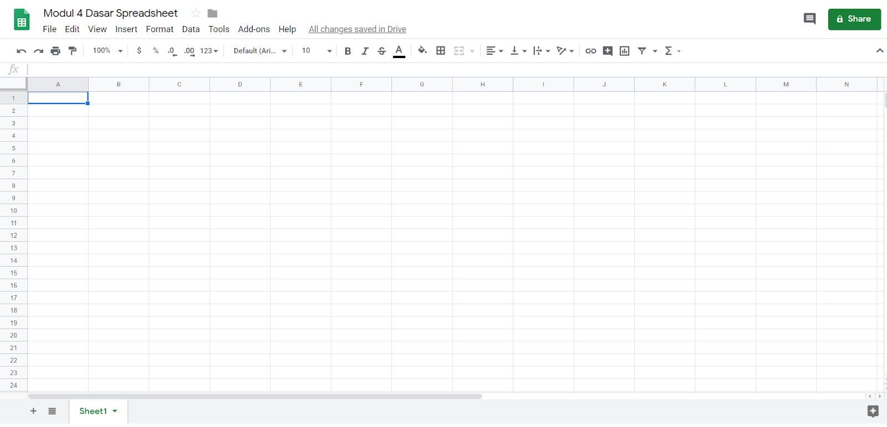
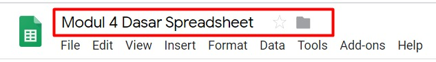
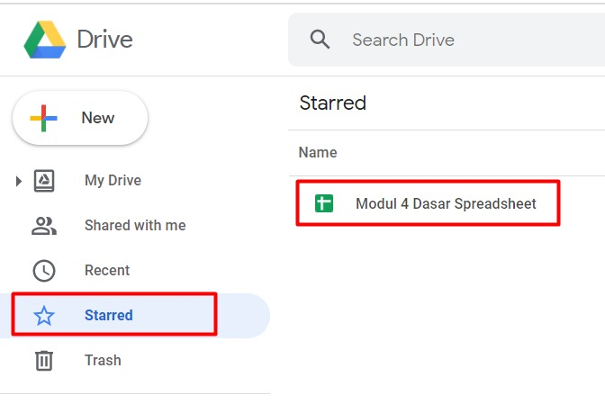
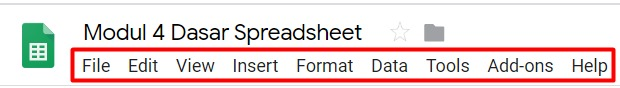
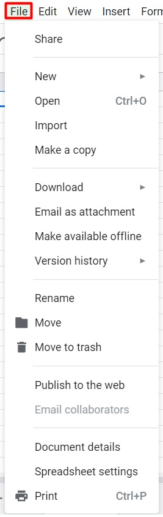
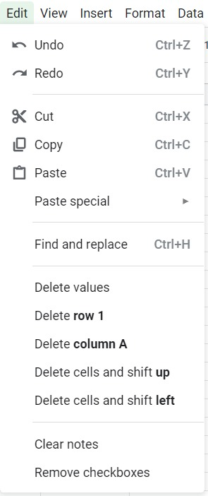
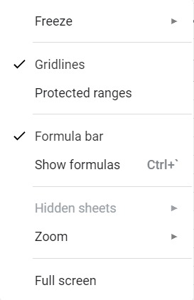

# Elemen pada Google Sheets

Pada pembahasan sebelumnya kita telah membahas pintasan perintah keyboard untuk membuat proses memasukkan data lebih cepat dan efisien. Apabila ingin melakukan pengaturan lebih lanjut, maka kita harus memahami elemen-elemen yang ada di Google Sheets.

## Title Bar

Kita mulai dari yang paling atas sendiri yaitu Title Bar. **Bagian ini menunjukkan judul berkas yang sedang dikerjakan**. Kita juga dapat mengubah judul berkas dengan sangat mudah yaitu dengan cara klik pada judulnya kemudian ubah sesuai keinginan. Untuk mengakhiri proses tekan Enter dan jadilah judul berkas yang baru.

Di samping judul juga terdapat gambar bintang yang berfungsi untuk menandai berkas supaya lebih mudah ditemukan. Apabila ikon bintang kita klik maka berkas tersebut dapat dengan mudah kita lihat pada halaman Google Drive kategori Stared seperti berikut.

Sedangkan ikon folder di samping bintang berfungsi untuk memindahkan berkas ke direktori lain yang diinginkan.

Selanjutnya pada sebelah kanan terdapat tombol lainnya yang tidak kalah penting seperti berikut:

Pada gambar menunjukkan 2 tombol. Sebelah kiri untuk melihat riwayat komentar yang diberikan. Sedangkan tombol hijau sebelah kanan yang bertuliskan share berfungsi untuk membagikan berkas spreadsheet ke pengguna lain berdasarkan hak akses yang ditentukan oleh pemilik.

## Menu Bar

Menu bar berada tepat di bawah judul berkas yang sebelumnya telah kita bahas. Menu yang disediakan oleh Google Sheets mulai dari File hingga Help akan Anda temui dalam uraian berikut.

1. File

Apabila kita klik menu File, maka muncul banyak sub-menu yang dapat kita lihat. Berikut penjabarannya.

Nama Menu | Kegunaan
--------- | --------
Share | Membagikan berkas yang kita kerjakan supaya dapat dilihat, diubah atau dikomentari oleh pengguna lain. Menu ini bisa kita gunakan untuk berkolaborasi dengan pengguna lain untuk menyelesaikan sebuah pekerjaan. Setiap perubahan yang dilakukan oleh pengguna lain dapat dilihat oleh pemilik berkas bergantung pada tingkat akses yang diberikan
New | Membuat berkas spreadsheet baru. Bahkan bisa juga digunakan untuk membuat berkas dokumen lain seperti google docs, presentation, dan lainnya
Import | Memasukkan berkas lain ke dalam spreadsheet yang sedang kita buat. Format yang didukung antara lain, csv, txt, tsv, tab, htm, html, xls, xlsx, xlsm, xlt, xltm, xltx, dan ods.
Make a copy | Menduplikasi berkas yang sedang kita kerjakan
Download | Mengunduh berkas yang kita kerjakan ke dalam komputer
Email as attachment | Mengirimkan berkas spreadsheet sebagai lampiran email
Make available offline | Memungkinkan kita mengerjakan spreadsheet secara offline dan data yang dimasukkan akan sinkron saat kondisi online. Namun, apabila berkas telah dibagikan ke orang lain maka hanya bisa dikerjakan secara online
Version history | Melihat setiap riwayat pengubahan data yang sebelumnya
Rename | Mengubah nama berkas spreadsheet
Move | Memindahkan berkas spreadsheet ke direktori lain dalam Google Drive
Move to trash | Menghapus berkas spreadsheet tapi masih bisa ditemukan di tempat sampah (trash) dalam Google Drive sehingga bisa dikembalikan lagi
Publish to the web | Berkas kita dapat dimasukkan ke dalam sebuah web dengan memanfaatkan embed link yang sudah disediakan
Email collaborators | Mengirimkan pesan kepada teman yang ikut tergabung dalam kolaborasi pengerjaan berkas spreadsheet
Document details | Memperlihatkan detail dari berkas spreadsheet yang sedang dikerjakan seperti direktori penyimpanan berkas, pemilik berkas, tanggal berkas dibuat, dan tanggal berkas dimodifikasi
Spreadsheet | Mengubah pengaturan pada Spreadsheet seperti zona waktu, bahasa, dan lainnya
Print | Digunakan untuk mencetak berkas spreadsheet

2. Edit

Dalam menu Edit, kita akan menemui beberapa sub-menu sebagai berikut:

Nama Menu | Kegunaan
--------- | --------
Undo | Mengembalikan ke kondisi perubahan data terakhir
Redo | Membatalkan perintah undo atau kembali ke kondisi sebelum perintah Undo
Cut | Memindahkan isi data dari suatu sel
Copy | Menduplikasi isi data dari suatu sel
Paste | Menampilkan data hasil duplikat atau pemindahan yang dilakukan sebelumnya
Paste special | Menampilkan data hasil duplikat atau pemindahan dengan pemilihan tertentu, misal hanya nilainya saja (value only), format penulisannya saja (format only), dan lainnya
Find and replace | Mencari data tertentu pada suatu sel dan menggantinya dengan masukan baru
Delete value | Hanya menghapus nilai baik berupa angka maupun kata yang berada dalam sebuah sel (tanpa mempengaruhi format penulisan)
Delete row | Menghapus data yang terdapat pada sebuah baris yang diinginkan
Delete column | Menghapus data yang terdapat dalam sebuah kolom
Delete cells and shift up | Menghapus data dalam sebuah sel dan data di bawahnya akan otomatis bergeser ke atas
Delete cells and shift left | Menghapus data dalam sebuah sel dan data di sebelah kanannya akan otomatis bergeser ke kiri
Clear notes | Menghilangkan catatan yang ada di sel terpilih
Remove checkbox | Menghilangkan checkbox yang ada di sebuah sel

3. View

Selanjutnya kita beralih ke menu View. Dalam menu view terdapat sub lainnya sebagai berikut:

Nama Menu | Kegunaan
--------- | --------
Freeze | Membuat baris atau kolom yang dibekukan akan terlihat walaupun kita scroll ke bawah atau samping
Gridlines | Menampilkan garis khayal sel di berkas spreadsheet
Protected range | Menampilkan sel mana yang terproteksi dan membutuhkan hak akses untuk mengubahnya
Formula bar | Menampilkan bar khusus untuk formula atau rumus yang dibuat dalam sebuah sel
Show formula | Menampilkan formula yang dibuat dalam sebuah sel
Hidden sheets | Menampilkan sheet yang disembunyikan
Zoom | Memperbesar tampilan spreadsheet
Full screen | Menampilkan spreadsheet dalam satu layar penuh