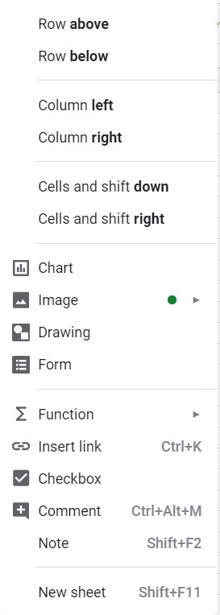
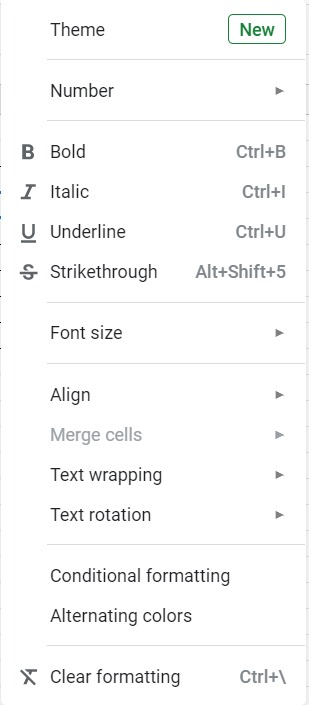
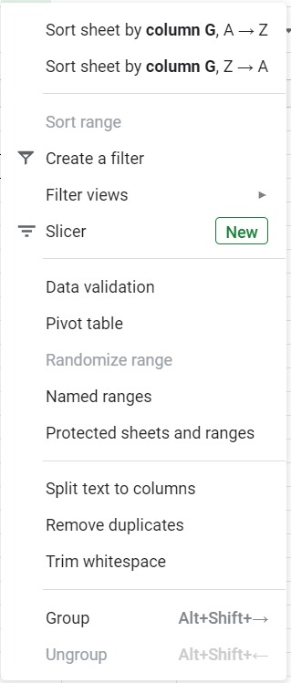
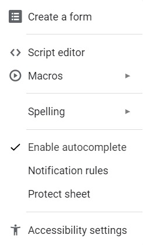
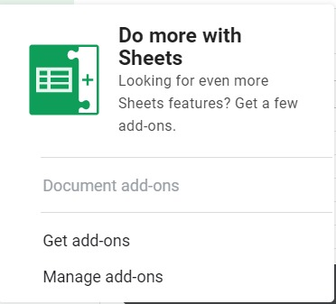
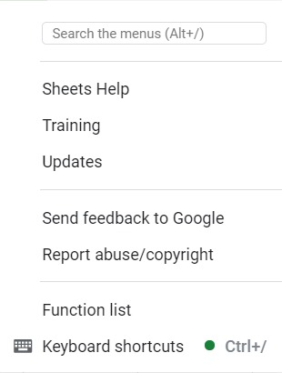

# Elemen pada Google Sheets (Lanjutan)

Berikut lanjutan dari materi sebelumnya mengenai elemen yang ada pada Menu Bar Spreadsheet,

4. Insert

Dalam menu Insert, kita dapat memasukkan beberapa komponen mulai dari baris dan kolom baru hingga membuat diagram. Berikut uraian selengkapnya:

Nama Menu |	Kegunaan
--------- | --------
Row above | Memasukkan baris baru di atas sel yang sedang dipilih.
Row below | Memasukkan baris baru di bawah sel yang sedang dipilih.
Column left | Memasukkan kolom baru di samping kiri sel yang sedang dipilih.
Column right | Memasukkan kolom baru di samping kanan sel yang sedang dipilih.
Cells and shift down | Menambahkan sel baru dengan menggeser ke bawah dari sel yang aktif saat itu.
Cells and shift right | Menambahkankan sel baru dengan menggeser ke kanan dari sel yang aktif saat itu.
Chart | Membuat grafik atau diagram berdasarkan data yang dibuat.
Image | Memasukkan gambar ke dalam sel yang aktif saat itu.
Drawing | Memasukkan objek sederhana seperti garis, bangun sederhana, dan lainnya layaknya menu autoshapes pada Microsoft Word.
Form | Mengintegrasikan spreadsheet dengan google form.
Function | Memasukkan rumus atau fungsi yang digunakan dalam spreadsheet.
Insert link | Memasukkan tautan ke dalam sel.
Checkbox | Membuat checkbox dalam sebuah sel.
Comment | Memberi komentar pada sel yang dipilih yang sangat berguna apabila berkolaborasi dengan orang lain.
Note | Untuk membuat catatan pada sel tertentu. Bedanya dengan comment adalah untuk note hanya pemilik spreadsheet sendiri yang bisa melihat.

5. Format

Menu selanjutnya yaitu Format. Dalam menu ini kita dapat mengatur seperti format penulisan, paragraf dan lainnya. Berikut penjelasan selengkapnya.

Nama Menu | Kegunaan
--------- | --------
Theme | Mengatur tema tampilan grafik yang akan dibuat nantinya.
Number | Mengatur segala sesuatu yang berhubungan dengan penulisan angka seperti mata uang, tanggal, persen, dan lainnya.
Bold | Membuat angka atau kata yang terdapat dalam sel menjadi tebal.
Italic | Membuat angka atau kata yang terdapat dalam sel menjadi miring.
Underline | Membuat angka atau kata yang terdapat dalam sel menjadi bergaris bawah.
Strikethrough | Membuat angka atau kata yang terdapat dalam sel menjadi tercoret.
Font size | Mengubah ukuran font.
Align | Mengubah format penulisan seperti rata kanan, tengah, dan kiri.
Merge cells | Menggabungkan beberapa sel menjadi satu sel.
Text wrapping | Membuat penulisan teks yang panjang menjadi beberapa baris dan bisa terbaca dalam 1 kolom.
Text rotation | Mengubah orientasi posisi dari teks dalam sebuah sel.
Conditional formatting | Melakukan format penulisan secara kondisional.
Alternating Colors | Memberikan warna ke dalam satu atau beberapa sel sesuai pola dan ketentuan warna yang ada.
Clear formatting | Menghilangkan semua format penulisan dalam sebuah sel, misal tebal, miring, dan sebagainya.

6. Data

Lanjut ke menu berikutnya yaitu Data. Dalam menu ini terdapat berbagai perintah untuk mengatur segala hal yang berkaitan dengan data. Berikut uraiannya:

Nama Menu | Kegunaan
--------- | --------
Short sheet by column (A-Z) | Menyortir data yang berada dalam sebuah sheet dalam sebuah kolom yang dipilih secara menaik (dari kecil ke besar).
Short sheet by column (Z-A) | Menyortir data yang berada dalam sebuah sheet dalam sebuah kolom yang dipilih secara menurun (dari besar ke kecil).
Sort range | Menyortir data yang ada dalam sel terpilih dengan parameter tertentu (menaik atau menurun).
Create filter | Mengurutkan dan mengelompokkan data yang dipilih dengan parameter tertentu.
Filter views | Mempermudah memantau pengurutan data sehingga lebih praktis penggunaannya.
Slicer | Mengatur data yang ada dalam sebuah tabel pivot. Penggunaan slice dapat memudahkan ubah data pivot dan chart dengan hanya sekali klik. Selain itu penggunaan slicer juga sangat membantu dalam membuat dashboard laporan.
Data validation | Memeriksa data yang dimasukkan sudah benar atau tidak. Misal data dari A1 sampai A10 ingin diketahui ada berapa angka yang lebih dari 5. Maka kita dapat menggunakan data validation dengan tipe number dengan rentang angka 1 sampai 5. Apabila terdapat data yang nilainya lebih besar dari 5 maka di pojok kanan atas terdapat penanda bahwa nilai dari sel tersebut melebihi data yang diinginkan.
Pivot table | Membuat sebuah pivot table yang berguna untuk analisis suatu data yang banyak.
Randomize range | Membuat pengurutan data secara acak.
Named ranges | Mengkategorikan baris atau kolom dalam sebuah rentang (range) dengan nama tertentu.
Protected sheets and ranges | Mengunci sel tertentu dan membatasi pengguna lain untuk melihat data yang terproteksi.
Split text to column | Memecah beberapa data dalam sebuah sel menjadi beberapa kolom. Misal A,B,C,D. Keempat data tersebut akan dipecah menjadi 4 kolom berdasarkan separator yang memisahkan antara data satu dengan lainnya.
Remove duplicates | Memeriksa dan menghapus duplikasi data yang berada dalam rentang sel tertentu.
Trim whitespace | Memangkas spasi (whitespace) apabila terdapat data yang kelebihan spasi di awal atau akhir penulisannya.
Group | Mengelompokkan data dalam baris atau kolom ke dalam grup tertentu.
Ungroup | Membatalkan proses pengelompokkan data dari suatu baris atau kolom tertentu.

7. Tools

Menu berikutnya adalah Tools yang berisi sub menu lainnya sebagai berikut:

Nama Menu | Kegunaan
--------- | --------
Create a form | Membuat google form baru yang data masukannya akan terekam dalam sheet baru yang otomatis terbuat.
Script editor | Membuat kustomisasi formula pada perhitungan rumus Google Sheets.
Macros | Merekam duplikasi dari serangkaian interaksi UI tertentu yang kita terapkan dan menyimpannya dengan tombol pintasan tertentu. Kita dapat menggunakan pintasan untuk mempercepat menjalankan kembali langkah-langkah makro yang tepat sesuai kebutuhan.
Spelling | Memeriksa penulisan teks dan menyesuaikan dengan pengaturan bahasa yang digunakan.
Enable autocomplete | Memberikan saran penulisan sehingga apabila kita mengetik kata, otomatis akan muncul saran tertentu. Apabila kita setuju dengan saran tersebut maka langsung tekan enter.
Notification rules | Apabila diaktifkan maka muncul notifikasi sesuai pengaturan yang dipilih. Misal terdapat notifikasi setiap perubahan yang ada pada berkas spreadsheet tersebut.
Protect sheet | Apabila berkas spreadsheet dibuka oleh pengguna lain dan mengarah ke sheet yang terproteksi maka akan muncul peringatan tertentu. Sebagai pemilik sheet, Anda dapat memberikan hak akses tertentu terhadap siapa saja yang ingin membuka sheet tersebut.
Accessibility settings | Mengaktifkan screen reader atau kaca pembesar yang membantu pengguna untuk memahami isi spreadsheet.

8. Add-ons

Dalam Google Sheets kita juga diizinkan untuk menambahkan alat tambahan yang dapat membantu pengerjaan spreadsheet lebih mudah dan efektif.

9. Help

Dalam menu help kita dapat memberikan feedback apabila ada saran pengembangan Google Sheets, bantuan apabila mengalami kesulitan, petunjuk untuk pintasan keyboard, dan lain sebagainya.
