# Baris dan Kolom

Pada materi sebelumnya kita telah mempelajari navigasi pada Google Sheets. Nah, sekarang yuk bermain dengan baris dan kolom dengan memanfaatkan contoh data spreadsheet yang sudah ada. Contoh data dapat diunduh disini sample file. (https://dicodingacademy.blob.core.windows.net/picodiploma/vd_academy/file_example_XLS_10.xls)

Dalam percobaan kali ini kita menggunakan data sederhana yang terdiri dari 10 baris saja. Kita dapat memasukkan file tersebut dengan cara Import seperti berikut:

1. Klik File - Import pada menu bar Google Sheets

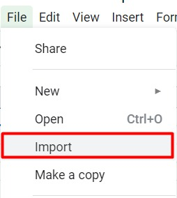

2. Selanjutnya pilih berkas yang ingin ditambahkan dan muncul jendela berikut

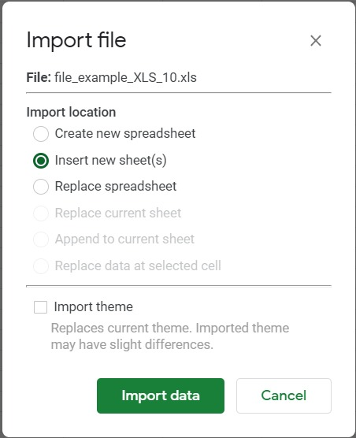

Pada gambar di atas terdapat tiga pilihan dengan fungsi masing-masing yaitu,
- Create new spreadsheet : menambahkan contoh berkas pada spreadsheet baru.
- Insert new sheet(s) : menambahkan contoh berkas menjadi sheet baru dalam spreadsheet yang sedang aktif.
- Replace spreadsheet : Menggantikan spreadsheet yang sedang aktif dengan contoh berkas yang ditambahkan.

Maka dari itu kita pilih Insert new sheet supaya tidak perlu membuat berkas baru.

3. Apabila data sudah dimasukkan, maka tampilannya sebagai berikut:

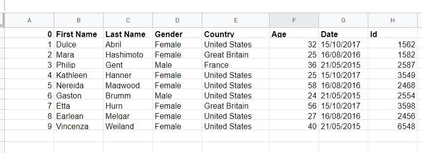

Jangan ditutup dulu berkasnya ya. Kita masih menggunakan lagi di uraian berikutnya.

## Menyisipkan Kolom

Saat ini Anda sudah memiliki 10 baris contoh data. Bagaimana caranya apabila kita ingin menambahkan kolom baru dengan nama city di antara gender dan country? Berikut langkah langkah-langkahnya.

1. Sorot salah satu kolom. Misalnya di sini kita memilih kolom gender. Karena gender berada di kolom D, maka klik kolom tersebut sehingga semua kolom D tersorot.

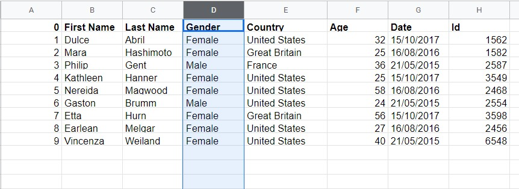

2. Klik kanan pada kolom gender tersebut kemudian pilih Insert 1 right karena kolom city yang ingin kita buat posisinya setelah kolom gender dan sebelum kolom country.

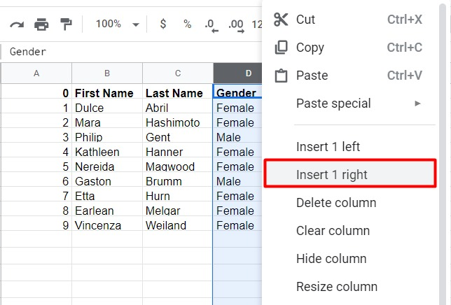

3. Hasilnya adalah kolom baru di antara gender dan country. Lalu kita dapat mengisi data pada kolom city.

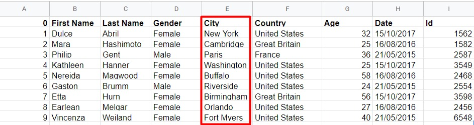

Kita telah berhasil menyisipkan kolom baru pada contoh data yang ada.

## Menghapus Kolom

Kita tidak sengaja membuat kolom baru dan ingin menghapusnya. Misalkan pada contoh data sebelumnya kita ingin menghapus kolom Date. Bagaimana caranya?

1. Karena date berada di kolom H, klik kolom tersebut sehingga semuanya tersorot.

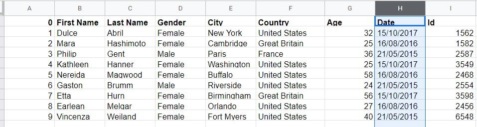

2. Klik kanan pada kolom date tersebut kemudian pilih Delete Column.
    
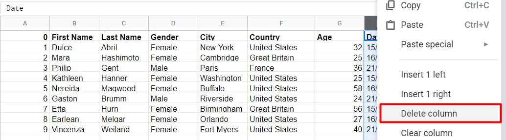

3. Sehingga data ID akan bergeser ke kiri seperti berikut.

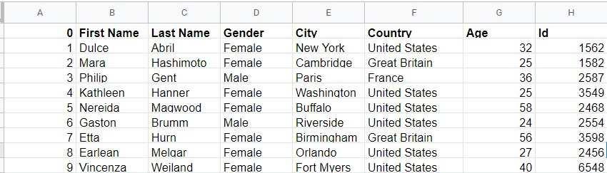

Kita telah berhasil menghapus kolom date dari contoh data di atas.

## Menyisipkan Baris

Sebelumnya kita membahas tentang menyisipkan dan menghapus kolom. Selanjutnya kita bermain dengan baris dari contoh data yang ada. 

Bagaimana caranya jika kita ingin menyisipkan nama George di baris ke-5 setelah nama Philip? Masih menggunakan contoh data terakhir di atas, mulai dengan langkah berikut.

1. Berdasarkan spreadsheet, Philip berada di baris ke-4. Karena itu klik baris tersebut sehingga semua baris ke-4 tersorot.

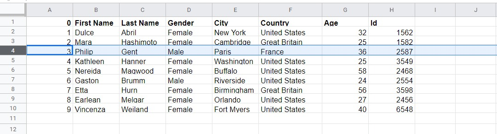

2. Klik kanan pada baris nama Philip tersebut kemudian pilih Insert 1 below karena nama George yang ingin kita buat posisinya setelah Philip dan sebelum Kaithleen.

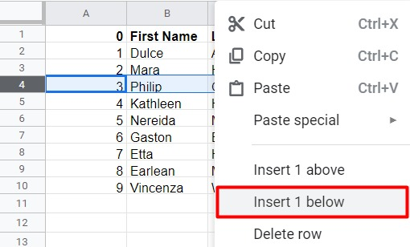

3. Sehingga menghasilkan baris baru di antara Philip dan Kaithleen. Lalu kita dapat mengisi data George pada baris baru tersebut.

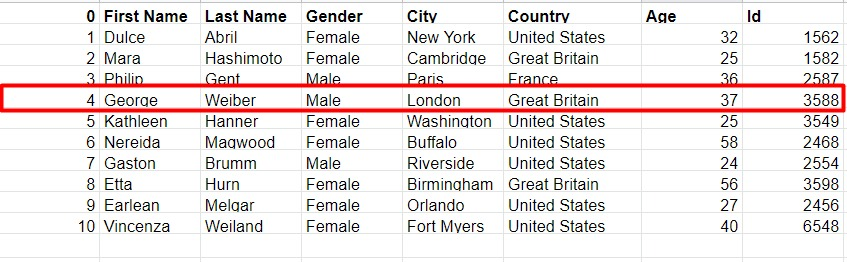

Kita telah berhasil membuat baris baru dengan nama George pada data contoh di atas.

## Menghapus Baris

Yeay, kita sudah bisa menghapus kolom. Saat ini kita akan beralih ke menghapus baris. Coba kita hapus kembali baris George yang sudah kita buat sebelumnya. Langsung simak uraian berikut ini.

Kita tidak sengaja membuat kolom baru dan ingin menghapusnya. Misalkan pada contoh data sebelumnya kita ingin menghapus kolom Date. Bagaimana caranya?

1. Karena date berada di baris ke-5, klik baris tersebut sehingga semuanya tersorot.

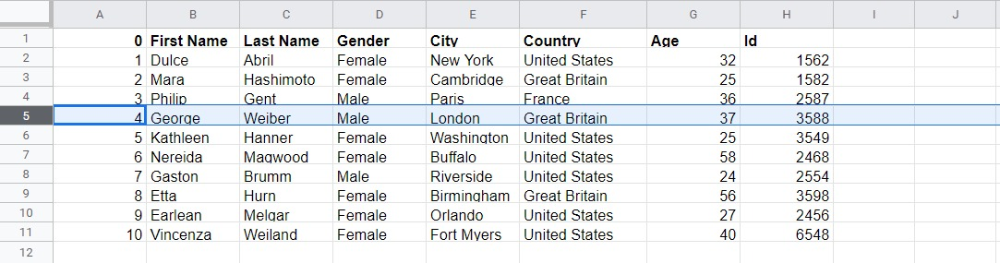

2. Klik kanan pada kolom date tersebut kemudian pilih Delete Column.

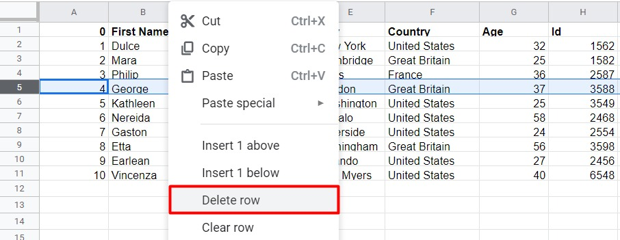

3. Sehingga data Kaithlenn akan bergeser ke atas seperti berikut.

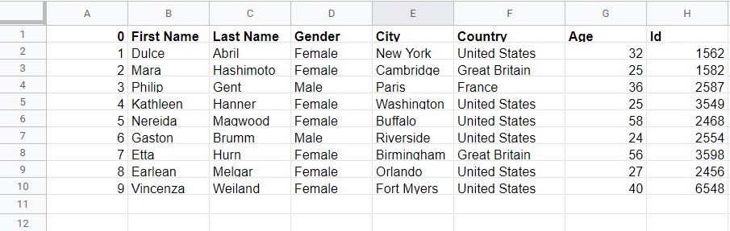

Kita telah berhasil menghapus baris George dari contoh data di atas.