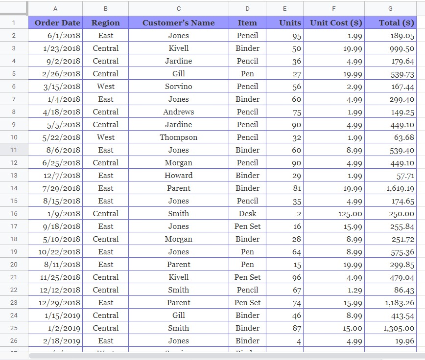
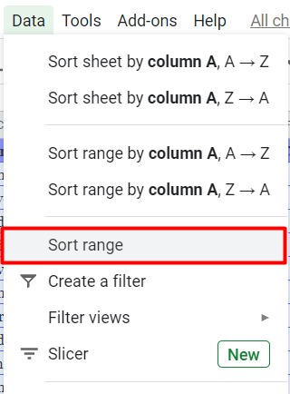
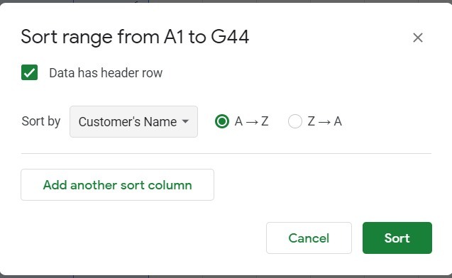

# Sortir Data

Tahukah Anda tentang sortir data di Google Sheets? Fitur ini berguna untuk mengurutkan data yang kita miliki supaya lebih tertata rapi.

Terdapat faktor yang harus didefinisikan di awal sebelum melakukan sortir data, di antaranya seperti:

- Manakah kolom yang harus disortir?
-  Tentukan terlebih dahulu data yang ingin disortir. Misalnya kita ingin mengurutkan data dari tabel penjualan barang berdasarkan jumlah produk yang terjual.
- Bagaimana metode mengurutkannya?
- Selanjutnya Anda dapat menentukan metode dalam proses sortir. Misalnya, Anda ingin mengurutkan data dari tabel penjualan mulai dari produk yang paling banyak terjual hingga yang paling sedikit.

Kunci dalam proses sortir adalah memastikan bahwa seluruh data yang ingin disortir telah terpilih. Setiap baris dalam berkas spreadsheet dapat mewakili penjualan produk kepada pelanggan. Kemudian, setiap kolom atribut akan mencatat detail misalnya seperti jumlah produk terjual penjualan, waktu dibuat, alamat pelanggan, dan lain-lain.

Masih bingung tentang sortir data? Simak penerapan sortir data pada uraian di bawah ini:

1. Unduh berkas contoh data penjualan yang ingin kita sortir di sini. (https://www.contextures.com/SampleData.zip)
2. Selanjutnya lakukan import contoh data tersebut ke dalam Google Sheets.
3. Sehingga tampilannya menjadi seperti berikut.

4. Sorot terlebih dahulu semua data yang ada di Spreadsheet tersebut kemudian pilih Data - Sort Range.

Sebelum ke langkah selanjutnya, tentukan terlebih dahulu data yang ingin kita urutkan. Misal kita telah membuat kondisi sebagai berikut:

- Mengurutkan data berdasarkan nama pelanggan secara menaik (A-Z).
- Mengurutkan data berdasarkan nama pelanggan dan nama item yang dibeli dari pelanggan tersebut (A-Z).

## Mengurutkan berdasarkan nama pelanggan (satu kondisi)

1. Untuk menyelesaikan kondisi pertama, perhatikan pengaturan sort range di bawah ini:

Centang has header row untuk mempermudah penentuan pengelompokkan data. Pada data penjualan di atas terdapat judul kategori masing-masing seperti order date, region, customer’s name, dan seterusnya yang mewakili setiap isi data di bawahnya.

2. Nah, pada kondisi kali ini kita akan mengurutkan data berdasarkan nama pelanggan sesuai urutan abjad menaik (A-Z). Maka kita mengisi kondisi Sort by dengan Customer’s Name dan diakhiri dengan klik Sort. Sehingga hasil pengurutan data berdasarkan nama pelanggan secara menaik (A-Z) menjadi sebagai berikut:

3. Data di atas menunjukkan nama pelanggan sudah terurut secara menaik sesuai abjad (A-Z). Bukan namanya saja yang berubah urutannya sesuai abjad, tetapi data yang melekat pada nama pelanggan tersebut juga ikut menyesuaikan.

## Mengurutkan berdasarkan nama pelanggan dan item (dua kondisi)

Selanjutnya kita ingin mengurutkan data berdasarkan nama pelanggan dan item yang dibeli. Apabila sebelumnya hanya menggunakan satu kondisi yaitu berdasarkan nama pelanggan saja, saat ini kita tambahkan lagi kondisi lainnya yaitu item. Sehingga data yang diurutkan adalah berdasarkan nama pelanggan dan item.

1. Sorot kembali semua data yang ada, kemudian pilih menu Data - Sort Range.

2. Sesuaikan pengaturan pada sort range sesuai dengan data yang ingin diurutkan dalam hal ini berdasarkan nama pelanggan dan item seperti berikut:

3. Pada kondisi pertama urutkan berdasarkan nama pelanggan berarti kita mengisi sort by dengan Customer’s Name. Kemudian tambahkan kondisi baru dengan klik Add another sort column dan isikan dengan Item. Sehingga alur sortirnya dimulai berdasarkan nama pelanggan terlebih dahulu kemudian itemnya.

4. Setelah selesai pilih Sort kemudian menampilkan hasil sebagai berikut:

Dari gambar di atas dapat dilihat bahwa metode pengurutan pertama adalah berdasarkan nama kemudian item. Misalnya Andrews pernah membeli binder dan pencil. Sedangkan Gill membeli Binder, pen, dan pencil. Karena abjad nama Andrew (A) lebih dulu dari Gill (G) maka Andrews berada di urutan pertama. Urutkan item yang dibeli Andrew menurut abjad mulai dari binder (b) hingga pencil (p). Setelah mengurutkan item yang dibeli Andrews, barulah menuju Gill dengan urutan item yang dibeli mulai dari binder hingga pencil.
