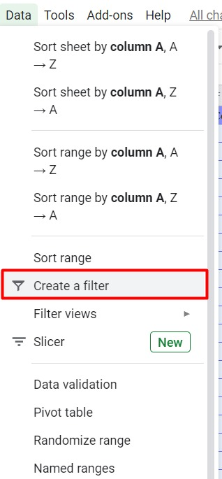
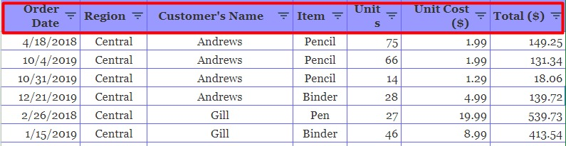
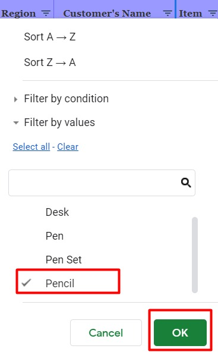
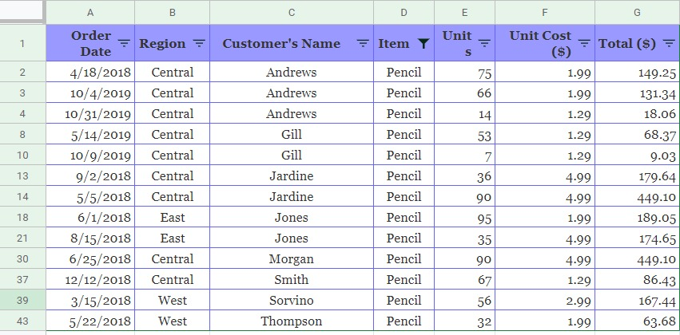

# Penyaringan Data

Pada sortir data kita hanya mengurutkan data berdasarkan kondisi yang ditentukan. Lalu, bagaimanakah cara untuk menampilkan siapa saja yang membeli produk pensil?  

Dari kondisi tersebut maka kita perlu menggunakan salah satu fitur spreadsheet yaitu penyaringan (filter). Untuk memperdalam pemahaman tentang penyaringan data, mari kita mulai penerapannya pada contoh data penjualan sebelumnya.

1. Pertama tentukan data apa yang ingin Anda ketahui. Misalnya kita ingin melihat dan menampilkan data pelanggan yang membeli pensil.
2. Sorot semua data dengan Ctrl + A, kemudian pilih menu Data - Create a filter.

3. Setelah itu Anda akan melihat ikon kecil di sebelah kanan kategori data.

4. Klik ikon kecil di samping kategori item dan centang pencil.

5. Setelah itu klik OK. Berikut inilah hasilnya:

