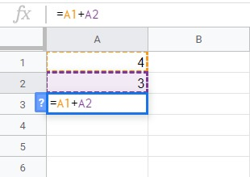

# Apa itu Formula?

Sebelum memulai pembahasan mengenai formula, ada baiknya kita menyegarkan ingatan tentang materi yang sudah dipelajari sebelumnya. Pada dasar spreadsheet kita telah belajar tentang navigasi hingga penyaringan data (filter). Namun, bagaimana jika kita ingin menganalisis data? Pasti dalam prosesnya tidak lepas dari perhitungan matematis dalam spreadsheet tersebut. Nah, di sinilah pentingnya formula yang dapat membantu kita dalam perhitungan tersebut mulai dari yang sederhana seperti penjumlahan, rata-rata hingga data yang kompleks.

Formula merupakan sebuah langkah atau rumus untuk melakukan perhitungan matematis sehingga mendapatkan nilai tertentu. Istilah formula sendiri sudah sangat umum ditemui dalam aplikasi spreadsheet seperti Microsoft Excel, LibreOffice Calc, dan Google Spreadsheet. Dengan formula kita akan terbantu dan lebih cepat menghitung data. Formula tidak hanya berjalan di antar sel dalam satu sheet saja. Namun, bisa berjalan di antar sel dalam sheet yang berbeda bahkan antar sel dalam berkas spreadsheet yang berbeda.

## Referensi Sel

Sebuah formula pasti merujuk pada sebuah alamat sel tertentu. Nah, rujukan alamat bisa disebut dengan referensi sel. Contoh sederhananya apabila kita ingin mengetahui jumlah nilai dari dua alamat sel, maka kita bisa menggunakan rumus penjumlahan sederhana seperti berikut.

Bagian A, B, C, dan seterusnya yang terbentang secara horizontal disebut kolom. Sedangkan 1, 2, dan 3 yang membentang vertikal disebut baris. Gambar di atas juga menjelaskan bahwa terdapat data pada sel A1 bernilai 4 dan sel A2 bernilai 3. Kemudian kita ingin mengetahui hasil penjumlahannya pada sel A3. Mulailah dengan tanda “=” diikuti dengan alamat sel A1 + A2. Sehingga menghasilkan nilai baru yaitu 7 pada sel A3.

Apabila nilai dari salah satu sel referensi sel A1 atau A2 diubah maka secara otomatis hasil penjumlahan di sel A3 juga berubah. Sehingga, jika kita merubah referensi sel, maka nilai yang tampil sebagai output di sel lain yang berisi rumus juga berubah. Berhati-hatilah dalam mengganti referensi sel yang berkaitan dengan rumus atau formula tertentu. Ini berlaku untuk semua penggunaan rumus yang ada di spreadsheet ya.

Dengan menggabungkan operator matematika dengan referensi sel, Anda dapat menerapkannya di rumus lainnya dalam Google Spreadsheet. Formula atau rumus juga dapat menyertakan kombinasi referensi sel dan angka, misalnya:

Penulisan rumus | Keterangan
--------------- | ----------
A1+A2 | Menjumlahkan alamat sel A1 dan A2
A1-A2 | Nilai pada sel A1 dikurangi dengan nilai pada sel A2
A1/2 | Nilai pada sel A1 dibagi dengan 2
A1*3 | Nilai pada sel A1 dikali dengan 3
A1^2 | Nilai pada sel A1 dipangkatkan 2