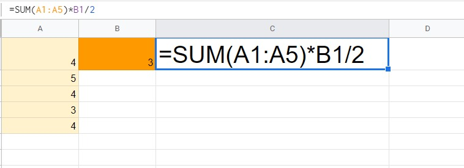

# Elemen Formula dalam Spreadsheet

Pernahkah Anda menulis sebuah fungsi sederhana dalam aplikasi spreadsheet? Pada materi sebelumnya kita sudah berkenalan dengan apa itu formula, referensi sel, dan operator yang biasanya digunakan dalam spreadsheet. Nah, kini saatnya mulai menulis formula. Tapi sebelum kita mulai menulis formula, ada baiknya kita mempelajari dulu elemen-elemen dalam sebuah formula.

Penulisan formula dalam spreadsheet diawali dengan tanda sama dengan “=”. Sedangkan untuk bagian-bagian dalam sebuah formula yaitu:

- Fungsi
- Referensi sel (single/range)
- Operator
- Konstanta

Untuk memperjelas setiap elemennya, langsung lihat penjabarannya berdasarkan gambar di bawah ini.

## Sama dengan (“=”)

Tanda sama dengan “=” merupakan elemen yang paling awal ditulis dalam sebuah formula apa pun sebelum lanjut ke elemen lainnya.

## Fungsi

Fungsi merupakan sebuah penamaan yang telah ditentukan untuk melakukan kalkulasi data berdasarkan susunan argumen dalam aplikasi spreadsheet. Misal, kita ingin menghitung rata-rata menggunakan fungsi AVERAGE, total data menggunakan fungsi SUM, dan lainnya yang akan dijelaskan lebih lanjut di materi berikutnya.

## Referensi Sel

Telah disinggung di penjelasan sebelumnya bahwa referensi sel merupakan acuan sebuah sel atau range dalam aplikasi spreadsheet, mulai dari sheet yang sama hingga berbeda berkas atau workbook. Pada contoh gambar di atas terdapat dua jenis referensi sel yaitu range yang ditunjukkan dengan (A1:A5) dan single sel yang ditunjukkan dengan alamat sel B1.

## Operator

Masih ingat apa itu operator dalam spreadsheet? Operator juga termasuk salah satu elemen dalam penulisan formula spreadsheet. Seperti yang dijelaskan pada materi sebelumnya, ada banyak jenis di dalam operator, yaitu seperti operator aritmatika, perbandingan, teks, dan referensi. Pada contoh gambar penulisan formula di atas menggunakan dua jenis operator yaitu operator aritmatika dan operator referensi. Operator aritmatika terdapat pada tanda pembagian (“/”) dan perkalian (“*”). Sedangkan operator referensi merujuk pada (A1:A5).

## Konstanta

Konstanta merupakan nilai masukan yang bukan berasal dari perhitungan karena nilainya selalu sama dan tidak pernah berubah. Bentuk dari konstanta bisa berupa teks atau angka, misalnya dalam contoh di atas konstanta ditunjukkan dengan angka 2.