# Fungsi Dasar dalam Spreadsheet

Setelah kita mengetahui tentang elemen yang terdapat dalam formula spreadsheet, saatnya kita belajar tentang macam-macam formula dan juga cara penulisannya. Sebelumnya buat contoh data sederhana berisi angka sebagai berikut:

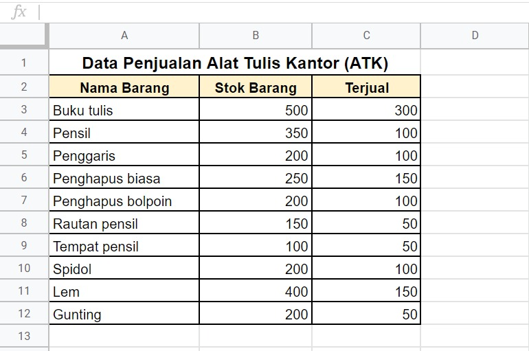

Berdasarkan contoh di atas kita akan menerapkan fungsi dasar spreadsheet. Berikut uraian lengkapnya.

## SUM

Kita sering menemui rumus ini dalam spreadsheet. Rumus SUM dapat membantu untuk mendapatkan nilai total dari rentang sel yang dipilih. Penggunaannya dengan cara menyorot semua baris atau kolom yang ingin diketahui jumlahnya. Penulisannya sebagai berikut:

```
=SUM(data ke-1, data ke-2, …. , data ke-n) 
```

Contoh kasus:

Bagaimana cara mengetahui total semua stok dan barang yang yang terjual berdasarkan data penjualan ATK di atas?

Pertama kita menghitung total dari stok barang dengan rumus =SUM(B3:B12). Sehingga sel yang dihitung mulai dari B3 hingga B12 menghasilkan nilai 2550.

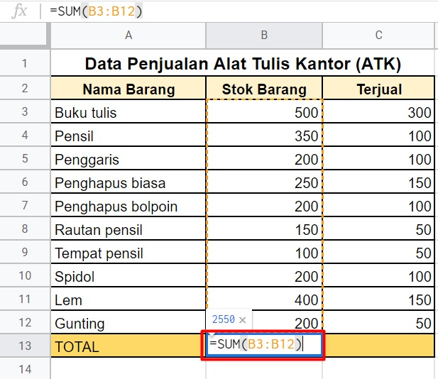

Selanjutnya kita hitung jumlah barang yang terjual. Masih menggunakan rumus fungsi yang sama yaitu =SUM(C3:C12)sehingga sel yang dihitung mulai dari C3 hingga C12 menghasilkan nilai 1150.

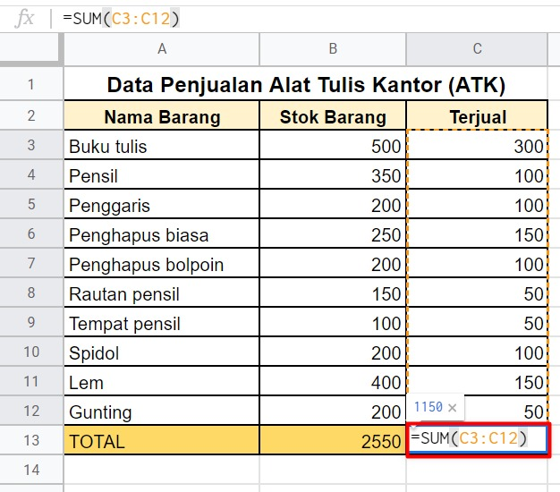

Berdasarkan perhitungan kita dapat mengetahui total stok barang adalah 2550 unit dan total barang yang terjual adalah 1150 unit.

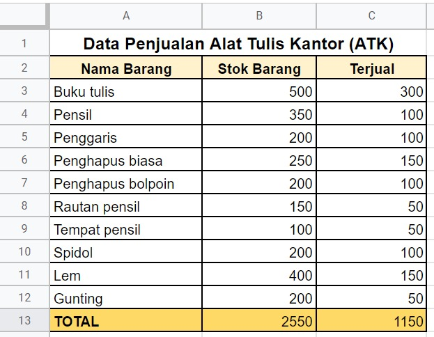

## SUMIF

Selanjutnya kita membahas fungsi SUMIF. Fungsi ini berbeda dari SUM yang biasa karena SUMIF ini berfungsi untuk menjumlahkan data dengan kriteria tertentu. Penulisan fungsi dari SUMIF sebagai berikut:

```
=SUMIF(range,”kriteria”,sum_range)
```

Contoh kasus

Kita akan menggunakan contoh data di bawah ini:

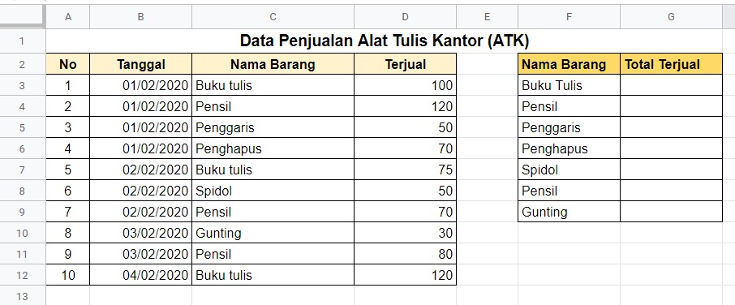

Misalnya, kita ingin mengetahui berapa total buku tulis berdasarkan data di atas?

Jawab:

Berdasarkan contoh tabel data di atas, kita dapat menuliskan rumus SUMIF pada sel G3 sebagai berikut:

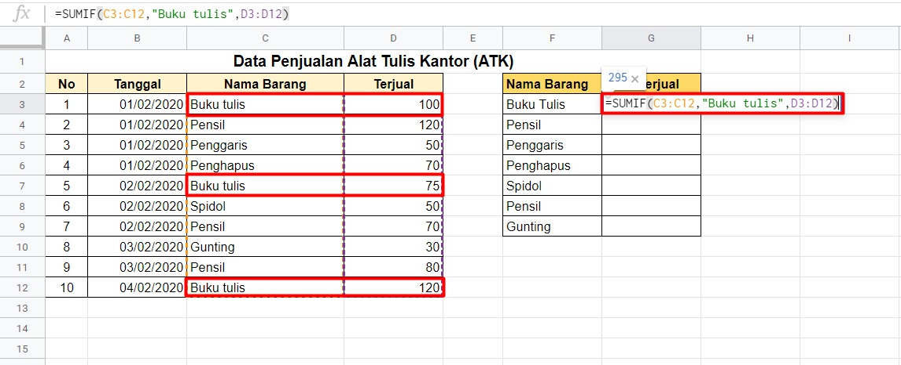

Pada rumus di atas, range diisi dengan sel C3 sampai C12 yang merupakan kumpulan nama barang yang terjual dari tanggal 01 Februari 2020 sampai 04 Februari 2020. Kemudian kriteria diisi dengan nama barang yang ingin dicari jumlahnya dan dalam contoh ini menggunakan “Buku tulis”. Kriteria dapat diisi dengan teks, angka, ataupun ekspresi. Sedangkan sum_range diisi dengan sel-sel yang ingin dijumlahkan datanya yang ditunjukkan pada sel D3 sampai D12. Sehingga menghasilkan total buku tulis yang terjual adalah 295 unit.

## SUMIFS

Kemudian ada lagi fungsi yang bernama SUMIFS. Tahukah Anda perbedaan antara SUMIF dan SUMIFS? Secara penggunaan sama yaitu untuk menjumlahkan data dengan kriteria tertentu. Apabila SUMIF hanya bisa menggunakan satu kriteria saja, pada SUMIFS kita bisa menggunakan lebih dari satu kriteria. Penulisannya sebagai berikut:

```
=SUMIFS(sum_range, kriteria_range1, “kriteria1”, kriteria_range2, “kriteria2”, dan seterusnya)
```

Contoh kasus:

Masih menggunakan contoh data di bawah ini:


Kali ini kita ingin mengetahui berapa total buku tulis yang terjual dari tanggal 01 Februari 2020 sampai 02 Februari 2020?

Jawab:

Berdasarkan contoh tabel data di atas, kita dapat menuliskan rumus SUMIF pada sel G3 sebagai berikut:

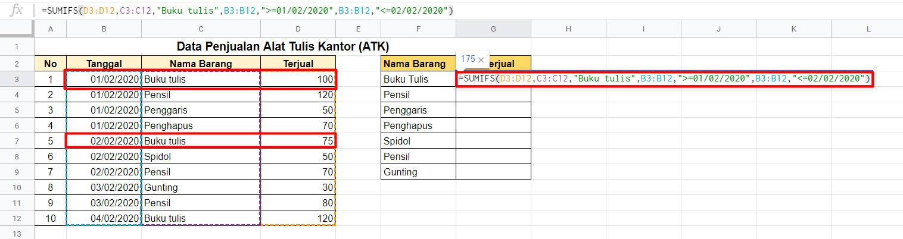

```
=SUMIFS(D3:D12,C3:C12,"Buku tulis",B3:B12,">=01/02/2020",B3:B12,"<=02/02/2020")
```

Pada contoh penjelasan gambar dan rumus di atas, sum_range diisi dengan sel sel yang ingin dijumlahkan datanya. Kriteria_range1 berisi nama barang yang ditunjukkan oleh sel C3 sampai C12. Kriteria1 yang ingin kita cari adalah Buku tulis dan Kriteria2 yang kita cari adalah buku tulis yang terjual pada atau setelah tanggal 01 Februari 2020 dan yang terjual pada atau sebelum tanggal 02 Februari 2020. Sehingga buku tulis yang terjual sejumlah 175 unit.

## AVERAGE

Masing ingatkah Anda dengan rata-rata aritmatika? Fungsi AVERAGE sama dengan rata-rata aritmatika yang menjumlahkan semua data kemudian dibagi dengan jumlah data yang ada. Penggunaannya hampir sama dengan rumus SUM yaitu sebagai berikut:

```
=AVERAGE(data ke-1, data ke-2, … , data ke-n)
```

Contoh kasus:

Bagaimana jika kita ingin mengetahui berapa rata-rata dari semua barang yang terjual dalam tabel data penjualan ATK?

Kita dapat menghitung rata-rata jumlah semua barang yang terjual dengan rumus =AVERAGE(C3:C12)sehingga sel yang dihitung mulai dari C3 hingga C12 menghasilkan nilai 115.


Berdasarkan perhitungan kita dapat mengetahui rata-rata dari semua barang yang terjual adalah 115 unit.

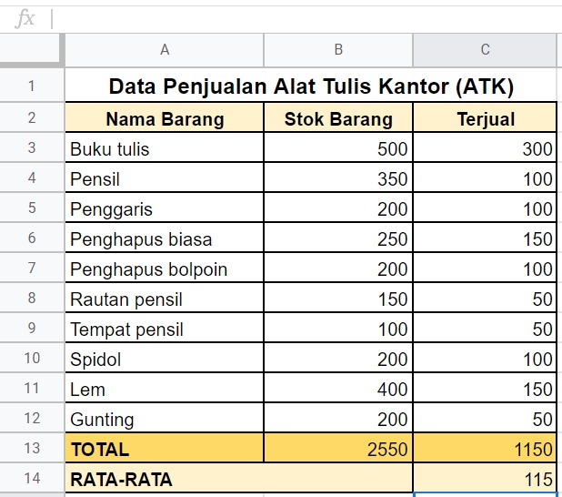

## COUNT

Count merupakan fungsi yang dapat menghitung jumlah sel terpilih dalam rentang tertentu yang berisi nilai numerik. Penggunaan fungsi COUNT sebagai berikut:

```
=COUNT(data ke-1, data ke-2, … , data ke-n)
```

Contoh kasus:

Dalam contoh penggunaan COUNT, kita modifikasi sedikit tabel data penjualan ATK untuk memperjelas penggunaan fungsi ini. Contoh perubahannya sebagai berikut:

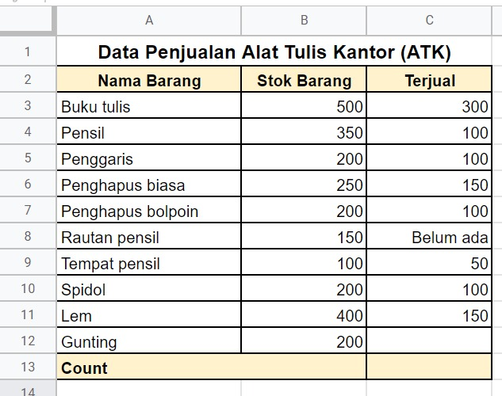

Pertanyaannya adalah bagaimana kita mengetahui jumlah produk yang berhasil terjual berdasarkan kolom terjual?

Kita mulai dengan menuliskankan rumus =COUNT(C3:C12) pada sel C13. Lebih jelasnya bisa dilihat pada gambar di bawah ini.

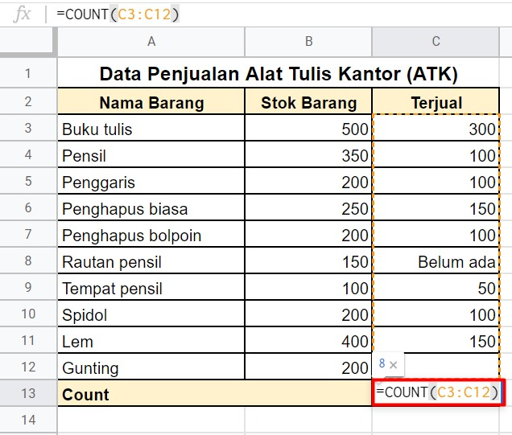

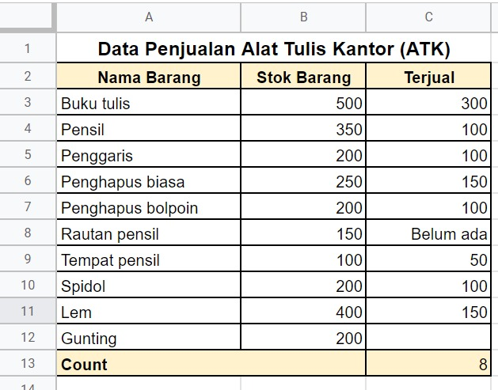

Berdasarkan perhitungan di atas kita dapat mengetahui barang yang berhasil terjual ada 8 jenis. Apakah Anda tahu kenapa hasilnya 8? 

Pada fungsi COUNT hanya menghitung nilai numerik (hanya angka saja) sehingga data yang berupa non-numerik dan sel kosong akan dilewati.

## COUNTA

Sama seperti COUNT, COUNTA dapat menghitung jumlah sel terpilih dalam rentang tertentu. Namun bedanya dalam COUNTA kita dapat menghitung semua sel yang terpilih, tak peduli apa pun jenis data yang ada di dalamnya (angka, teks, tanggal, kondisi benar atau salah, hingga kesalahan perhitungan). Tetapi terdapat satu yang dilewati dalam perhitungan COUNTA yaitu sel yang kosong. Penggunaan rumus COUNTA sebagai berikut:

```
=COUNTA(data ke-1, data ke-2, … , data ke-n)
```

Contoh kasus:

Pada contoh kasus ini kita masih menggunakan tabel sebelumnya yang digunakan untuk fungsi COUNTA.

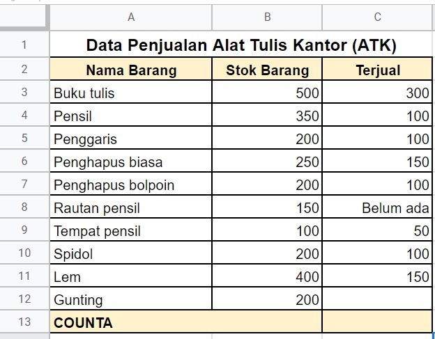

Pertanyaannya adalah bagaimana kita mengetahui berapa jenis barang yang terjual berdasarkan kolom terjual? (termasuk yang belum terjual dan sel tidak kosong).

Kita lakukan hal yang sama seperti fungsi sebelumnya, namun di sini menggunakan rumus =COUNTA(C3:C12) pada sel C13. Untuk lebih jelasnya lihatlah gambar di bawah ini.

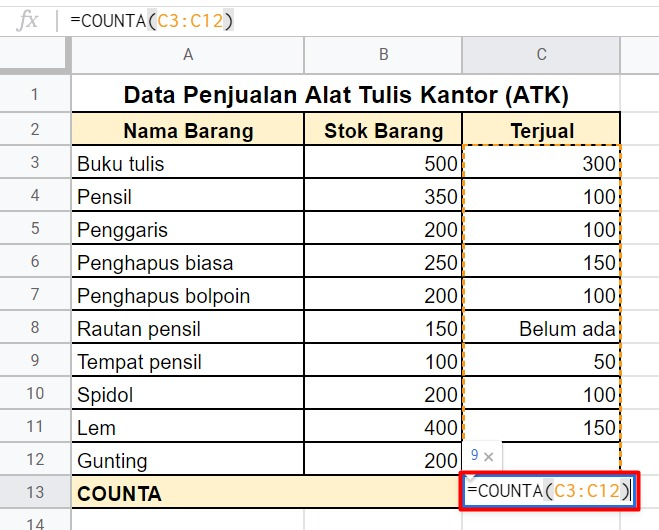

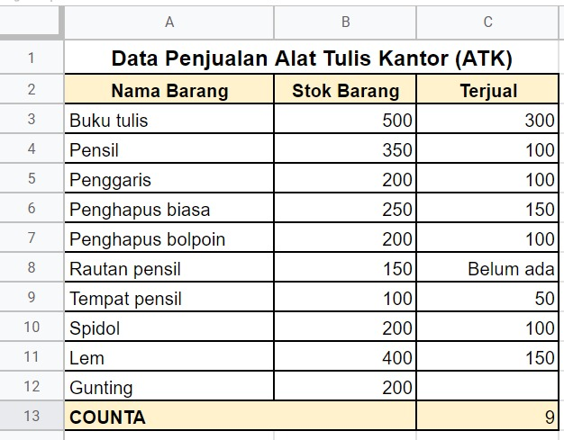

Berdasarkan gambar di atas, COUNTA dari data terjual adalah 9 karena menghitung semua jenis data hanya melewati sel yang kosong saja.

## COUNTIF dan COUNTIFS

Tahukah Anda apa fungsi dari COUNTIF? COUNTIF sering digunakan untuk menghitung banyaknya data pada kumpulan sel dengan kriteria tertentu. Sistematika penulisannya sebagai berikut:

```
=COUNTIF(range,kriteria)
```
- Range : Data COUNTIF yang dihitung.
- Kriteria : Kondisi tertentu yang diinginkan untuk diketahui. Bisa berisi teks, operasi logika, ataupun angka.

Sedangkan COUNTIFS berfungsi untuk menghitung banyaknya data pada kumpulan sel berdasarkan kriteria (lebih dari satu). Sistematika penulisannya sebagai berikut:

```
=COUNTIFS(kriteria_range1,kriteria1, kriteria_range2, kriteria2, dan seterusnya)
```
- Kriteria_range1 : range pertama yang dihitung jumlah datanya.
- Kriteria1 adalah kondisi tertentu yang diinginkan untuk diketahui.
- Kriteria_range2,kriteria2 adalah kriteria atau kondisi berikutnya yang ingin diketahui.

Contoh kasus:

Kita akan menggunakan contoh tabel berikut:

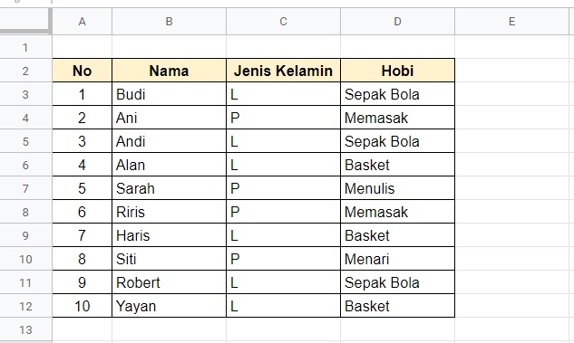

Berdasarkan tabel di atas, kita ingin mengetahui:

    Berapa orang yang berjenis kelamin laki-laki?
    Berapa orang yang berjenis kelamin laki-laki dan hobi bermain sepak bola?

Jawab:

Untuk mengetahui berapa orang yang berjenis kelamin laki-laki, kita dapat menggunakan fungsi COUNTIF seperti berikut:

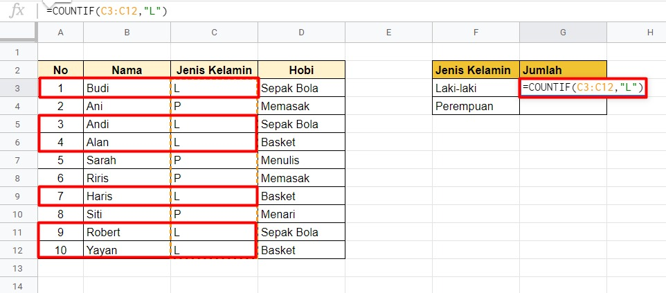

Penulisan fungsi yang digunakan =COUNTIF(C3:C12,"L")

Sedangkan untuk mengetahui berapa orang yang berjenis kelamin laki-laki dan memiliki hobi sepak bola, kita dapat menggunakan fungsi COUNTIFS seperti berikut:

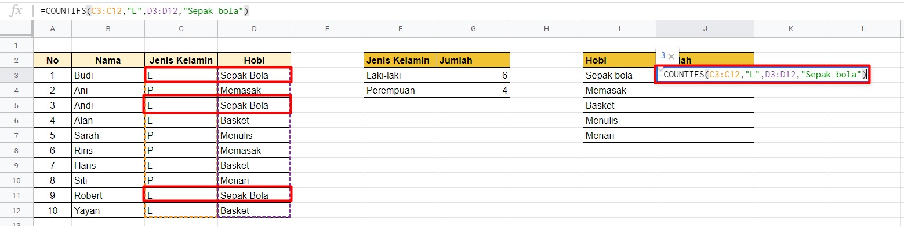

Penulisan fungsi yang digunakan =COUNTIFS(C3:C12,"L",D3:D12,"Sepak bola")
