# Fungsi Dasar dalam Spreadsheet (Lanjutan)

Berikut ini adalah lanjutan dari materi sebelumnya tentang fungsi dasar dalam spreadsheet.

## Min dan Max

Apakah Anda pernah menggunakan fungsi min max sebelumnya? Kedua fungsi ini berguna untuk menentukan nilai terendah (MIN) dan tertinggi (MAX) dari suatu rentang data yang terpilih. Contoh penggunaan rumus min max seperti berikut:

```
=MIN(data ke-1, data ke-2, …, data ke-n)
=MAX(data ke-1, data ke-2, …, data ke-n)
```

Contoh kasus:

Kita kembali menggunakan tabel data penjualan ATK di bawah ini untuk menerapkan contoh kasus penggunaan Min Max.


Nah berdasarkan tabel di atas, apa yang kita lakukan jika ingin mengetahui barang apa yang paling banyak dan paling sedikit terjual?

1. Pertama, untuk mengetahui barang apa yang paling banyak terjual gunakan rumus =MAX(C3:C12).

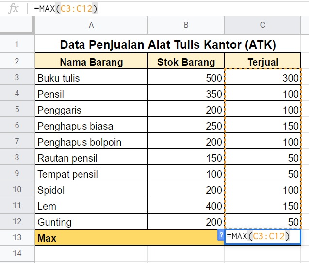

Rumus MAX di atas memilih rentang data mulai dari C3 hingga C12. Sehingga dapat disimpulkan bahwa barang yang terjual paling banyak adalah buku tulis sejumlah 300 penjualan.

2. Selanjutnya untuk mengetahui barang apa yang paling rendah penjualannya,  carilah nilai minimal. Rumus yang dapat diterapkan adalah =MIN(C3:C12).
    
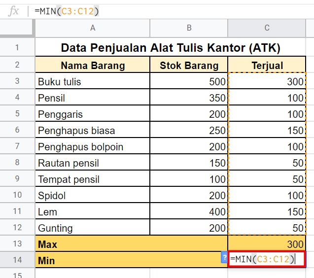

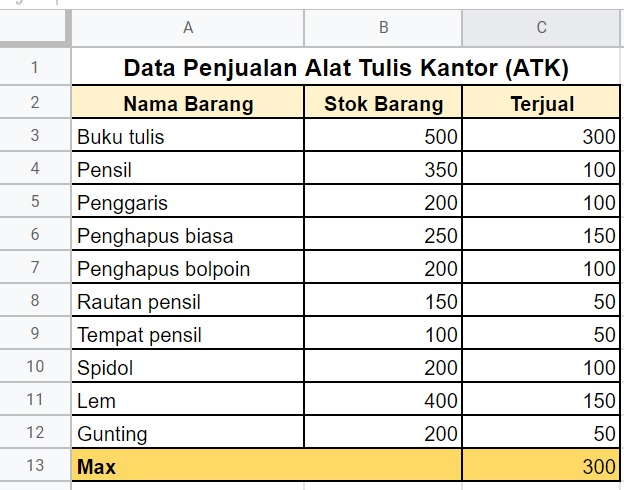

Rumus MIN di atas memilih rentang data mulai dari C3 hingga C12. Kesimpulannya, barang yang terjual lebih sedikit dibanding yang lain adalah rautan pensil, tempat pensil, dan gunting dengan jumlah masing-masing sebanyak 50 penjualan.

## Trim

Selanjutnya fungsi TRIM digunakan untuk menghilangkan ruang kosong yang tidak dibutuhkan pada sebuah teks. Fungsi ini hanya berjalan pada sel tunggal bukan rentang sel. Penggunaan rumusnya adalah sebagai berikut:

```
=TRIM(teks)
```

Contoh kasus:

Untuk menerapkan fungsi TRIM, kita gunakan contoh kasus dengan data seperti berikut:

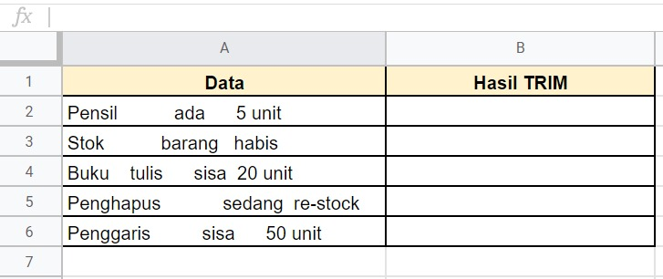

Terlihat pada contoh di atas bahwa data yang ada terlalu banyak spasi dan tidak rapi. Di sinilah kegunaan fungsi TRIM. Terapkan rumus =TRIM(A2) pada sel B2 sebagai berikut:

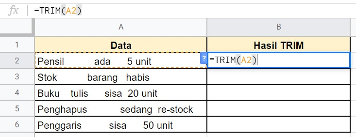

Hasilnya setelah menggunakan fungsi TRIM, data yang dihasilkan pun menjadi  lebih rapi. Tampilan akhirnya sebagai berikut:

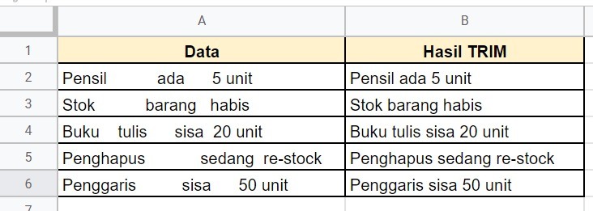

## Replace

Selanjutnya terdapat fungsi Replace. Tahukah Anda apakah fungsi Replace dalam spreadsheet? Replace dapat digunakan untuk mengganti string baik berupa angka maupun teks biasa. Sistematika penulisan Replace sebagai berikut:

```
=REPLACE(text, position, length, new_text)
```

Contoh kasus:

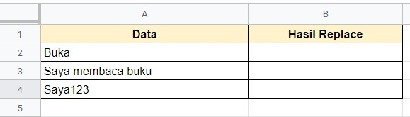

Pada contoh data di atas, terdapat 3 data yang ingin kita ganti, yaitu:

- Buka diganti menjadi Buku
- Saya membaca buku diganti menjadi Saya menulis buku
- Saya123 diganti menjadi Aku123

1. Untuk contoh pertama kita menerapkan fungsi sebagai berikut pada sel B2

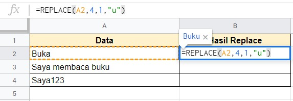

Berikut penjelasannya sesuai sistematika penulisannya:

- Text : Dapat diisi dengan teks secara langsung atau alamat sel. Dalam contoh di atas menggunakan alamat sel A2.

- Position : Posisi atau urutan dari huruf yang ingin diganti. Dalam hal ini huruf “a” yang ingin kita ganti berada diurutan ke 4 dari kata “Buka”

- Length : Panjang karakter yang ingin kita ganti. Karena yang ingin kita ganti hanya huruf “a” saja berarti kita isi dengan 1.

- New_text : Teks baru yang ingin kita gunakan untuk mengganti teks lama, bisa berupa angka atau huruf. Dalam contoh di atas kita menggunakan huruf “u” sebagai teks baru supaya kata “Buka” bisa berganti menjadi “Buku”.

2. Contoh selanjutnya kita ingin mengganti kalimat “Saya membaca buku” menjadi “Saya menulis buku”.

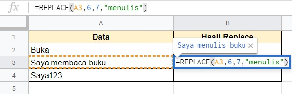

Berikut penjelasannya sesuai sistematika penulisannya:

- Text : Dapat diisi dengan teks secara langsung atau alamat sel. Dalam contoh di atas menggunakan alamat sel A3.

- Position : Posisi atau urutan dari huruf yang ingin diganti. Dalam hal ini kata “membaca” yang ingin kita ganti berada diurutan ke 6 dengan spasi terhitung satu karakter.

- Length : Panjang karakter yang ingin kita ganti. Karena yang ingin kita ganti kata  “membaca” berarti kita isi dengan 7.

- New_text : Teks baru yang ingin kita gunakan untuk mengganti teks lama, bisa berupa angka, huruf, dan kalimat. Dalam contoh di atas kita menggunakan kata “menulis” sebagai teks baru supaya kata “membaca” bisa berganti menjadi “menulis”.

3. Kemudian kita ingin mengganti kalimat “Saya123” menjadi “Aku123”.

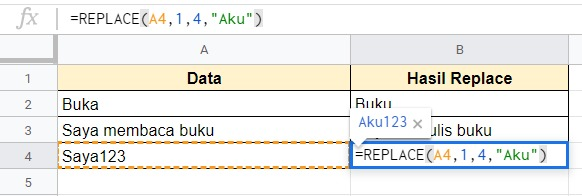

Berikut penjelasannya sesuai sistematika penulisannya:

- Text : Dapat diisi dengan teks secara langsung atau alamat sel. Dalam contoh di atas menggunakan alamat sel A4.

- Position : Posisi atau urutan dari huruf yang ingin diganti. Dalam hal ini dari kata “Saya123” hanya diganti bagian “Saya” saja. Sehingga urutan karakternya diisi dengan 1.

- Length : Panjang karakter yang ingin kita ganti. Karena yang ingin kita ganti kata  “Saya” berarti kita isi dengan 4.

- New_text : Teks baru yang ingin kita gunakan untuk mengganti teks lama, bisa berupa angka, huruf, dan kalimat. Dalam contoh di atas kita menggunakan kata “Aku”

Sehingga hasil akhirnya sebagai berikut:

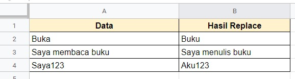

## Unique

Unique merupakan sebuah fungsi yang dapat kita gunakan untuk mencari data yang unik dari sebuah data yang mungkin saja ada yang sama. Sistematika penulisannya sebagai berikut:

```
=UNIQUE(range)
```

Contoh kasus:

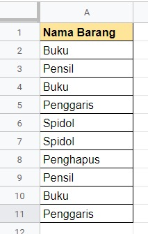

Bagaimanakah jika kita ingin mengambil data yang unik saja dari data di atas?

Jawab:

Kita dapat menggunakan fungsi UNIQUE seperti di bawah ini:

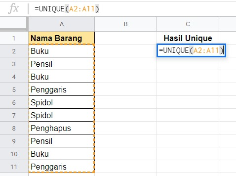

Secara otomatis setelah fungsi dijalankan hasilnya akan memunculkan daftar unik dari nama barang. Unik dalam artian tidak ada data yang sama seperti gambar di bawah ini:

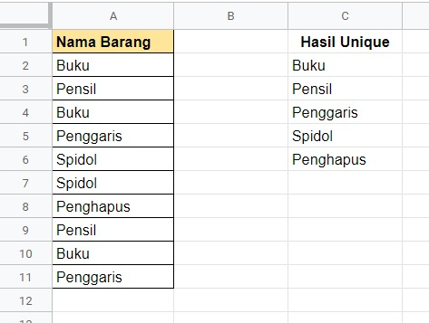

## IF

Fungsi IF digunakan untuk menentukan data Anda dengan hasil tertentu berdasarkan kondisi logika yang diberikan. Penggunaannya sebagai berikut:

```
=IF(Sel yang ingin diuji, [nilai jika benar], [nilai jika salah])
```

Contoh:

```
= IF (E4>=E3, “Ya”,”Salah”)
```

Berdasarkan contoh di atas, kita akan memeriksa apakah nilai pada sel E4 lebih besar sama dengan sel E3. Jika logikanya benar, biarkan nilai sel tempat fungsi tersebut menjadi bernilai “Ya”, jika tidak maka bernilai “Salah”.

## IF Sederhana

Untuk menerapkan fungsi IF dalam contoh kasus, kita modifikasi contoh tabel Penjualan data seperti berikut:

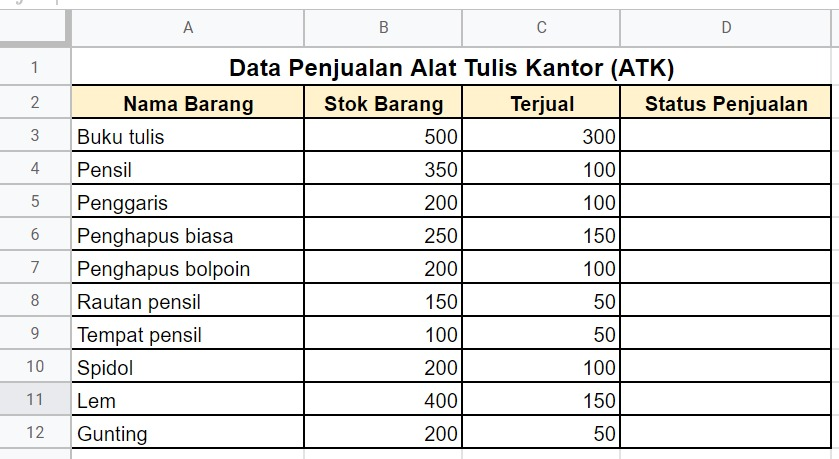

Contoh kasus:

Kita ingin mengetahui status penjualan setiap barang: sudah bagus atau perlu ditingkatkan. Parameter untuk menentukan status tersebut adalah jika barang yang terjual lebih dari 75 unit maka masuk kategori penjualan bagus. Namun jika kurang dari 75 unit yang terjual maka statusnya perlu ditingkatkan. Bagaimana cara mengetahuinya?

Pada alamat sel D3 masukkan rumus =IF(C3>75,"Bagus","Perlu ditingkatkan"). Fungsi tersebut memeriksa sel C3 yang berisi nilai 300 - apakah lebih besar dari angka standar yang ditentukan yaitu 75. Jika ya, maka masuk ke kategori bagus, kalau lebih kecil masuk ke kondisi perlu ditingkatkan.

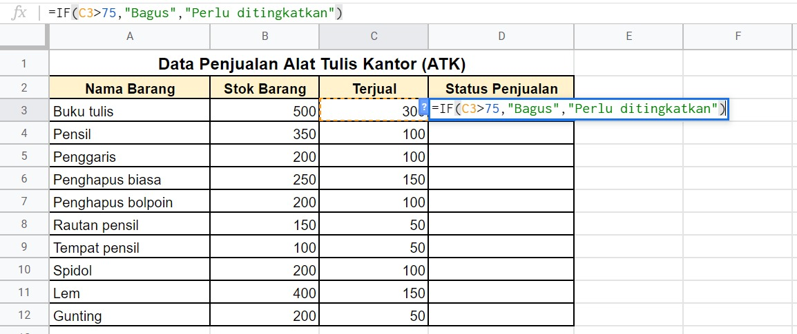

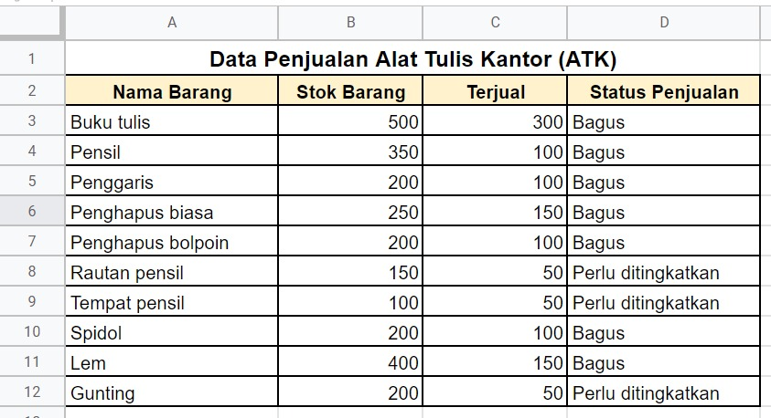

## IF Bertingkat

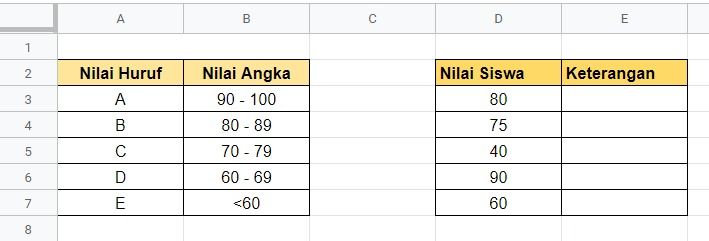

Terdapat 5 nilai siswa dalam sebuah ulangan matematika. Bagaima caranya jika kita ingin mengetahui nilai huruf dari kelima siswa tersebut?

Jawab:

Kita dapat menggunakan IF bertingkat pada alamat sel E3 seperti berikut:

    =IF(D3>=90,"A",IF(D3>=80,"B",IF(D3>=70,"C",IF(D3>=60,"D","E"))))

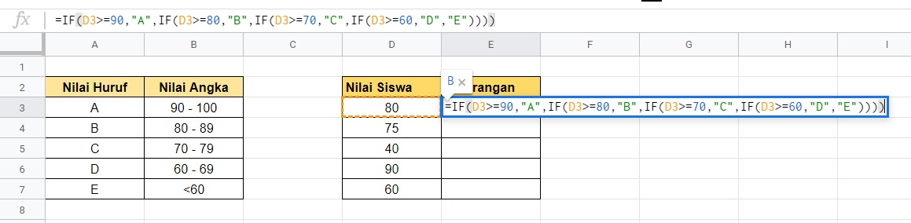

Pada tabel di atas terdapat empat logika IF. IF pertama digunakan jika nilai lebih dari sama dengan 90 mendapat A. Disambung dengan IF kedua jika nilai lebih dari sama dengan 80 mendapat B. Selanjutnya jika nilai lebih besar sama dengan 70 mendapat nilai C. Terakhir jika nilai lebih dari sama dengan 60 maka mendapat nilai D. Jika tidak memenuhi kondisi di atas berarti otomatis mendapat nilai E karena di bawah 60. Jangan lupa tutup kurung sebanyak jumlah IF pada akhir fungsi. Sehingga seluruh hasilnya sebagai berikut:

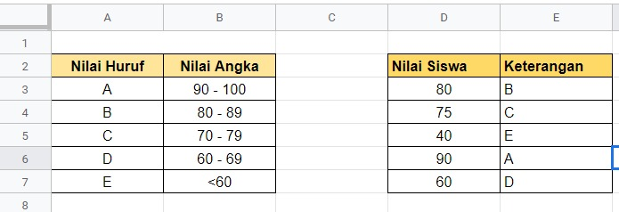


