# Apa itu Pivot Table?

Untuk membantu menjelaskan pivot dalam spreadsheet, berikut akan gambarannya lewat contoh data harga indekos per bulan.

Menurut Anda, bagaimana jika kita ingin mengetahui berapa jumlah indekos putra dan total harga per bulannya? Mungkin Anda pernah menggunakan fungsi COUNTIF (menghitung jumlah data berupa teks dengan parameter tertentu) dan SUMIF (menjumlahkan data berupa angka sehingga diketahui jumlah keseluruhannya) untuk menyelesaikan permasalahan tersebut. 

Namun, bagaimana jika contoh kasusnya diganti dengan berapa jumlah indekos putri dan total harga per bulannya? Pasti Anda akan mengganti rumus tersebut dan terkesan kurang praktis dan efisien. Nah, **di sinilah waktunya kita menggunakan pivot agar lebih fleksibel dalam mengetahui sebuah kelompok data yang diinginkan**. Cukup dengan beberapa klik, kita bisa mengetahui hasilnya sebagai berikut:

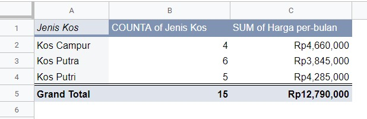

Berdasarkan contoh di atas kita dapat mengetahui jumlah dan harga indekos per bulan berdasarkan jenisnya. Dengan ini bisa disimpulkan bahwa pivot table dapat bantu mengumpulkan dan mengelompokkan data berdasarkan parameter tertentu sesuai kebutuhan. Sebelum membuat pivot, pastikan data Anda sudah rapi atau bisa dirapikan dulu baik dari kategori, nilai, dan sebagainya.

## Membuat Pivot Table dari Data Sederhana

Sudah coba membuat pivot table dengan contoh data di atas? Jika belum yuk kita belajar bersama membuat pivot tabel sederhana dengan contoh data di bawah ini:

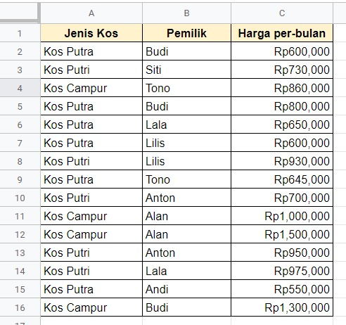

Contoh data di atas merupakan modifikasi dari tabel sebelumnya dengan menambahkan nama pemilik. Penerapan pivot table pun jadi lebih detail. Untuk memulai, simak langkah-langkahnya di bawah ini ya.

1. Pertama pastikan Anda sudah membuat tabel data seperti contoh di atas, kemudian sorot semua data.

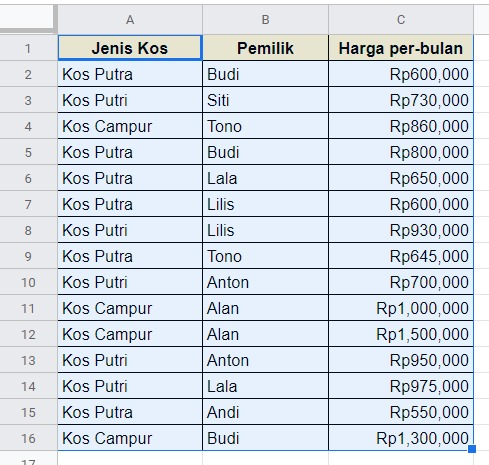

2. Setelah itu pilih menu Data - Pivot table.

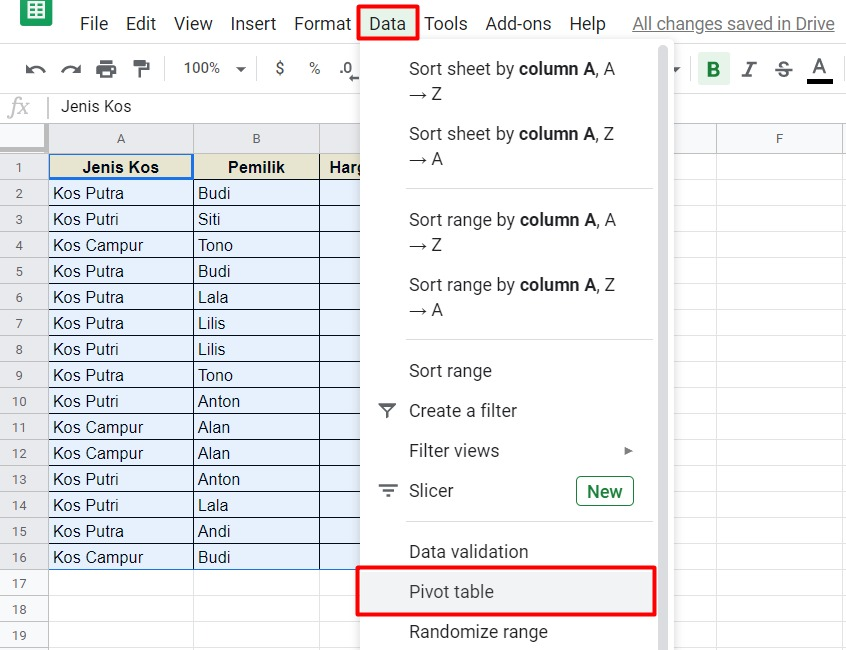

3. Muncul jendela baru Create pivot table. Pilih New Sheet supaya data hasil pivot dibuat pada sheet lain sehingga tidak bercampur dengan data asal. Namun, jika Anda menghendaki hasil pivot diletakkan dalam sheet yang sama maka pilih Existing sheet. Setelah itu klik Create.

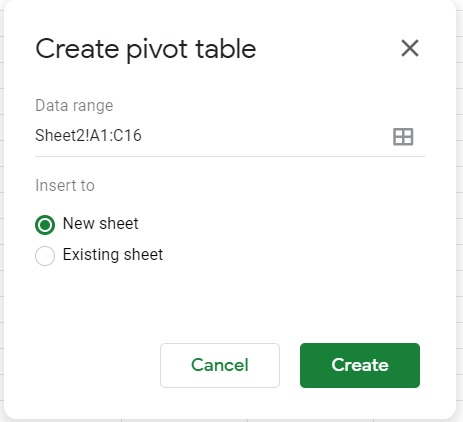

4. Setelah itu muncul sheet baru dengan isi Row, Column, dan Values. Serta di samping kanan terdapat Pivot table editor seperti di bawah ini.

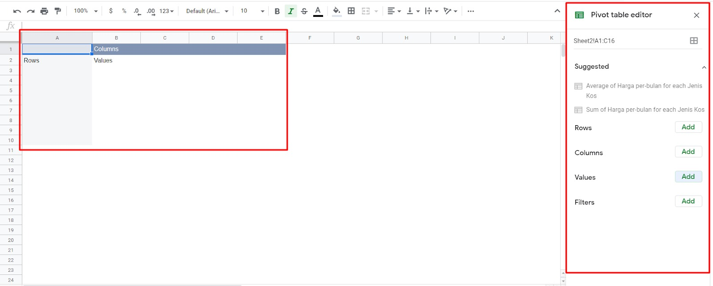

5. Selanjutnya kita tentukan data apa yang ingin dikelompokkan dengan pivot table. Misal, kita ingin melihat setiap pemilik mengelola beberapa jenis tempat indekos.

6. Dari kondisi di atas, kita coba masukkan ke dalam pivot table editor. Untuk menambahkan nama pemilik indekos, kita dapat memasukkannya ke dalam Rows dengan klik tombol Add dan pilih Pemilik.

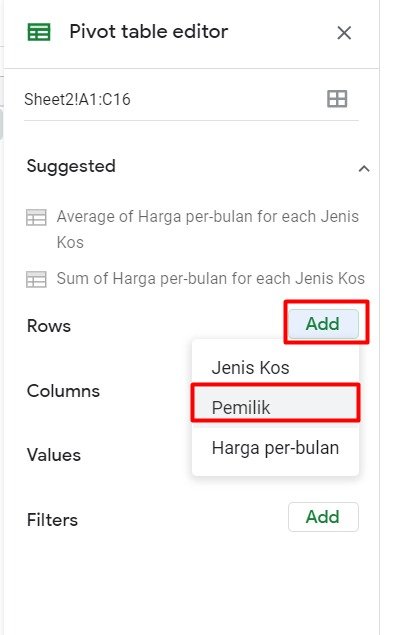

7. Hasil yang didapatkan dari langkah tersebut adalah menampilkan baris nama pemilik seperti di bawah ini.

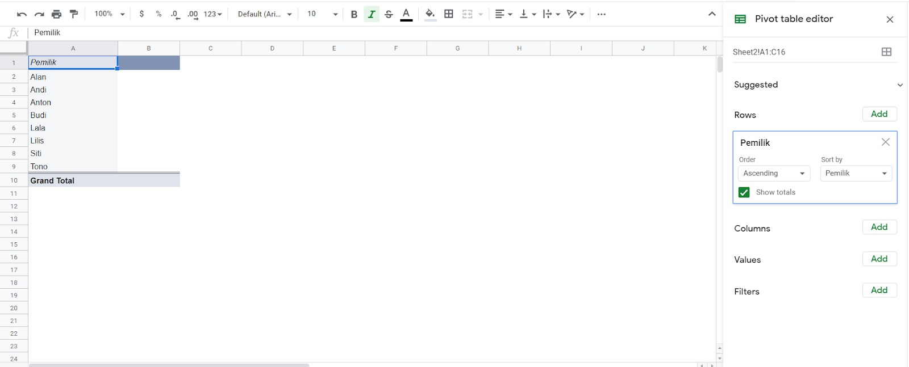

8. Selanjutnya kita ingin mengetahui jenis indekos yang ada. Anda dapat mulai menambahkan kolom baru pada Pivot table editor dengan klik Add - pilih Jenis Kos.

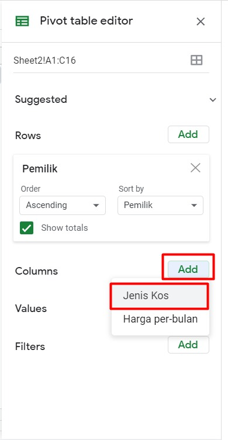

9. Hasil yang didapatkan setelah menambah kolom jenis indekos pada pivot table editor adalah menampilkan jenis indekos yang ada dalam bentuk kolom seperti berikut:

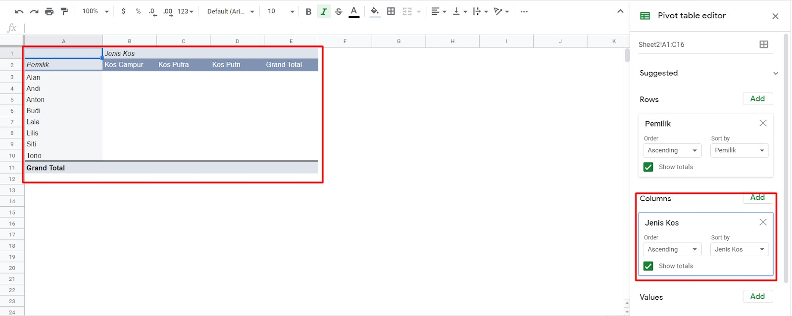

10. Kemudian untuk mengetahui berapa jumlah indekos yang dikelola setiap pemiliknya, pada Pivot table editor bagian value, klik Add - pilih Jenis Kos.

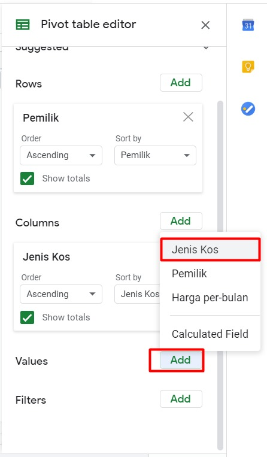

11. Nah, saat ini kita telah mengetahui setiap pemilik mengelola berapa jenis indekos dari data yang telah dikelompokkan di bawah ini.

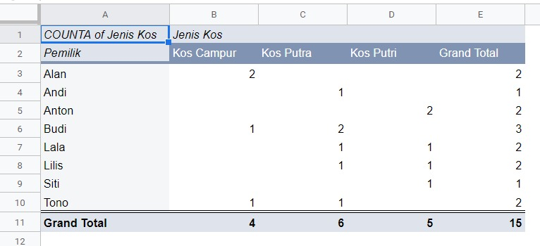

Berdasarkan hasil pivot table di atas kita telah berhasil mengetahui setiap pemilik mengelola berapa jenis indekos. Misal, Alan memiliki 2 indekos berjenis campur, Budi memiliki 1 indekos campur dan 2 indekos putra, dan lain seterusnya. Yay, kita telah berhasil membuat pivot table. Selanjutnya kita akan melanjutkan pembahasan mengenai elemen setiap pivot table. Yuk, lanjut ke materi berikutnya.