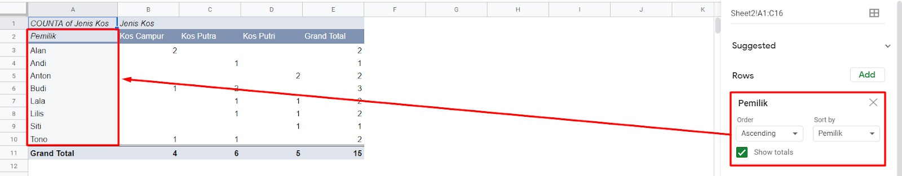
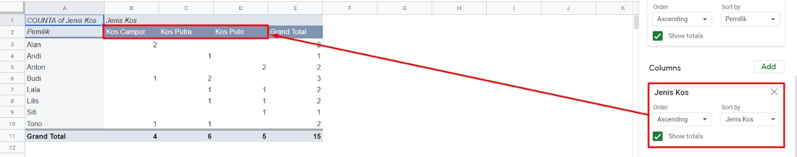
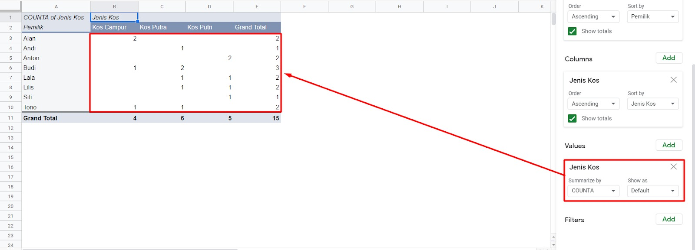
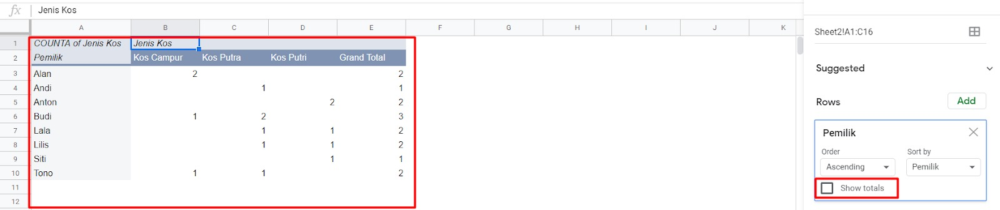
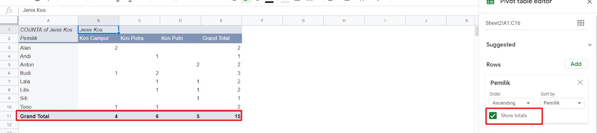
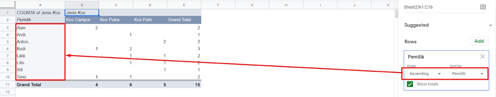
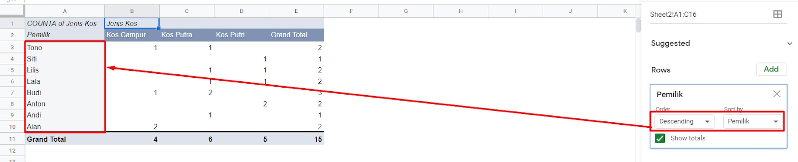

# Elemen Pivot Tabel

Bicara mengenai pivot table, erat kaitannya dengan kolom, baris, dan nilai (value). Seperti yang telah kita lakukan pada materi sebelumnya, hasil pivot tersebut pasti mengandung ketiga elemen tadi yaitu kolom, baris, dan nilai. Mari kita bedah satu per satu setiap elemennya.

## Baris

Elemen pertama yang akan kita bahas adalah baris. Pada saat klik tombol Add pada bagian Rows di Pivot table editor, secara otomatis sistem akan memberikan Anda pilihan nama judul dari setiap kolom yang Anda buat. Ketika kita memilih salah satu, misalnya “pemilik,” sistem akan menampilkan data nama pemilik yang ada secara unik. Unik di sini menjelaskan bahwa jika terdapat nama pemilik yang sama, seperti “Budi” yang disebut 2 kali, maka yang tampil dalam pivot hanya satu saja.

## Kolom

Sama seperti membuat baris data berdasarkan nama judul dari setiap tabel secara mendatar dalam bentuk kolom sehingga nantinya data nilai tampil dalam bentuk agregat setiap kolom.

## Nilai (Value)

Ketika kita menekan tombol Add pada bagian Values, sistem akan menyuguhkan pilihan yang sama seperti pada baris dan kolom. Misal pilihannya ada pemilik, jenis indekos, dan harga per bulan. Nah, jika kita mengisinya dengan jenis indekos dan fungsi penghitungnya menggunakan COUNTA, maka semua data yang ada berdasarkan jenis indekos akan dihitung dan disesuaikan dengan nama pemilik indekos. Misalnya gambar di atas menunjukkan nama pemilik Alan memiliki nilai 2 indekos yang ia kelola dan berjenis campur. Begitu pula data jenis indekos lainnya. Jumlah yang ditampilkan berdasarkan nama pemilik indekos masing-masing.

## Total

Pada saat membuat pivot pada baris atau kolom, di bagian bawah terdapat show totals yang dapat dicentang atau tidak. Jika dicentang maka tabel akan menampilkan grand total, dan sebaliknya.

## Penyaringan

Setiap baris dan kolom memiliki sistem pengurutan berdasarkan parameter masing-masing. Misal pada baris pemilik terdapat pengaturan untuk mengurutkan datanya secara ascending (naik) atau descending (turun) berdasarkan abjad awal dari setiap nama pemilik. Misalkan seperti berikut:

