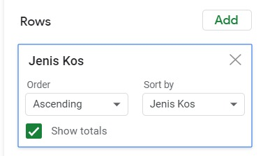
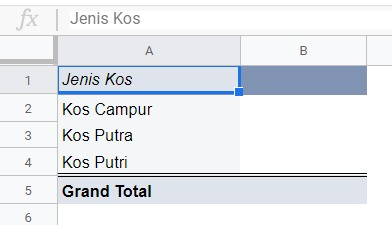
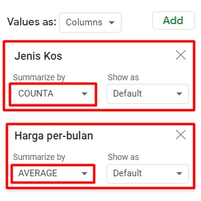
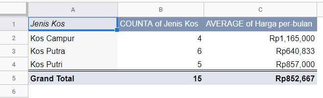
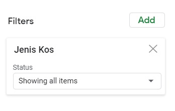
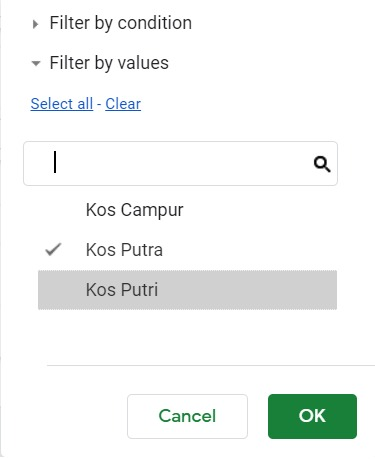
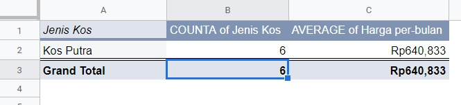
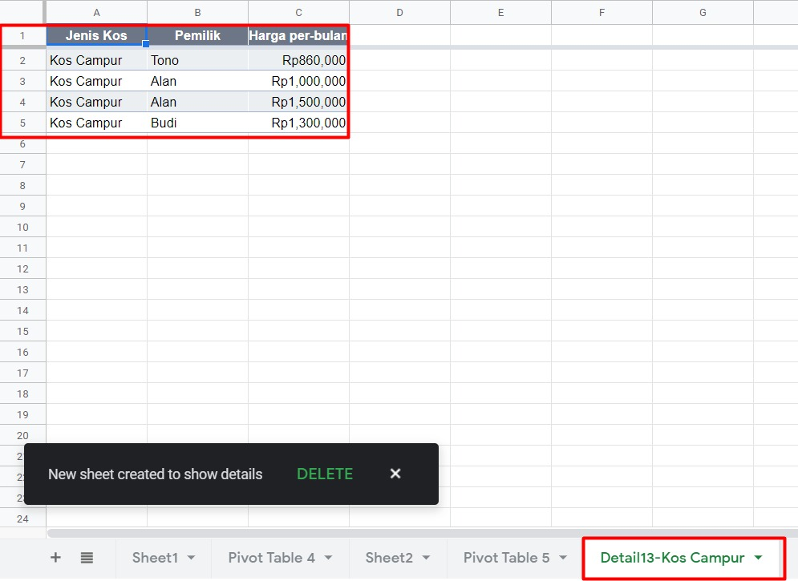

# Tips Pivot Tabel

Pivot table merupakan sebuah cara yang efektif dalam mengelompokkan data. Untuk memaksimalkan penggunaannya, berikut tips-tips dalam pembuatan pivot table:

1. Pertama tentukan dulu baris yang ingin dibuat. Di sini kita akan menggunakan jenis indekos. Caranya sama yaitu tekan Add pada bagian Rows kemudian pilih Jenis Kos.

Sehingga hasilnya sebagai berikut:

2. Berikutnya tambahkan dua nilai (value) baru yaitu Jenis Kos dan Harga per-bulan dengan rincian sebagai berikut:

3. Seperti ditunjukkan gambar pada langkah ke-2 di atas kita telah menambahkan nilai jenis indekos dan harga per-bulan. Sesuai dengan fungsinya, kita ingin mengetahui jumlah jenis indekos yang ada maka pada Summarize by pilih fungsi COUNTA. Sedangkan untuk tahu Harga per-Bulan, kita ingin tahu harga rata-ratanya maka isilah Summarize by dengan AVERAGE. Sehingga hasilnya menjadi seperti di bawah ini:

## Menambahkan Fitur Penyaringan (filter)

Kita juga dapat melakukan penyaringan dengan menampilkan beberapa data yang kita inginkan. Misal, dari hasil pivot kita hanya ingin menampilkan hasil data dari indekos putra saja. Maka kita dapat menambahkan filter pada pivot table editor seperti berikut:

1. Pada pivot table editor, klik Add pada bagian Filter dan pilih Jenis Kos.

2. Selanjutnya terlihat status “Show all items”. Klik tombol dropdown tersebut dan hilangkan centang pada data yang tidak ingin kita lihat. Pada contoh kali ini kita hanya ingin melihat data dari indekos putra saja. Klik OK apabila sudah sesuai.

3. Kita telah mendapatkan hasil filter yang menampilkan data indeindekos putra saja dari table pivot. Tampilannya sebagai berikut:

## Menampilkan Detail Data dari Pivot Table

Kali ini terdapat sedikit tambahan tips tentang menampilkan detail data dari pivot table. Percayalah, caranya benar-benar sederhana. Misal kita memiliki data pivot table sebagai berikut:

Dari hasil di atas, kita ingin tahu detail indekos campur yang berjumlah empat dengan harga rata-rata per bulan sejumlah 1.165.000 rupiah itu.

Nah, kekuatan super yang dapat dilakukan pivot table adalah mampu menampilkan detail dengan hanya klik dua kali pada salah satu value yang ingin dilihat detailnya. Di sini kita klik dua kali pada alamat sel B2 dan yang terjadi adalah sebagai berikut.

Dengan sekejap saja Google Spreadsheet membuat sheet baru lagi dengan berisi detail masing-masing dari indekos campur yang berisi pemilik dan harga per bulan. Keren, bukan?
