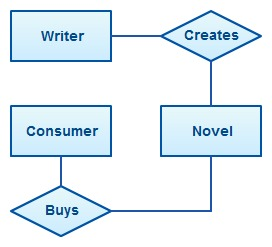
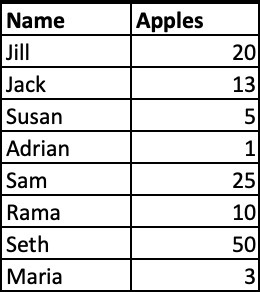
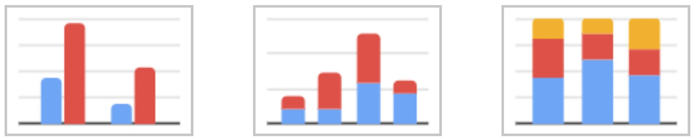
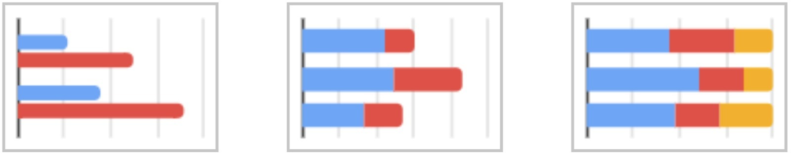
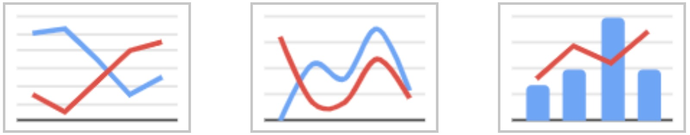
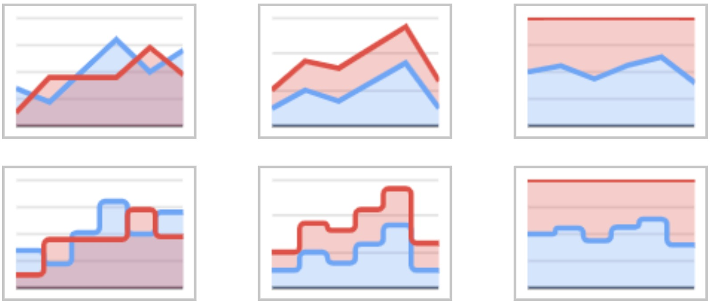
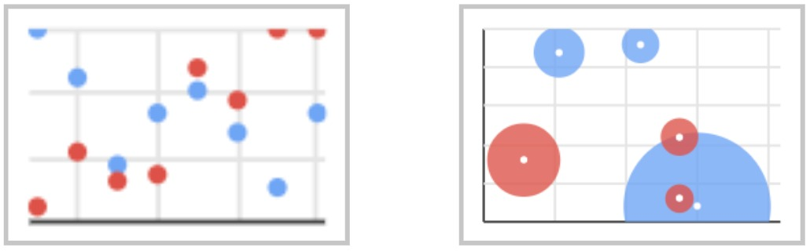
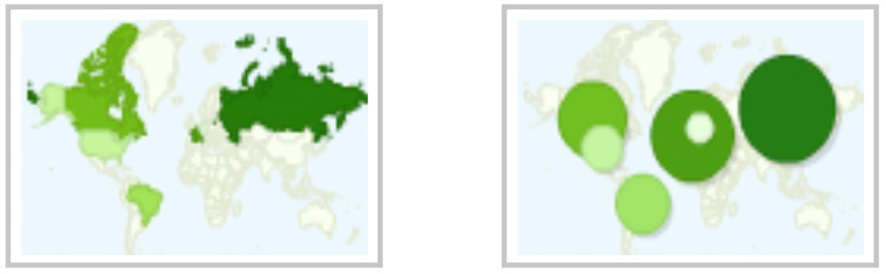

# Apa itu diagram?

**Diagram adalah sebuah representatif visual terhadap informasi yang menunjukkan bagaimana mereka bekerja sama**. Anda mungkin pernah mendengar chart atau graph, kedua hal tersebut merupakan bagian dari diagram. Diagram digunakan untuk mempermudah kita memahami informasi dari data yang kita miliki. Ketika kita membicarakan data maka yang paling sering terlintas adalah bentuk baris dan kolom yang berisi informasi, namun berapakah waktu yang kita butuhkan untuk mengerti informasi dalam bentuk baris dan kolom tersebut? Atau ketika kita memiliki banyak poin data, berapa lama waktu yang dibutuhkan untuk mengetahui relasi antar poin data tersebut?

**Dari gambar diatas kita dapat lebih mudah memahami bagaimana data bekerja dan berelasi antara satu sama lain. Hal ini disebut sebagai data understanding**, nantinya pemahaman ini akan memudahkan kita untuk membuat hipotesa atau analisis lebih dalam terhadap data. 

Ketika kita menganalisa data lebih dalam kita akan menemukan beberapa pemahaman baru yang menunjang hipotesis kita. Untuk menunjukan bahwa hipotesis kita adalah benar, maka kita perlu menunjukan pemahaman tersebut terhadap orang lain. Semakin mudah orang lain paham dengan pemahaman kita maka hipotesis tersebut semakin valid.

Ketika kita memiliki hipotesis bahwa ada 3 orang yang suka buah apel. Dari gambar tabel tersebut kita sulit untuk mendapat justifikasi dari hipotesa karena otak kita harus memproses data dalam tabel tersebut terlebih dahulu. Coba bandingkan ketika kita melihat gambar grafik di bawah.

Dengan melihat grafik di atas. sekilas kita dapat melihat bagaimana data tersebut mendukung hipotesa kita karena, secara eksplisit Jill, Sam, dan Seth memakan apel lebih dari rata-rata anak memakan apel sehingga mendukung terdapat 3 orang yang suka memakan buah apel. Jadi fungsi grafik di sini adalah mempersingkat waktu pemahaman orang lain terhadap informasi yang ingin kita sampaikan.

## Macam-macam diagram/grafik spreadsheet

Untuk mempermudah penyerapan informasi dari sebuah data, grafik disediakan dalam berbagai macam bentuk. Terdapat banyak tools pengolahan data menjadi grafik seperti halnya Microsoft Excel, Google Sheet, Tableau, Power BI, dan lain sebagainya. Nah sebenarnya tiap-tiap tools menyediakan jenis grafik yang berbeda. Untuk pembelajaran kali ini kita akan mengambil salah satu tools pengolah angka yaitu Google Sheet, kenapa? Karena penggunaan tools ini gratis, cukup mudah karena hampir sama dengan Microsoft Excel, dan tersedia setidaknya 7 jenis grafik yaitu Column, Line, Bar, Area, Pie, Scatter, dan Map yang umum digunakan untuk pengolahan data.

## Bar/Column Chart

**Bar/Column Chart Adalah jenis grafik di mana setiap kategori diwakili oleh persegi panjang, dengan tinggi persegi panjang yang sebanding dengan nilai agregasi data**. Grafik ini juga dikenal sebagai Vertical Bar Chart.

Column chart menampilkan data untuk satu set kategori, dengan satu nilai untuk setiap kategori. Kita juga dapat menggabungkan lebih dari satu kategori, misalnya saat ingin menghitung pengeluaran dan pemasukan dari setiap bulan selama satu tahun. Pada kasus tersebut kita akan membandingkan jumlah pengeluaran dan pemasukan pada tiap bulan. Apabila kita ingin menggabungkan kategori pengeluaran dan pemasukan ke dalam satu representasi namun berbeda warna, hal tersebut dinamakan Stacked Column Chart. Namun biasanya stacked digunakan untuk melihat persentase atau komposisi dari sebuah kategori.

Horizontal Bar Chart atau biasa disebut dengan Bar Chart sama persis dengan Column chart, perbedaannya hanya arah dari grafik tersebut yaitu persegi panjang akan memanjang secara horizontal sesuai dengan nilai. Atau bisa dibilang nilai sumbu x dan y ditukar.

## Line Chart

**Jenis grafik yang menampilkan informasi sebagai serangkaian titik data yang disebut 'penanda' yang dihubungkan oleh segmen garis lurus**. Terdiri dari sumbu x horizontal dan sumbu y vertikal. Sebagian besar grafik garis hanya berurusan dengan nilai angka positif, sehingga sumbu ini biasanya berpotongan di dekat bagian bawah sumbu y dan ujung kiri sumbu x. Titik di mana sumbu berpotongan selalu (0, 0). Setiap sumbu dilabeli dengan kategori data.

Sumbu x juga disebut sumbu independen karena nilainya tidak bergantung pada apa pun. Sebagai contoh, waktu selalu ditempatkan pada sumbu x karena terus bergerak maju terlepas dari apa pun. Sumbu y juga disebut sebagai poros dependen karena nilainya tergantung pada sumbu x.

Anda dapat membuat grafik yang membandingkan jumlah uang yang dipegang oleh setiap kantor cabang dengan garis yang terpisah untuk setiap kantor. Dalam hal ini setiap baris akan memiliki warna yang berbeda. Bahkan Anda bisa menggabungkan Column Chart dengan Line Chart, biasanya hal ini digunakan untuk melihat realita terhadap ekspektasi seperti halnya target penjualan(line) dan hasil penjualan(bar).

Grafik ini adalah alat visual yang kuat untuk pemasaran, keuangan, atau fungsi lain yang melibatkan korelasi antara dua nilai numerik. Jika dua atau lebih garis ada di grafik, itu dapat digunakan sebagai perbandingan di antara mereka.

## Area Chart

Memperlihatkan perubahan dalam satu jumlah atau lebih dari waktu ke waktu. Ini mirip dengan Line Chart. Dalam Area dan Line Chart, titik data diplot dan kemudian dihubungkan dengan segmen garis untuk menunjukkan nilai kuantitas pada beberapa waktu yang berbeda. Namun, bagan area berbeda dari grafik garis, karena area antara sumbu x dan garis diisi dengan warna atau bayangan.

Grafik ini merupakan pilihan yang baik untuk digunakan ketika Anda ingin menunjukkan tren dari waktu ke waktu nilai yang tepat. Dalam bagan area skor ujian, kita dapat melihat bahwa skor pada umumnya meningkat seiring waktu bahkan tanpa mengetahui skor pasti pada setiap ujian tunggal.

Sama seperti Line & Bar Chart, grafik ini juga dapat menggabungkan beberapa nilai agregasi ke dalam satu representasi atau disebut stacked. Bagian stacked menunjukkan seberapa banyak masing-masing bagian berkontribusi terhadap jumlah keseluruhan. Misalnya, pemilik rantai toko grosir mungkin ingin membuat bagan yang menunjukkan keuntungan yang dihasilkan oleh masing-masing tokonya dan total laba yang dihasilkan oleh semua toko bersama.

## Pie Chart

Jenis grafik yang menampilkan data dalam grafik lingkaran. Potongan-potongan grafik sebanding dengan fraksi keseluruhan dalam setiap kategori. Dengan kata lain, setiap irisan pai relatif terhadap ukuran kategori tersebut dalam kelompok secara keseluruhan. Seluruh "kue pai" mewakili 100% dari keseluruhan, sedangkan pai "irisan" mewakili bagian dari keseluruhan.

Kita sulit melihat nilai secara presisi dengan grafik ini sulit untuk melihat nilai secara presisi, terutama dengan persentase yang rumit yaitu 13,9% dengan 15%. Ketika dalam bentuk irisan kita tidak dapat melihat secara jelas perbedaan antara kedua nilai tersebut ataupun ketika kita ingin membelah grafik ini ke dalam 10 bagian yang sama besar, akan ada banyak irisan yang kita sulit pahami. Oleh karena itu grafik jenis ini umum digunakan ketika nilai irisan memiliki perbedaan cukup signifikan dan jumlah kategori data yang tidak banyak.

## Scatter Chart

Menggunakan titik untuk merepresentasikan nilai numerik pada kategori yang berbeda. Posisi setiap titik pada sumbu horizontal dan vertikal menunjukkan nilai untuk titik data individual. Grafik ini digunakan untuk mengamati hubungan antar variabel.

Biasanya warna pada titik akan merepresentasikan kategori yang berbeda. Contohnya apabila kita memiliki 100 poin data nilai ujian siswa, di mana terdapat kategori kelas. Dengan menggunakan grafik ini kita dapat melihat relasi antara kelas terhadap nilai ujian. Apabila sebuah kelas memiliki nilai yang tinggi maka akan terlihat banyak titik-titik yang sewarna saling berdekatan. Ataupun kita dapat melihat korelasi antara jenis kelamin terhadap nilai. Hasil dari grafik ini akan mempermudah kita untuk mengelompokkan suatu golongan berdasarkan hipotesa-hipotesa yang kita buat.

Grafik ini juga dapat berguna untuk mengidentifikasi pola lain dalam data. Kita dapat membagi titik data menjadi kelompok berdasarkan seberapa dekat kumpulan titik dikelompokkan bersama. Plot pencar juga dapat menunjukkan apakah ada kesenjangan tak terduga dalam data dan jika ada titik outlier. Ini bisa bermanfaat jika kita ingin membagi data menjadi beberapa bagian, seperti dalam pengembangan persona.

## Map Chart

Memungkinkan kita untuk memvisualisasikan hubungan spasial dalam data dengan menunjukkan data pada peta geografis. Misalnya kita ingin melihat penyebaran virus corona (COVID-19) di dunia, kita membuat peta penanda sesuai dengan jumlah orang yang terkena virus. Umumnya pada peta seperti ini, semakin tebal warna hijaunya, semakin intens pula kepadatan datanya. Kita jadi dapat melihat bagian geografis mana yang banyak terkena penyakit tersebut.

Ketika membuat grafik ini kita membutuhkan informasi secara geografis, apakah itu nama lokasi, kota, negara, atau secara spesifik latitude/longitude. Terdapat dua jenis penanda untuk grafik ini yaitu 

- Poin Geografis: menunjukkan titik data pada peta dengan menunjukkan penanda pada koordinat geografis yang mirip dengan cara bagan XY menempatkan titik pada koordinat XY. Penanda dapat memvariasikan bentuk, warna, dan ukurannya (yang terakhir disebut grafik "Gelembung"). Penanda itu sendiri dapat menjadi diagram lingkaran seperti yang akan kita lihat nanti.
    
- Area Geografis: area warna pada peta untuk menunjukkan nilai atau kategori data untuk suatu area. Misalnya, area bisa berupa negara bagian Amerika Serikat dan warnanya dapat menunjukkan nilai numerik untuk setiap negara bagian. Jenis bagan peta di mana kita mewarnai area geografis dikenal sebagai choropleth.

