# Menggambarkan Kuantitatif Data ke Bentuk Diagram

Untuk penggunaan grafik secara lebih rinci akan kita bahas pada pembelajaran selanjutnya. Diharapkan pada pembelajaran kali ini setidaknya Anda bisa mengetahui struktur data yang dapat digunakan untuk membuat grafik-grafik tersebut. Nah kini, setelah teori, tak lengkap rasanya tanpa latihan. Pada bagian kali ini kita akan belajar untuk membuat data ke dalam sebuah grafik menggunakan Google Sheet. Jenis grafik dalam Google Sheet bisa dikombinasikan dengan jenis model lainnya. Misalnya, diagram batang dapat dikombinasikan dengan diagram garis. Namun, penerapannya juga harus sesuai dan tidak dipaksakan supaya data dapat mudah dipahami.

Oke, dalam latihan ini kita akan menggunakan data kamar Airbnb yang disewakan di New York yang bisa diunduh melalui Kaggle.

Dataset: New York City Airbnb

Deskripsi: Sejak 2008, para tamu dan tuan rumah telah menggunakan Airbnb untuk memperluas kesempatan travelling dan menghadirkan cara yang lebih unik dan personal untuk mengalami dunia. Dataset ini menjelaskan aktivitas cantuman dan metrik di NYC, New York untuk 2019.

Unduh:  https://www.kaggle.com/dgomonov/new-york-city-airbnb-open-data 

Tools: Google Sheet

- Untuk mengunduh data dari Kaggle harus memiliki akun Kaggle terlebih dahulu.
- Untuk menggunakan Google Sheet harus memiliki akun Gmail terlebih dahulu.

## Langkah 1: Persiapan

Pastikan semua tools dan data sudah dipersiapkan. Setelah semua siap, maka buat Google Sheet baru.

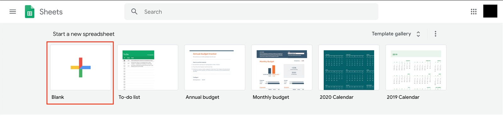

Data yang kita unduh sebelumnya memiliki ekstensi .zip, oleh karena itu kita perlu untuk unzipped file tersebut. Untuk memasukkan data dari komputer ke Google Sheet, klik File → Import dan pilih/taruh berkas yang ingin dimasukkan.

Unggah berkas AB_NYC_2019.csv dari data yang telah kita ekstrak dan masukkan konfigurasi seperti gambar di bawah. Setelah itu klik Import data. Sheet akan terisi dengan data dari berkas yang kita unggah.

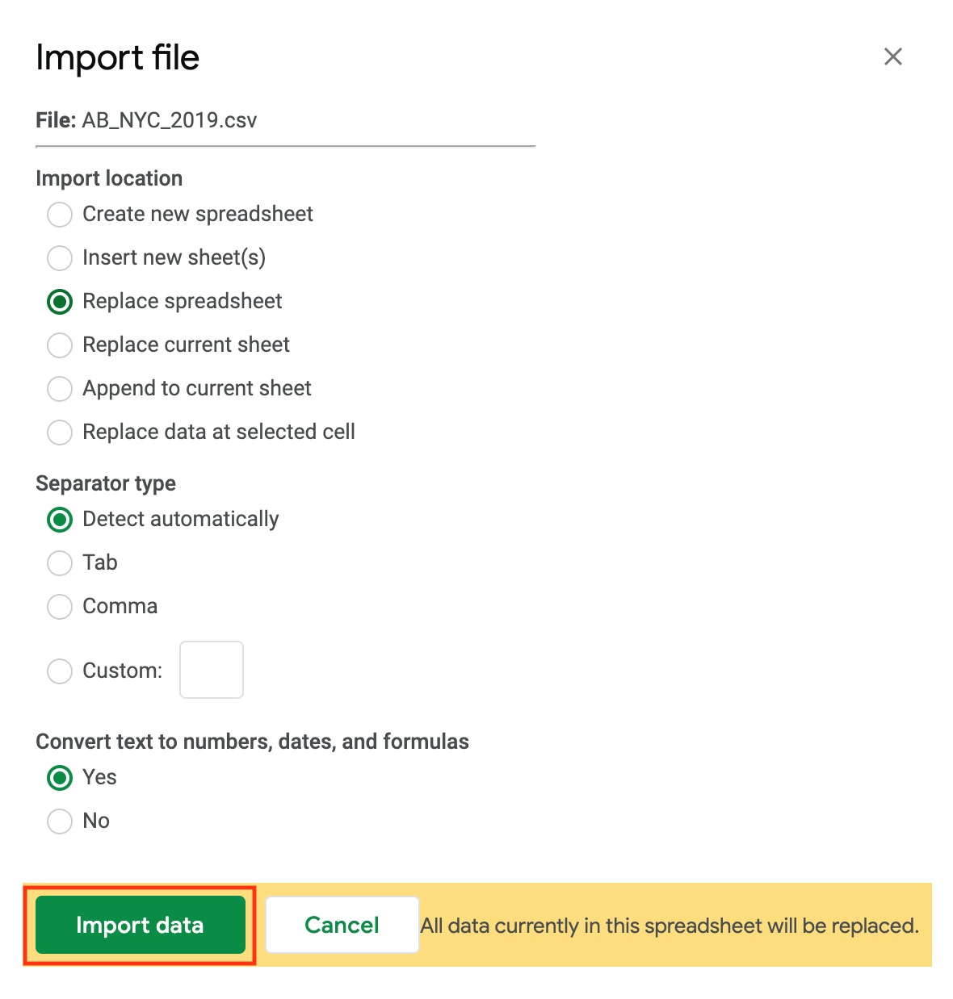

Sheet akan terisi dengan data dari berkas yang kita unggah seperti berikut:

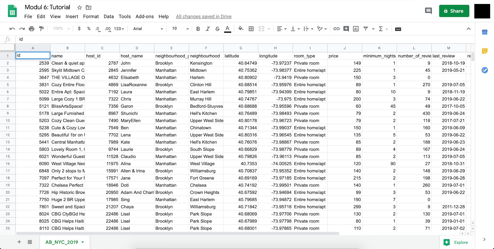

## Langkah 2: Visualisasi

Preparasi data dan semua data sudah berhasil ditampilkan, bukan? Sekarang saatnya kita mulai membuat visualisasi data-data tersebut. Caranya sangat mudah, kita tinggal memilih kolom dan baris mana yang ingin kita visualisasikan. Nah sebelum kita memilih kolom dan baris untuk divisualisasikan, kita perlu memahami maksud dari data tersebut. Mulailah dari deskripsi secara global data sampai dengan arti kolom dan isinya. Pertama kita mengetahui bahwa data ini merupakan data kamar Airbnb yang disewakan. Namun apa sajakah arti tiap kolom pada data tersebut?

- Id : Identifier unik untuk tiap tempat sewa
- Name : Nama tempat
- Host_id : Identifier penyedia kamar/tempat
- Host_name : Nama penyedia kamar/tempat
- Neighbourhood_group : Kelompok lingkungan dari tempat tinggal yang disediakan host, merupakan pengelompokan dari neighbourhood
- Neighbourhood : Nama dari lingkungan tempat tinggal yang disediakan host
- Latitude & longitude : Garis lintang dan garis bujur dari tempat tinggal yang disediakan
- Room_type : Tipe kamar yang disediakan
- Price : Harga sewa per malam
- Minimum_nights : Minimal sewa per malam
- Number_of_reviews : Jumlah ulasan oleh pelanggan
- Last_review : Tanggal review terakhir
- Reviews_per_month : Rasio banyaknya ulasan perbulan
- Calculated_host_listings_count : Jumlah daftar per host
- Availability_365 : Beberapa hari ketika daftar tersedia untuk pemesanan

Atau untuk lebih mengetahui deskripsi data, lihatlah di sini. Setelah kita mengetahui maksud dari kolom dan isian data tersebut kita mulai dapat membuat pertanyaan pada diri sendiri, sebagai contohnya “Saya ingin melihat perbandingan rata-rata harga tiap tipe kamar.”

Dari sana kita tahu bahwa kolom yang kita gunakan adalah room_type dan price dengan menggunakan semua baris. Untuk mulai membuat visualisasi klik kolom I (room_type) dan J (price) dengan menekan shift, maka akan tampil seperti gambar di bawah ini

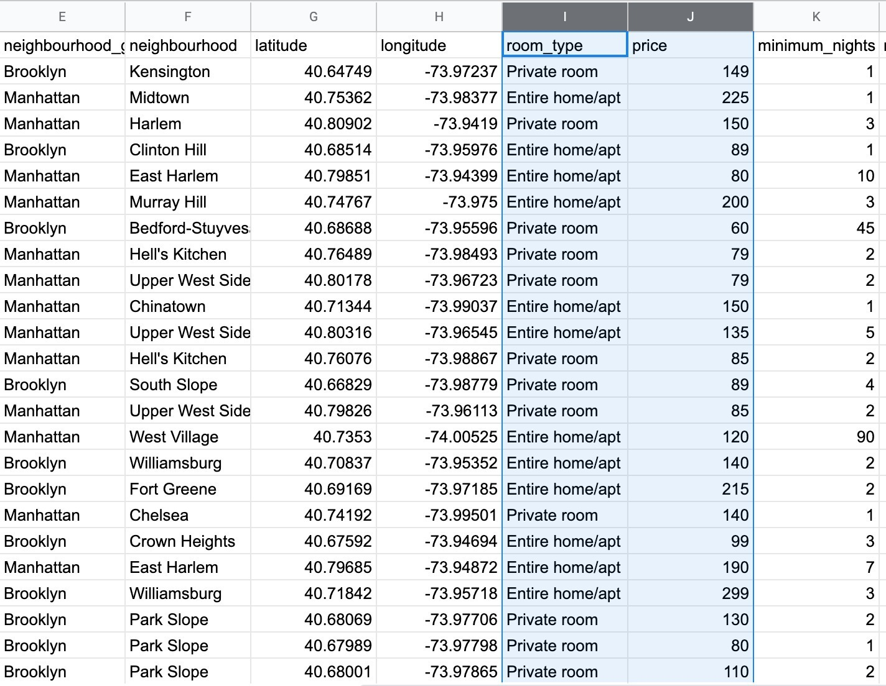

Pemilihan data bisa digunakan dengan membuat pivot table, dari tabel tersebut kita dapat memilih baris dan kolom yang diinginkan untuk membuat visualisasi.

Setelah data yang dibutuhkan telah dipilih, kita dapat memvisualisasikan dengan klik Insert → Chart.

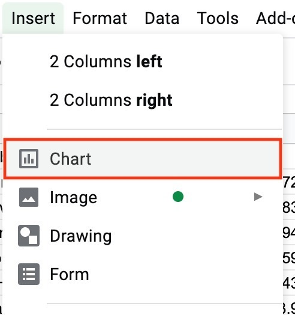

Secara standar grafik yang pertama terbentuk adalah Grafik kolom dengan X Axis adalah room_type dan Y Axis adalah sum (penjumlahan) dari price.

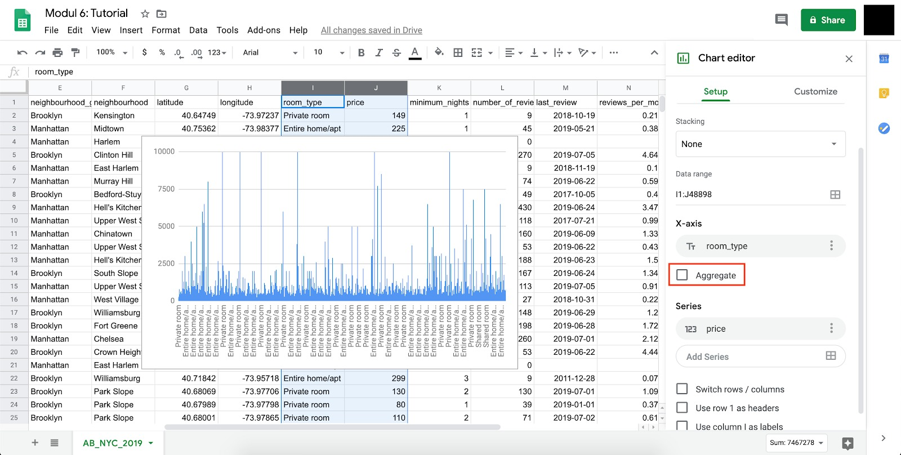

Nah bisa kita lihat bahwa grafik yang terbentuk tidak rapi. Terlalu banyak data poin pada X Axis. Hal tersebut dikarenakan kita tidak melakukan grouping atau pengelompokan. Oleh karena itu silakan a ceklis tombol Aggregate untuk melakukan agregasi terhadap room_type yang sama. Maka visualisasi akan berubah seperti gambar di bawah ini.

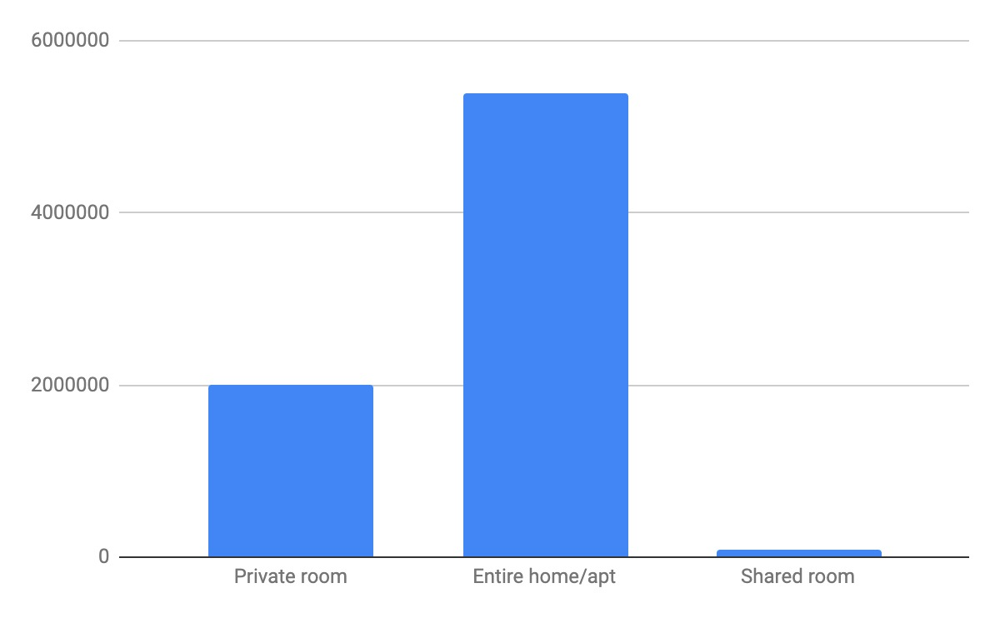

Untuk merubah jenis grafik yang diinginkan dan sesuai dengan jenis data yang kita pilih, klik Chart type pada Chart editor. Misalnya jika kita ingin merubah tampilan grafik menjadi bentuk Grafik Pie, cukup klik bentuk Grafik Pie yang kita inginkan.

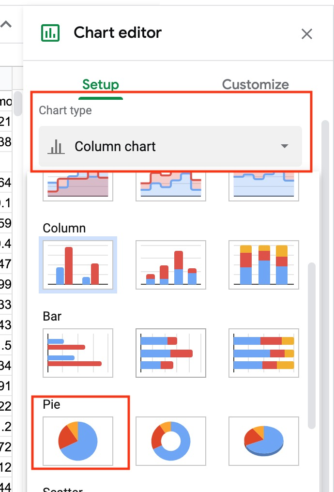

Lalu grafik sebelumnya akan berubah seperti di bawah ini.

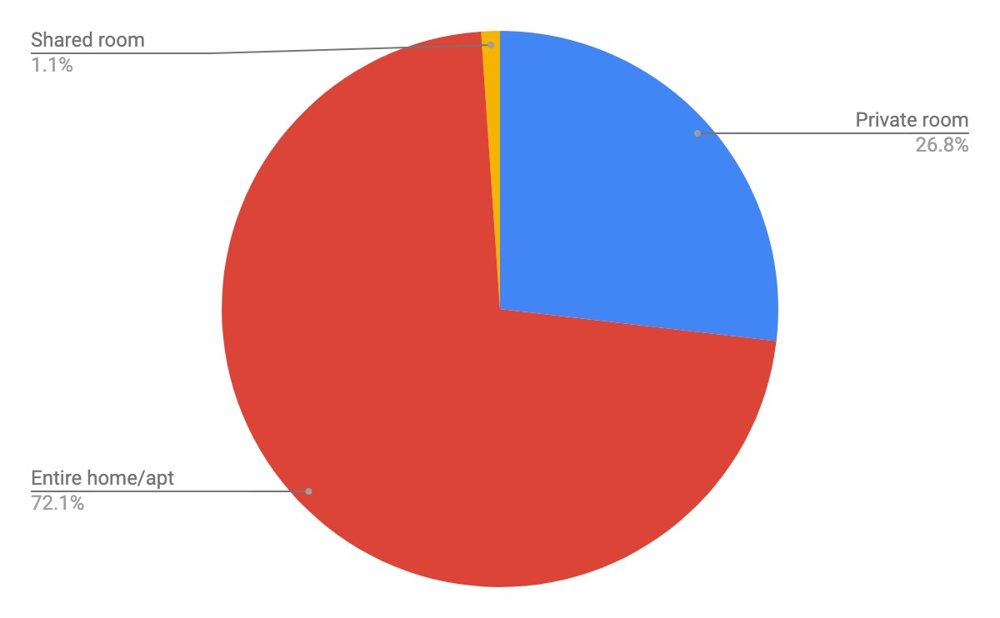

Perlu diingat bahwa nilai Y Axis di sini masih menggunakan nilai awal yaitu sum. Untuk merubah menjadi rata-rata kita dapat dengan mengklik seperti gambar di bawah dan menggantinya menjadi average.

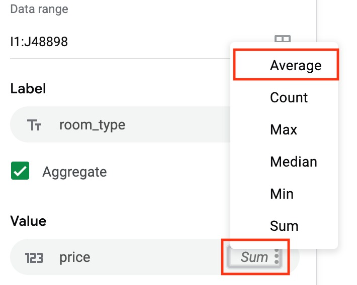

Sehingga hasil grafiknya seperti berikut.

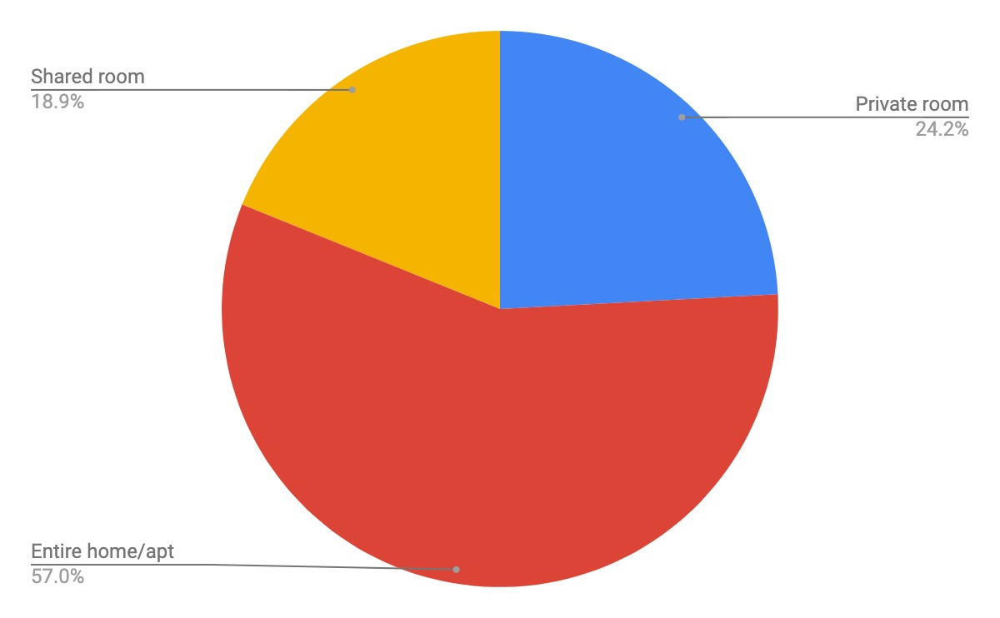

Nah hal yang perlu diperhatikan adalah setiap tipe grafik masing-masing memiliki kebutuhan data yang berbeda-beda. Seperti halnya pada grafik kolom sebelumnya, data yang dibutuhkan ada X Axis dan Y Axis. Sementara itu pada bentuk grafik kolom kombo area, Y Axis dapat dimasukkan oleh beberapa data lainnya sebagai perbandingan seperti gambar di bawah ini.

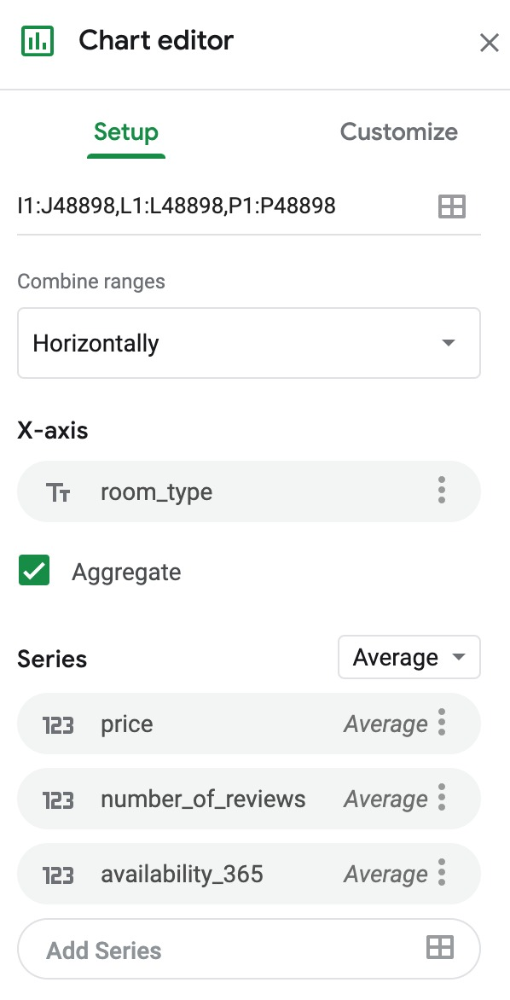

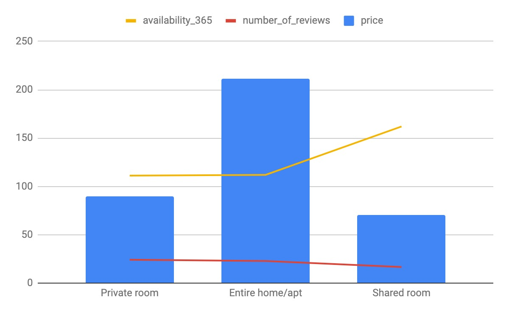

Untuk melakukan styling pada font, legend, warna, dan lainnya, lakukan konfigurasi sesuai jenis grafik yang kita pilih pada bagian Customize. Setelah mengetahui itu semua ini saatnya Anda mencoba sendiri dan pelajari terus potensi-potensi yang ada untuk membuat grafik yang lebih kompleks dan lebih mudah dipahami.

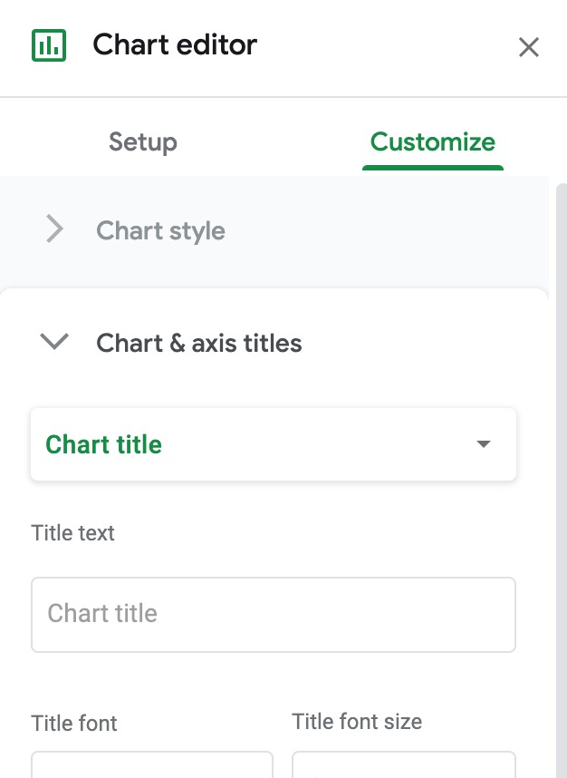