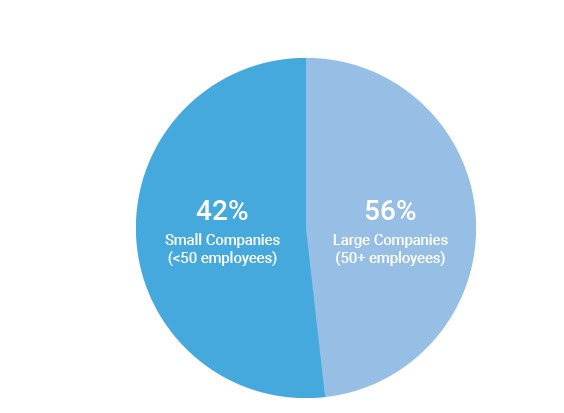
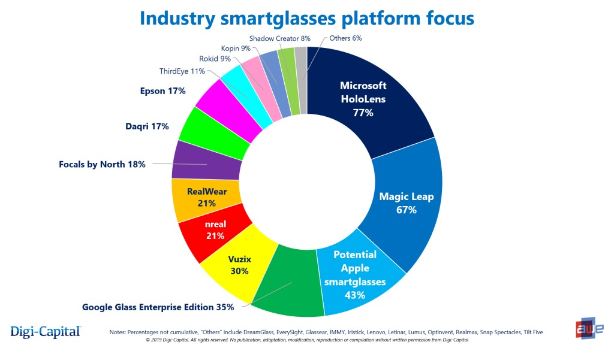
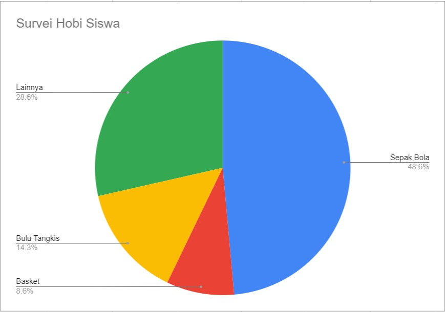
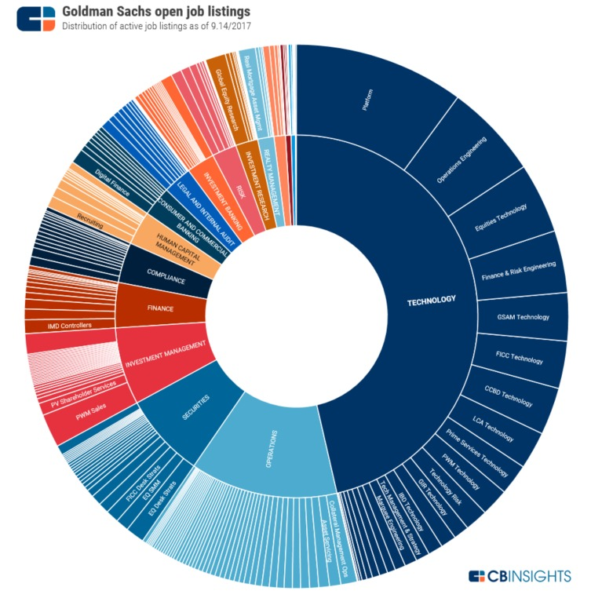
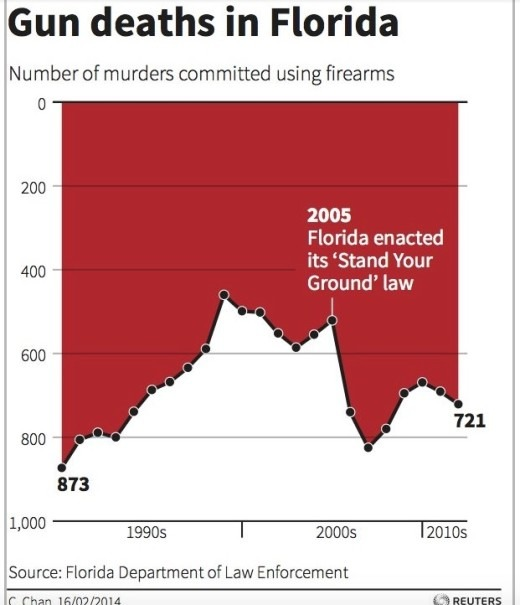
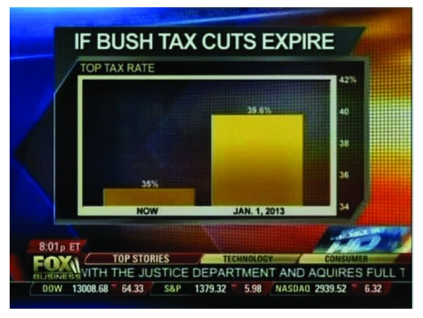
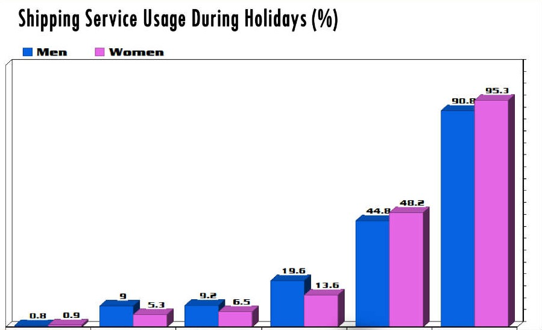
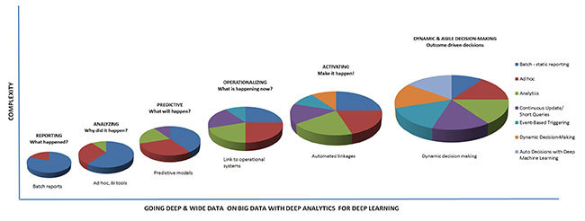

# Kesalahan Umum dalam Visualisasi Data

Sudahkah Anda menerapkan visualisasi data dalam menyajikan data? Kita telah sepakat bahwa visualisasi data memudahkan audiens dalam memahami data yang kita presentasikan. Namun, apakah metode visualisasi data dapat selalu menyampaikan informasinya dengan efektif?

Visualisasi akan efektif jika dibuat dengan mematuhi kaidah yang ditentukan. **Namun, terkadang penerapan visualisasi data dilakukan dengan cara yang sebaliknya: tak tepat dan tak patuh pedoman**. Sehingga penerapan visualisasi data kadang berujung pada output data yang membingungkan, ambigu. Alhasil, alih-alih membuat paham, audiens jadi meragukan kebenaran data. 

Karena itulah, Anda perlu tahu dan hindari beberapa kesalahan umum yang sering dilakukan dalam membuat visualisasi data. Berikut ini penjelasannya:

## Nilai Persentase Tidak Sesuai

Menurut Anda, adakah yang salah dari diagram lingkaran di atas? Jika Anda mengatakan “Ya, ada yang salah” itu sudah tepat. Alasannya, total nilai persentase yang ditunjukkan dari diagram sebesar 98% atau kurang dari 100%. Selain itu ada juga kesalahan lainnya yaitu besar / porsi irisan lingkaran Small Companies (42%) lebih besar daripada Large Companies (56%). Karena 42 itu lebih kecil dari 56, maka besar porsi potongan lingkarannya pun seharusnya lebih kecil, bukan sebaliknya. 

Perhatikan bahwa penulisan persentase dan besar porsi irisan yang merepresentasikan data, harus tepat. **Jika menggunakan satuan persen maka total data yang disajikan totalnya harus 100%. Apabila menggunakan satuan derajat maka data yang disajikan totalnya harus 360 derajat**. Sehingga dari diagram di atas jika datanya sudah tepat maka bisa menjadi seperti berikut:

Besar porsi irisan juga harus sesuai dengan nilai datanya. Jangan pula menampilkan terlalu banyak irisan yang bisa berujung bias, contohnya di bawah ini:

Pasti Anda akan sulit untuk membaca informasi dari diagram lingkaran di atas. Sulit untuk membedakan data mana yang lebih besar dibandingkan lainnya. **Memang idealnya irisan diagram lingkaran tak lebih dari empat irisan supaya perpotongan irisannya terlihat jelas**. Sehingga kita tahu data mana yang lebih besar atau lebih kecil. 

Lalu bagaimana kalau data yang ingin ditulis berjumlah enam? Sebagai contoh Anda dapat menggambarkannya seperti di bawah ini:

“Lainnya” merupakan data hobi yang dihimpun selain sepak bola, bulu tangkis, dan basket. Bisa jadi ada menulis, membaca, dan lain sebagainya.  

Namun, menulis “lainnya” saja tidak cukup. Anda perlu tambahkan keterangan: kategori lainnya itu berisi hobi apa saja? Jika data yang dibutuhkan sangat banyak misal lebih dari 100 data, maka kita perlu menuliskan data hobi ini dalam bentuk tabel saja, bukan diagram lingkaran.

## Terlalu Banyak Data

Kita telah mengetahui tujuan visualisasi data adalah membuat sebuah data yang kompleks menjadi lebih mudah dipahami dengan bentuk visual. Namun, bagaimana jika sebaliknya?

Ini dapat terjadi jika kita “maksa” untuk memasukkan semua data yang berjumlah besar. Hasilnya tidak efektif dan tentu membingungkan pembaca. Contohnya perhatikan gambar di bawah ini:

Begitu banyak data yang dimasukkan dalam diagram lingkaran di atas, bukan? 

Sebagai pembaca, kita sulit bahkan tak bisa menangkap informasi apa yang ingin disampaikan oleh diagram tersebut. Seperti diulas pada poin sebelumnya bahwa apabila menggunakan diagram lingkaran, paling efektif gunakan 4 irisan data saja. Apabila banyak sekali data seperti gambar di atas, maka sebaiknya tuliskan data Anda dalam bentuk tabel saja. Hal tersebut berlaku juga untuk semua jenis diagram.

## Tidak Mengikuti Standar Penulisan

Apabila Anda melihat grafik di atas, bagaimana tren data yang menunjukkan angka pembunuhan menggunakan senjata api di Florida? Sekilas tidak ada yang salah tetapi coba perhatikan kembali sumbu Y. Nilai yang ditunjukkan, terbalik. Angka 0 berada di atas sebagai nilai minimum dan angka 1000 sebagai nilai minimum berada di bawah. Hal tersebut sudah tidak sesuai dengan standar umum penulisan karena umumnya sumbu Y dimulai dari nilai minimum berada di bawah dan semakin ke atas semakin naik nilainya.

Tentu saja ini berpengaruh bagi pembaca informasi karena bisa menimbulkan salah persepsi. Mereka akan mengira bahwa trennya turun padahal dari 2005 hingga 2007 menunjukkan kenaikan apabila sumbu Y tidak terbalik. Jadi, usahakan dalam pembuatan sumbu X maupun Y gunakanlah standar penulisan umum yang berlaku.

## Terdapat Sumbu yang Terpotong

Nilai pada suatu sumbu sangat penting kaitannya dengan data yang ditampilkan dalam sebuah diagram. Jika penerapannya kurang tepat maka memicu bias bagi pembacanya. Sebagai contoh, lihatlah gambar di bawah ini:

Ada “diskon” alias potongan pada sumbu Y sehingga langsung dimulai dari 34, bukan 0. Akibatnya, pembaca dapat menyimpulkan terdapat  kesenjangan potongan pajak yang tinggi antara 1 Januari 2013 dan saat berita tersebut rilis. Padahal nilainya hanya 35% versus 39% sehingga seharusnya tampilan kedua diagram batang tak begitu berbeda tingginya. Di sini kita jadi paham bahwa setiap data pada sumbu Y mutlak harus dimulai dari 0 agar menghindari bias dan salah interpretasi data.

## Penggunaan Grafik 3D yang Kurang Sesuai

Pasti kita ingin visualisasi data kita terlihat keren kan? Saat terselip di benak kita untuk menggunakan skema 3 dimensi dalam visualisasi, segeralah cari alternatif lain. Tahukah Anda mengapa penggunaan jenis diagram 3 dimensi kurang disarankan dalam visualisasi data? Dapat memudahkan pembaca dalam memahami data dan tidak terjadi bias supaya tidak menimbulkan perbedaan persepsi tentang data yang disajikan. Contohnya dapat Anda lihat di bawah ini:

Selain penggunaan 3D yang menyebabkan bias, diagram batang di atas juga tidak menuliskan nilai dari sumbu Y dan sumbu X. Pembaca akan kebingungan dan sulit memahami maksud dari informasi yang tersaji.

## Susah Dibandingkan

Visualisasi data bertujuan untuk memudahkan kita membandingkan data yang ada. Namun, contoh di atas menunjukkan sebaliknya. Perbandingan dari setiap data, sulit dipahami. Selain karena menggunakan jenis diagram 3D, tiap diagram lingkaran yang dibuat juga mengandung terlalu banyak data. Seharusnya kita dapat menggunakan jenis diagram lainnya untuk membandingkan atau melihat tren dari beberapa kategori misalnya diagram batang atau diagram garis.

Untuk memahami contoh lainnya mengenai kesalahan dalam visualisasi data, cek di  https://viz.wtf/.