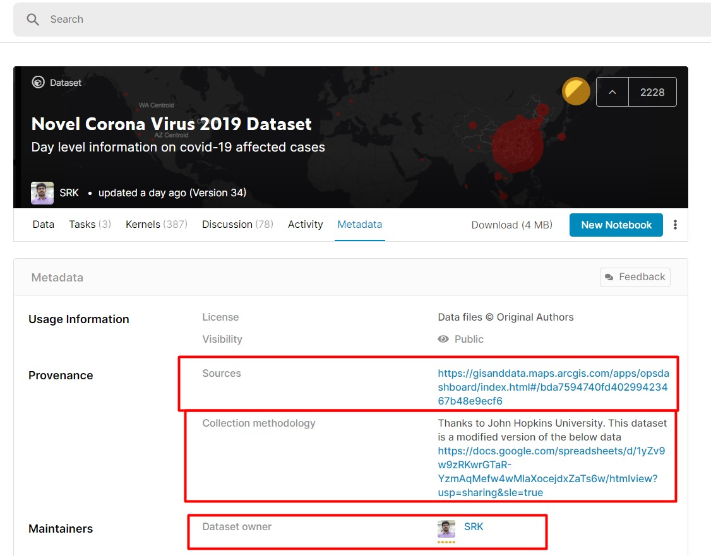
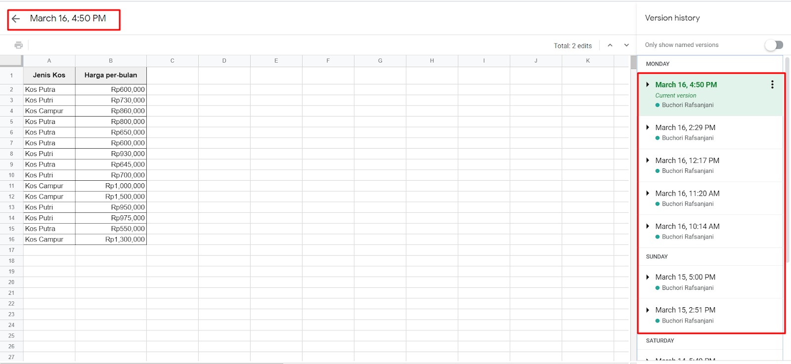
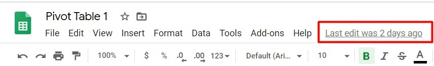
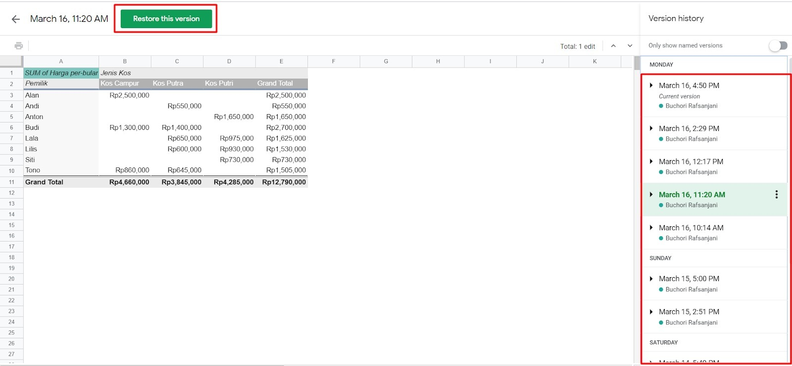

# Apa itu Dokumentasi Data?

Pernahkah mendengar istilah dokumentasi data? **Dokumentasi data atau yang sering disebut dengan data provenance adalah sebuah langkah untuk melihat sumber data yang kita peroleh**. Kata provenance sendiri berasal dari bahasa perancis provenir yang berarti “berasal” atau dalam istilah juga disebut silsilah. 

Dalam konsep sejarah seni, kata provenance sering digunakan dalam dokumentasi sebuah karya seni sehingga setiap detailnya tetap tercatat. Misalnya kapan pertama kali sebuah karya seni diciptakan dari sisi ide, eksekusi, hingga akhirnya menjadi yang dapat kita nikmati saat ini. 

Contoh lainnya, coba bayangkan Anda berperan sebagai seorang Data Scientist. Anda mendapatkan sebuah dataset yang siap untuk dianalisis. Anda tidak tahu data ini berasal dari mana, bagaimana validitasnya, apakah ia akan berubah selama proses pengerjaan Anda, dan sebagainya. Gawat kan? Padahal dokumentasi data ini penting untuk mengetahui keabsahan data dan memungkinkan kita menggunakannya kembali di waktu yang lain.

W3C Provenance Incubator Group menjelaskan tentang dokumentasi data sebagai berikut:

“a record that describes entities and processes involved in producing and delivering or otherwise influencing that resource. Provenance provides a critical foundation for assessing authenticity, enabling trust, and allowing reproducibility. Provenance assertions are a form of contextual metadata and can themselves become important records with their own provenance.”

Terdengar rumit? Baiklah. Berikut ini contoh sebuah penggambaran dokumentasi data yang ditunjukkan dalam sebuah metadata.

Contoh data provenance di atas didapat dari website kaggle. Pada gambar di atas terlihat dokumentasi yang menyertakan sumber data, metodologi pembuatan data, dan juga pemilik dari dataset. Berikut contoh lain dari dokumentasi data yang familiar bagi Anda.

Tampilan di atas merupakan version history dari berkas Google Spreadsheet. Semua perubahan data tercatat mulai dari tanggal hingga nama orang yang melakukan perubahan. Version history ini dapat Anda temukan saat klik bagian berikut:

Untuk dapat kembali ke penulisan sebelumnya kita dapat melakukan restore version dengan memilih dari riwayat penulisan dan klik Restore this version.

