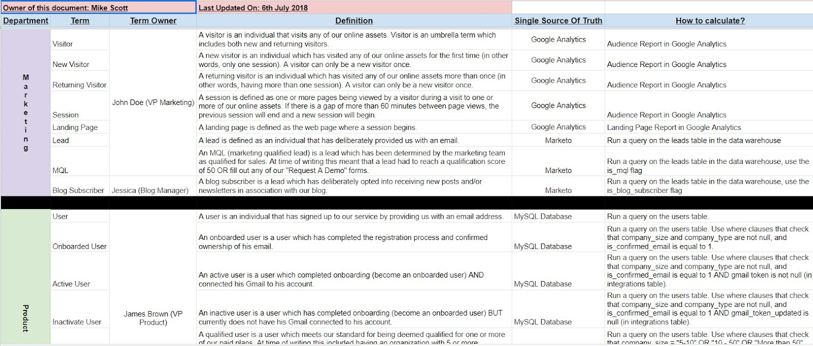
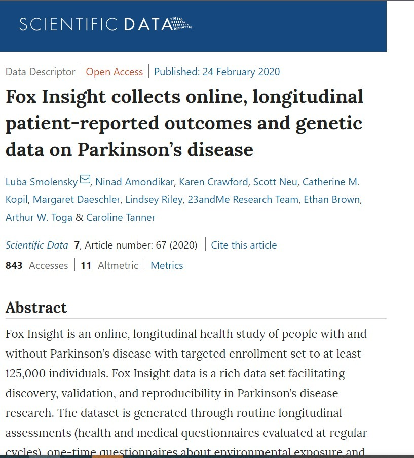

# Pentingnya Dokumentasi Data

Definisi di atas memperjelas bahwa kepercayaan, kredibilitas, dan reproduksibilitas terhadap sebuah data yang ada, dapat didasari oleh dokumentasi sumber data yang sesuai. Dalam sebuah penelitian, pengguna data tidak serta merta dapat menjadi pembuat data. Orang yang membuat data dapat:
- Mengonfigurasikan instrumen atau simulasi dari mengumpulkan data primer atau
- Menerapkan metodologi dan proses tertentu guna mengekstraksi, mengubah, dan menganalisis data masukan demi menghasilkan sebuah produk data keluaran.

Metadata merupakan bagian penting dari data yang dipublikasi untuk menentukan kualitas, kredibilitas, reprodusibilitas hasil (terukur), serta menentukan apakah data dapat digunakan kembali atau tidak (reusable).

## Mengelola Sumber Data

Provenance dapat dicatat dalam jenis metadata tentang sebuah data. Banyak bidang metadata yang dapat dikumpulkan dalam kategori informasi asalnya, misalnya tanggal pembuatan, pemilik, perangkat lunak atau tools lain yang digunakan, metode pemrosesan data, dan lain sebagainya. Dengan demikian, pengelolaan dan manajemen data yang baik menjadi dasar dari dokumentasi data yang akurat.

Salah satu usaha dan pendekatan yang mungkin Anda familiar adalah blockchain dalam supply-chain management, mari simak video berikut:

https://www.youtube.com/watch?v=oOywU_rXgFE

Bayangkan bahwa metadata adalah lokasi ikan ditangkap, nelayan yang menangkapnya, kapan ikan tersebut ditangkap, dan sebagainya. Sementara data adalah ikan itu sendiri.

Pendekatan yang dapat dilakukan dalam mendapatkan sebuah dokumentasi data sebagai berikut:

- Dicatat dalam bentuk teks, bisa menggunakan skema penulisan umum atau bisa juga dengan skema khusus dalam data provenance.
- Dicatat dan disimpan secara internal menggunakan program perangkat lunak atau dalam sistem eksternal lainnya.
- Dituliskan dalam bentuk yang dapat dibaca oleh mesin atau yang bisa dibaca oleh manusia.

Bentuk sederhananya, sebuah sumber dicatat dan disimpan dalam sebuah berkas berjudul README yang di dalamnya menjelaskan tentang pengumpulan data dan metode pemrosesan. Data sumber juga dapat dicatat dengan lebih terstruktur menggunakan elemen-elemen spesifik dalam standar metadata seperti Dublin Core (https://dublincore.org/), hingga standar disiplin metadata khusus seperti ISO 19115-2 (https://www.iso.org/standard/67039.html). Untuk lebih memperjelas  contoh bentuk penulisan dokumentasi data, simak uraian berikut ini:

- Berkas README
Pernah menemui berkas readme? Berkas readme biasanya berupa text (.txt) dan sering kita temui dalam paket instalasi perangkat lunak, kode pemrograman, kumpulan data, dan bisa juga ditemui dalam proyek penelitian. Tentunya dalam proyek penelitian sebuah berkas readme harus memuat daftar berkas yang digunakan dalam dataset, rujukan informasi yang relevan, serta berkas lain yang menunjang penelitian seperti artikel, karya ilmiah, atau slide presentasi. Untuk template penulisan readme, cek tautan Guide to writing readme ini (https://data.research.cornell.edu/content/readme).

- Data Dictionaries

Data dictionaries atau kamus data berisi informasi kunci tentang data yang Anda kumpulkan. Ia digunakan untuk menjelaskan suatu bagian tertentu dalam dataset, misal menjelaskan arti dari nama sebuah variabel, kegunaan, deskripsi, dan lain sebagainya. Kamus data biasanya digunakan pada data tabular atau sebuah database. Contoh dari data dictionaries dapat di simak di tautan example data dictionaries (https://data.nal.usda.gov/data-dictionary-examples).

- Data Paper

Berbeda dengan paper penelitian biasa, dalam data paper cenderung menyajikan dataset yang lebih besar disertai dengan metadata yang menggambarkan isi, konteks, kualitas, hingga struktur dari data tersebut. Contoh data paper dapat Anda lihat di tautan Scientific Data (https://www.nature.com/sdata/).

## Tools Dokumentasi Data

Dalam proses dokumentasi data pastinya kita memerlukan sebuah tools supaya lebih mudah dan efisien. Berikut beberapa hal yang dapat Anda lakukan.

1. Pergunakan Buku Catatan

Cara tradisional yang dapat diterapkan adalah dengan buku catatan. Kita dapat menggunakan catatan sebagai alat untuk mencatat sumber data yang kita peroleh. Namun, jika berbicara tentang data pasti tidak jauh dengan angka dan terkadang terdiri dari banyak digit. Sehingga jika data yang dicatat dalam jumlah yang besar maka rentan salah. Kita dapat menggunakan buku catatan untuk mencatat poin-poin pentingnya untuk meminimalisir kesalahan.

2. Gunakan Alur Ilmiah yang Terstruktur

Nah di sini lah kita dapat memanfaatkan alur terstruktur yang terdiri dari pencatatan, eksekusi, pemrosesan, dan urutan secara ilmiah. Hal tersebut penting supaya pembaca paham sumber asal dan teori yang mendukung dokumentasi data buatan kita. Data provenance adalah konsep yang penting dalam sebuah alur ilmiah. Selain itu data provenance juga memungkinkan para peneliti untuk memahami asal data, mengembangkan eksperimen, dan melakukan validasi terhadap proses untuk memperoleh suatu data.

Alur tersebut dapat dirancang dalam bentuk grafis secara berurutan berdasarkan tugas yang diberikan. Sehingga tugas baru yang dimasukkan dapat mengambil masukan dari tugas sebelumnya dan data yang didapatkan dari luar. Supaya alur kerja dapat digunakan kembali di masa mendatang maka informasi yang dicatat dapat menunjukkan dari mana data berasal, bagaimana proses data tersebut diubah, dan komponen apa saja yang mendukung di dalamnya. Hal tersebut dapat memungkinkan peneliti lainnya untuk melakukan eksperimen lebih lanjut dan merevisi apabila terdapat hal yang kurang tepat dari data tersebut.

3. Log dan Blockchain

Jika bekerja sendiri, Anda dapat melakukan logging, atau menggunakan tools bantuan (docs, spreadsheet) yang memiliki kemampuan untuk memperlihatkan histori. Anda yang bekerja dengan tools modern mungkin mengenal istilah logging atau auditing. Anda dapat memanfaatkan log aplikasi untuk mencatat perubahan pada Data.

Pada pasar perdagangan dunia, pencatatan ini dapat dilakukan melalui shared ledger yang diterapkan pada blockchain. Setiap stakeholder akan memiliki salinan dari setiap kejadian yang tercatat, termasuk perubahan-perubahan yang terjadi pada data tersebut. 

4. Tips Dokumentasi Data

- Tautan ke data sumber asli harus jelas. Sebutkan dari mana Anda mendapatkannya. Ini sangat penting untuk menunjukkan sumber supaya dataset terlihat kuat dan dapat dipercaya.
- Penjelasan setiap perubahan data yang Anda lakukan harus dituliskan dengan terperinci. Ini krusial bagi Anda sendiri atau orang lain yang ingin memeriksa data Anda.