# Visualisasi yang Efektif

Terdapat banyak sekali jenis grafik yang dapat digunakan dalam visualisasi data, tetapi hanya sedikit di antaranya yang mampu menjawab kebutuhan kita. Pada tahap ini kita akan fokus pada beberapa visual.

## Berbentuk Teks

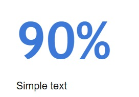

**Ketika kita hanya ingin menampilkan satu atau dua angka saja, gunakan teks sederhana. Tabel dan grafik tidak perlu**. Buat tampilan angka terlihat menonjol. Tambahkan beberapa kata pendukung untuk menyampaikan pikiran kita secara jelas. Penambahan kata atau kalimat pendukung berfungsi untuk meminimalisir perbedaan pendapat atau kesalahan informasi. Untuk mengilustrasikan penjelasan tersebut, mari kita lihat contoh di bawah ini:

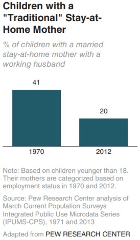

Kenyataannya, kita tidak harus menggunakan diagram atau grafik jika ingin menampilkan beberapa angka saja. Grafik tidak menjelaskan banyak mengenai interpretasi angka. Dalam kasus ini, harusnya gunakan sebuah kalimat sederhana saja, seperti: Tahun 2012 sebanyak 20% anak tinggal di rumah ibunya, dibandingkan dengan tahun 1970 sebanyak 41%. Sebagai alternatif, kita dapat mewujudkan informasi visual alternatif sebagai berikut:

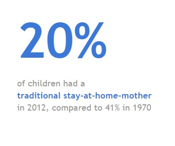

Ketika kita hanya memiliki satu atau dua angka yang ingin disampaikan, sampaikanlah tanpa grafik atau tabel. Sebaliknya, jika ada banyak angka untuk ditampilkan, tabel atau grafik jadi opsi terbaik.

## Tabel

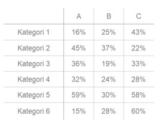

Pasti kita sering menemui data dalam bentuk tabel. Ketika terdapat sebuah tabel kita cenderung akan menggunakan telunjuk untuk membaca antar baris dan kolom untuk membandingkan nilai. Tabel sangat baik untuk beragam audiens yang membaca baris tertentu sesuai kepentingan masing-masing. Jika kita berhadapan dengan banyak unit pengukuran, tabel lebih memudahkan saat dibaca.  

Perlu diperhatikan jika membuat tabel dalam presentasi. Hindari penggunaan garis tepi yang tebal atau bayangan. Audiens jadi fokus ke garis atau bayangan tersebut. Lebih baik gunakan garis tepi tipis atau ruang putih untuk memisahkan elemen-elemen dalam tabel. Berikut ilustrasi untuk memperjelas detail tsb:

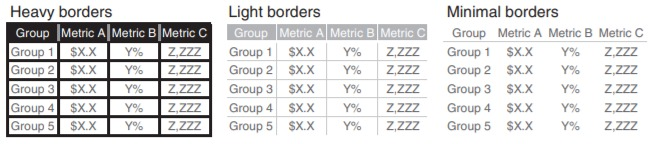

Garis tepi seharusnya digunakan untuk membantu audiens membaca data namun jangan berlebihan sehingga jadi pusat perhatian. Pertimbangkan untuk membuat garis tepinya jadi abu-abu atau tanpa warna. Datalah yang seharusnya menjadi pusat perhatian, bukan garis tepi.

## Heatmap

Cara untuk menggabungkan detail angka pada tabel dengan visual adalah menggunakan heatmap. Grafik ini berfungsi untuk memvisualisasikan data melalui format tabulasi yang memanfaatkan pewarnaan dalam sel untuk menunjukkan besaran nilai angkanya.

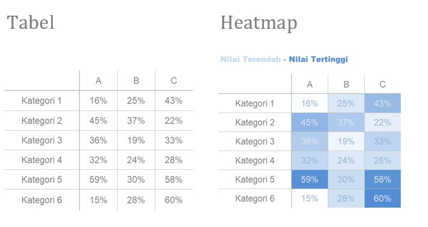

Pada gambar di atas terdapat tabel biasa di sebelah kiri dan heatmap di sebelah kanan. Pada tabel biasa kita harus mengamati tiap baris dan kolom untuk memahami data mana yang lebih besar atau lebih kecil dibandingkan lainnya. Untuk mengurangi proses dalam memahami data, gunakan saturasi warna sebagai penanda visual. Hal ini dapat membantu mata dan otak kita bekerja lebih cepat untuk menentukan hal penting yang kita butuhkan. Kategori warna pada tabel heatmap sebelah kanan membuat proses mencari informasi lebih mudah dan cepat karena jika kita ingin mencari data yang persentasenya paling besar dapat mencari saturasi warna yang paling gelap.

## Grafik

Grafik lebih cepat diproses dan mudah dipahami dalam mendapatkan informasi. Artinya, kita dapat lebih cepat memahami informasi dari grafik dibandingkan dengan tabel yang didesain dengan baik.

Grafik yang digunakan umumnya terbagi menjadi empat kategori : Titik, garis, batang, dan area.

1. Titik : Scatterplot

Grafik scatterplot berguna untuk menunjukkan hubungan antara dua hal yang terdapat di sumbu x dan y karena grafik ini membuat kita memproses data serentak untuk melihat hubungan apa yang muncul. Meski jarang digunakan, dunia bisnis masih ada yang menggunakan scatterplot.

Sebagai contoh, bayangkan kita mengelola armada bus dan ingin memahami hubungan antara mil yang ditempuh dan biaya per mil. Scatterplot akan terlihat seperti gambar di bawah ini.

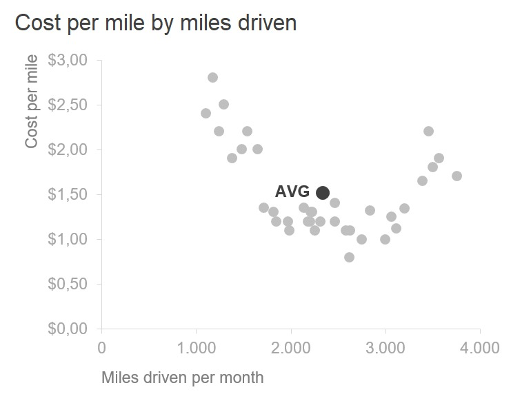

Jika kita ingin lebih fokus pada kasus di mana biaya per mil di bawah rata-rata, maka kita dapat memodifikasi sedikit scatterplot untuk menarik perhatian pembaca seperti pada gambar di bawah ini.

Kita dapat menambahkan informasi observasi, seperti biaya per mil lebih tinggi dari rata-rata ketika jarak tempuh kurang dari 1.700 mil atau lebih dari 3.300 mil untuk sampel yang diobservasi.

## Garis

Grafik garis biasanya digunakan untuk melihat data yang bersifat kontinu. Karena titik biasanya dihubungkan melalui garis, grafik ini membuat hubungan antar titik dan mungkin tidak sesuai untuk data yang bersifat kategori. Sering kali, data kontinu berupa unit waktu: hari, bulan, kuarter, atau tahun.

Di antara kategori grafik garis, terdapat dua tipe yang biasanya digunakan yaitu grafik garis dan slopegraph.

1. Grafik Garis
Grafik garis dapat menampilkan sebuah serial data, dua serial data atau multi serial data seperti contoh pada gambar di bawah ini.

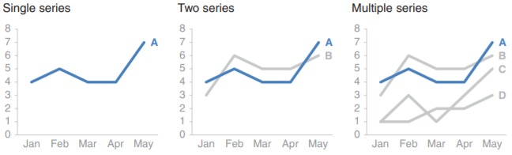

2. Slopegraph
Slopegraph berguna ketika menyajikan data yang memiliki dua periode waktu atau perbedaan data. Hal tersebut bertujuan untuk menunjukkan secara cepat kenaikan dan penurunan atau perbedaan kategori yang beragam antara dua data.

Bayangkan kita menganalisis dan mengkomunikasikan data dari survei karyawan. Dari hasil analisis tersebut menunjukkan perubahan dalam kategori survei dari 2014 hingga 2015 seperti berikut:

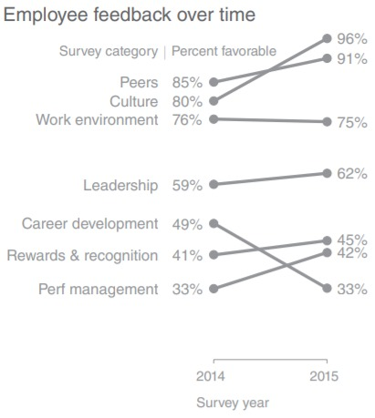

Slopegraph memuat banyak informasi. Dalam hal nilai absolut garis yang menghubungkan titik, kita jadi dapat gambaran kenaikan atau penurunan tingkat perubahan tanpa penjelasan.

Jika terlalu banyak garis bersinggungan, slopegraph mungkin tidak efektif sehingga sulit membaca datanya. Berikut merupakan contoh slopegraph dengan menunjukkan satu kategori yang menurun dari tahun sebelumnya.

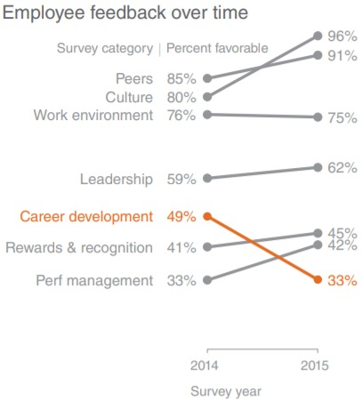

## Batang

Terkadang kita menghindari penggunaan grafik batang karena grafik ini terlalu sering digunakan. Pendapat ini justru salah. Sebaliknya, grafik batang seharusnya digunakan karena mereka sering digunakan sehingga audiens tidak perlu mempelajari cara membaca grafik yang baru. Daripada menggunakan energi untuk memahami bagaimana cara membaca grafik, lebih baik jika audiens menggunakan waktunya untuk memahami isi datanya.

Grafik batang mudah untuk dibaca. Mata kita akan membandingkan beberapa data yang digambarkan dalam bentuk batang secara cepat. Sehingga, kita bisa dengan cepat tahu data yang terbesar, terkecil, dan perbandingan antara kategori data. Perlu diingat, karena mata kita membandingkan secara otomatis dan melihat batang pada ujung atas, mulailah dari titik 0 pada sumbu Y. Tanpa demikian, perbandingan visual, bisa salah seperti ini (diagram sebelah kiri).

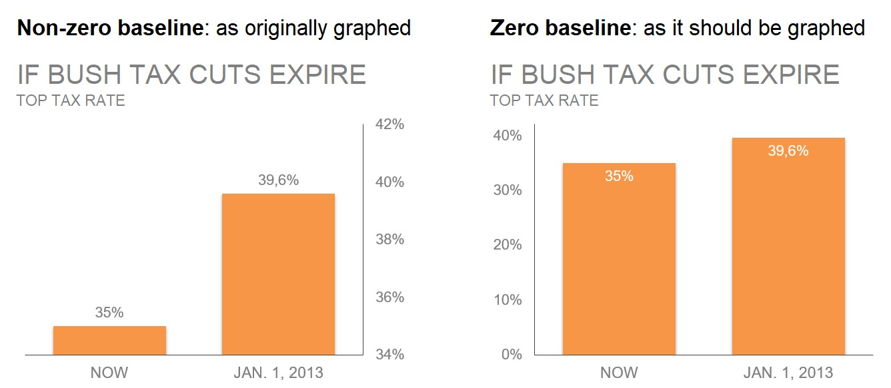

Pada grafik sebelah kiri terlihat perbedaan yang sangat mencolok karena sumbu Y tidak dimulai dari 0. Sebenarnya kenaikan tidak terlalu signifikan karena jika diterapkan sumbu Y mulai dari 0 akan terlihat seperti grafik sebelah kanan.

Selanjutnya selain mempertimbangkan panjang batang, kita juga harus memperhatikan lebar dari diagram batang tersebut. Secara umum lebar batang harus lebih besar dibandingkan jarak antara batang, penggambarannya seperti di bawah ini.

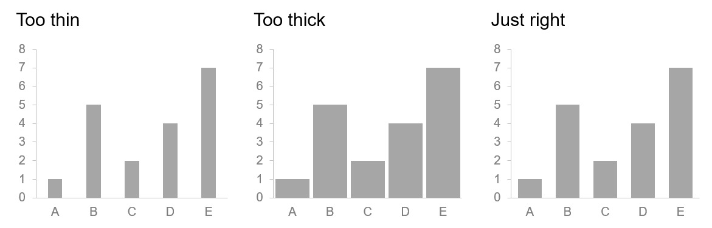

Kita telah membahas bagaimana cara terbaik untuk membuat grafik batang secara umum. Selanjutnya mari kita lihat ragam jenis grafik batang. Dengan tahu varian yang ada, kita bisa memilih mana yang terbaik untuk keperluan kita.

1. Grafik Batang Vertikal
Seperti grafik garis, grafik batang vertikal dapat berjumlah satu, dua, ataupun multi serial data. Perlu diingat bahwa jika serial data yang ditambahkan semakin banyak, semakin sulit audiens fokus membaca dan menarik kesimpulan. Alternatifnya, gunakan grafik multi serial. Kita juga harus memperhatikan penyesuaian visual yang terjadi jika memiliki satu serial data. Hal ini membuat susunan kategorisasi menjadi penting. Pertimbangkan apa yang ingin diketahui audiens dan buat susunan kategorisasi sejelas mungkin.

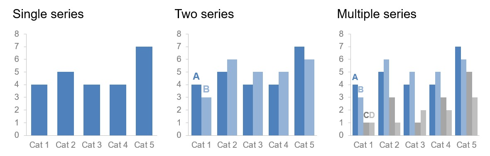

2. Grafik Batang Vertikal Bertumpuk
Stacked vertical bar chart atau grafik batang bertumpuk penggunaannya lebih terbatas. Grafik ini memungkinkan kita untuk membandingkan antar kategori utama dan juga antar sub komponen dalam tiap kategori. Namun, grafik ini dapat membuat audiens kebingungan secara visual, terutama ketika aplikasi grafik menambahkan variasi warna secara otomatis. Sulit untuk membandingkan sub komponen dari kategori-kategori ketika mereka tidak terletak sejajar di garis bawah. Hal ini menyulitkan kita untuk membandingkan, seperti ilustrasi pada gambar di bawah ini.

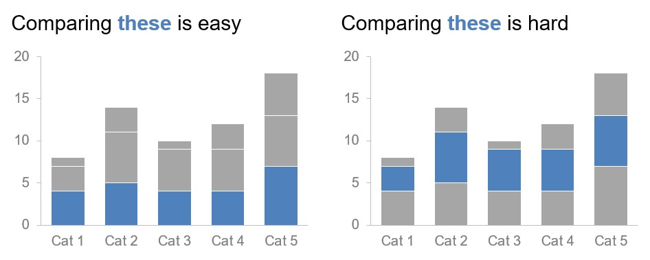

3. Grafik Air Terjun
Waterfall Chart atau apabila diterjemahkan menjadi grafik air terjun dapat digunakan untuk menampilkan bagian tertentu dari grafik batang bertumpuk. Hal tersebut bertujuan untuk lebih fokus menunjukkan data awal, kenaikan atau penurunan, serta data akhir.
Cara terbaik untuk mengilustrasikan waterfall chart adalah dengan contoh spesifik. Bayangkan kita adalah rekan bisnis yang ingin memahami dan mengkomunikasikan bagaimana perubahan jumlah karyawan dari tahun lalu untuk klien kita.

Di sisi kiri, kita melihat jumlah karyawan di awal tahun. Seraya kita bergerak ke arah kanan, kita melihat pertambahan: perekrutan dan peralihan karyawan ke dalam tim yang semula berasal dari tim yang berbeda organisasi. Pertambahan ini diikuti dengan pengurangan: peralihan karyawan keluar tim untuk tim yang berbeda dan pengurangan karyawan. Batang yang di ujung kanan merepresentasikan jumlah karyawan di akhir tahun, setelah pertambahan dan pengurangan karyawan di awal tahun.

4. Grafik Batang Horizontal
Grafik ini sangat mudah dibaca untuk mengetahui kisaran sebuah data, khususnya jika nama kategori panjang. Selain itu, mata kita memproses informasi mulai dari kiri atas (nama kategori) hingga ke kanan (data) dari grafik batang horizontal. Ini artinya ketika kita membaca data, kita sudah mengetahui apa yang dipresentasikan.

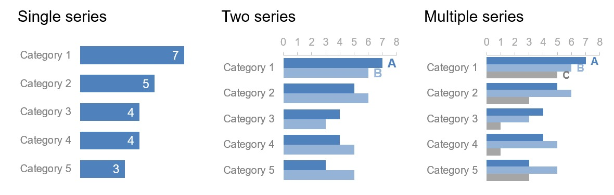

5. Grafik Batang Horizontal Bertumpuk

Grafik batang horizontal bertumpuk dapat menunjukkan perbandingan antara kategori total dengan antar sub komponen di tiap kategori.

Grafik ini dapat digunakan untuk memvisualisasikan porsi keseluruhan skala dari negatif hingga positif, karena kita menggunakan garis dasar yang konsisten baik ujung kiri maupun ujung kanan. Pendekatan grafik ini dapat terlihat cukup baik pada contoh data survei di bawah ini:

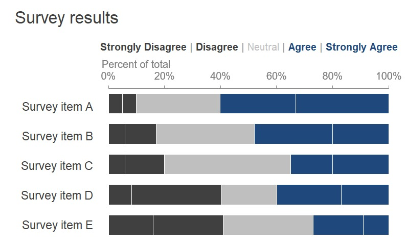

## Area

Salah satu grafik yang paling dihindari adalah area. Mata manusia tidak terbiasa menghubungkan data kuantitatif dengan bidang dua dimensi. Hal ini menyebabkan grafik area lebih sulit dibaca daripada grafik-grafik sebelumnya. Untuk alasan ini, hindari grafik area kecuali ketika ingin memvisualisasikan angka dengan ukuran besaran yang berbeda. Kehadiran dua dimensi dari grafik ini memungkinkan kita menampilkan data lebih ringkas dibandingkan dengan satu dimensi.

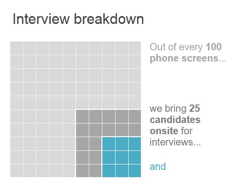

