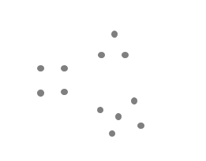
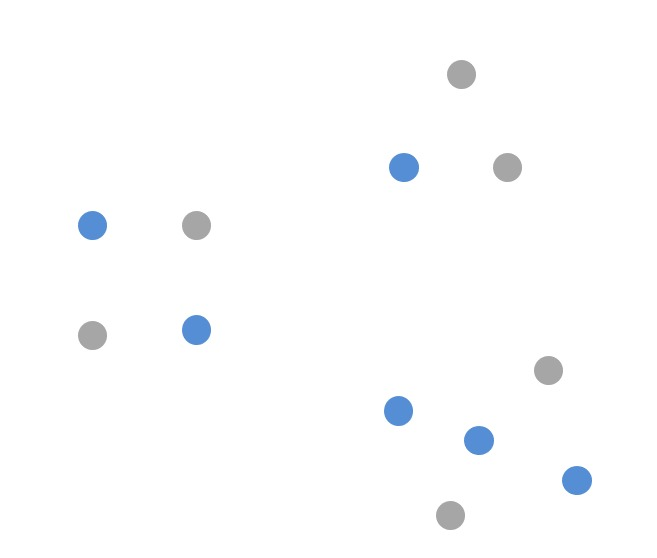
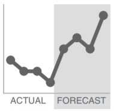
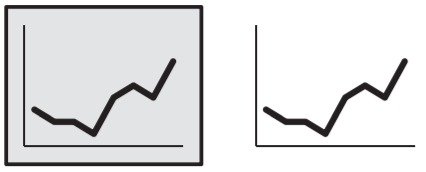
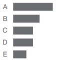

# Prinsip Gestalt dalam Persepsi Visual

Ketika mengidentifikasi elemen informasi yang mungkin masih terlihat berantakan dalam visualisasi, pertimbangkan prinsip gestalt dalam persepsi visual. **Gestalt merupakan sebuah teori yang menyatakan bahwa seseorang cenderung mengelompokkan sesuatu yang dilihat menjadi satu kesatuan utuh berdasarkan pola, hubungan, dan kemiripan**. Berikut enam prinsip gestalt dalam persepsi visual yang akan kita pelajari: proximity, similarity, enclosure, closure, continuity, and connection.

## Proximity (Kedekatan)

Kita cenderung berpikir bahwa objek yang berdekatan secara fisik termasuk pada golongan yang sama. Kita akan melihat titik-titik sebagai tiga kelompok terpisah akibat kedekatan relatif satu sama lain, contohnya seperti di bawah ini:

## Similarity (Kesamaan)

Objek yang memiliki warna, bentuk, ukuran, dan arah yang sama dianggap terkait atau termasuk bagian dari suatu kelompok. Kesamaan ini dapat membantu menarik perhatian audiens ke arah yang ingin kita fokuskan.

## Enclosure (Pembeda)

Kita berpikir objek-objek yang memiliki batas secara fisik termasuk dalam sebuah kelompok. Salah satu cara untuk mengoptimalkan prinsip enclosure adalah menggambar visual pembeda dalam data kita. Seperti menambahkan area berbayang untuk memisahkan prediksi dengan data yang aktual di bawah ini:

## Closure (Bentuk Tertutup)

Konsep closure berkata bahwa orang-orang menyukai hal sederhana dan sesuai dengan konstruksi yang ada di pikiran mereka. Karena hal ini orang-orang cenderung melihat elemen individu sebagai elemen-elemen tunggal atau sesuatu yang dapat dikenali. Sehingga elemen tersebut terlihat solid dan terlihat seimbang. Misalnya penggambaran grafik masih terbaca dengan baik sehingga tidak perlu ditambahkan garis tepi atau bayangan.

## Continuity (Kesinambungan Pola)

Prinsip continuity mirip dengan closure. Ketika melihat objek, mata kita mencari garis tepi dan secara alami membuat kelanjutan dari apa yang kita lihat meskipun kelanjutannya tidak terlihat secara eksplisit. Contohnya dapat dilihat pada gambar di bawah ini. Penerapan prinsip ini menghilangkan garis sumbu-y vertikal. Maka kita tetap melihat gambar batang yang berbaris di titik yang sama karena konsistensi jarak antara label di kiri dan data di kanan. Seperti apa yang kita lihat di prinsip closure dalam aplikasi, membuang elemen yang tidak dibutuhkan dapat membuat data kita lebih menonjol.

## Connection (Koneksi)

Prinsip terakhir yang akan kita bahas adalah connection. Kita cenderung memikirkan objek yang secara fisik terhubung sebagai bagian dari grup. Koneksi biasanya memiliki nilai asosiatif yang lebih kuat daripada warna, ukuran, atau bentuk yang serupa. Properti connection tidak sekuat enclosure tetapi dapat mempengaruhi hubungan ini melalui ketebalan dan pewarnaan untuk menciptakan hirarki visual yang diinginkan.

Salah satu cara yang bisa kita manfaatkan untuk prinsip koneksi adalah grafik garis yang bertujuan untuk membantu mata kita melihat susunan data seperti pada gambar di bawah ini.

Berdasarkan penjelasan di atas kita dapat mengetahui bahwa prinsip gestalt membantu kita memahami bagaimana orang melihat dan mengidentifikasi elemen yang tidak diperlukan untuk mempermudah proses komunikasi visual.

