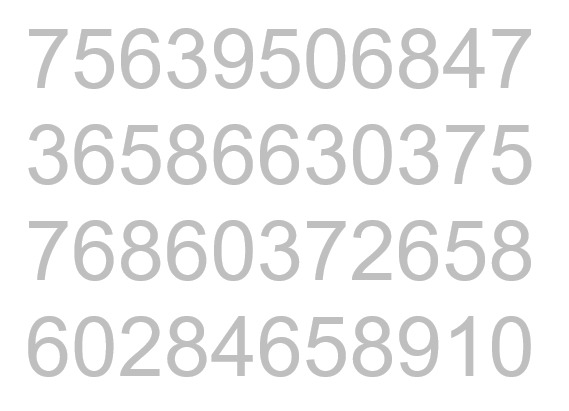
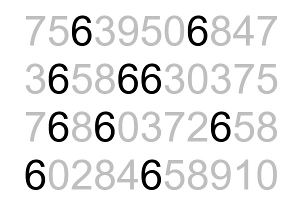
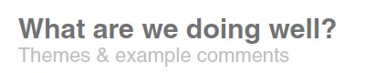
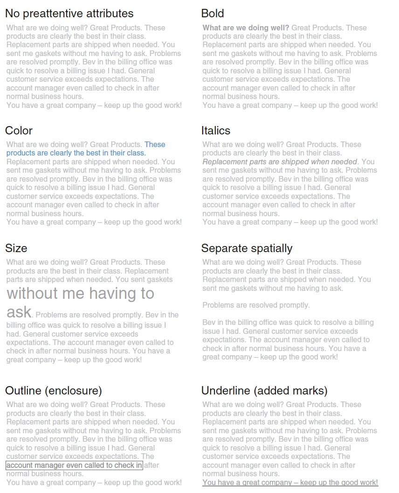
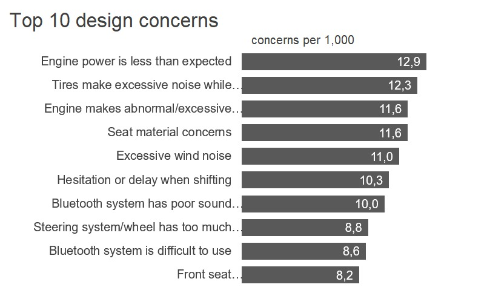
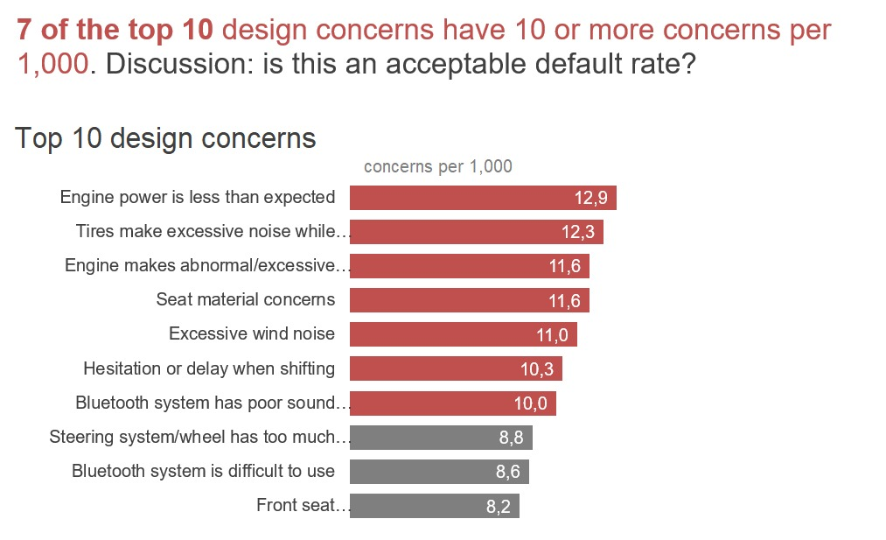
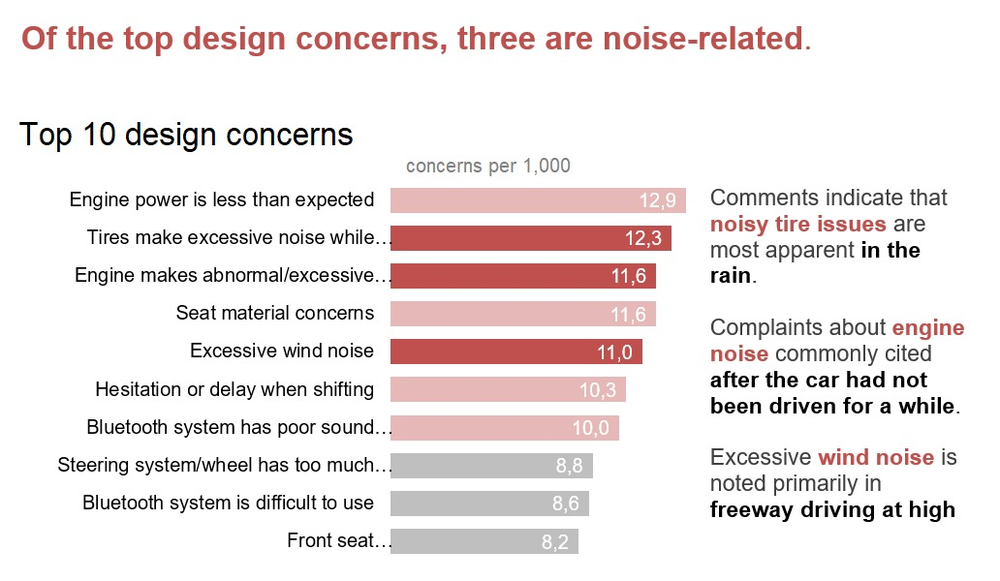
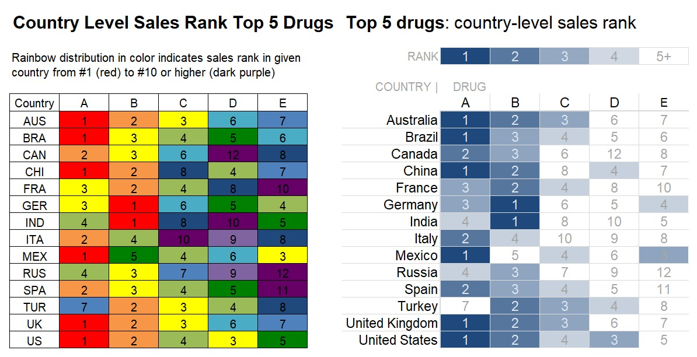
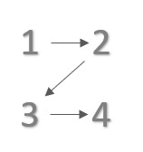

# Preattentive Attributes

Kita telah mengetahui pentingnya mengidentifikasi dan menghilangkan hal-hal yang berantakan dari visual yang dibuat. Kita akan berbicara singkat mengenai pengamatan dan ingatan untuk menekankan pentingnya sebuah preattentive attributes. Pada bagian ini kita akan mengeksplorasi bagaimana atribut seperti, ukuran, warna, dan posisi di halaman dapat digunakan secara strategis dalam dua cara:

1. Preattentive attributes dapat dimanfaatkan untuk membantu mengarahkan perhatian pada fokus utama yang ingin disampaikan.
2. Atribut ini dapat digunakan untuk membuat hierarki elemen visual yang mengarahkan perhatian pada informasi yang hendak diinformasikan sesuai dengan proses yang diharapkan.

Jika kita menggunakan preattentive attributes secara strategis, audiens jadi mudah melihat dan menemukan dengan cepat apa yang kita ingin mereka cari.

## Preattentive attributes adalah sinyal fokus area

Cara terbaik untuk membuktikan kekuatan preattentive attributes adalah dengan mendemonstrasikannya. Gambar di bawah ini menunjukkan sejumlah angka. Hitunglah berapa banyak angka enam yang ada dalam rangkaian tersebut.

Jawabannya adalah sepuluh. Pada gambar di atas tidak terdapat tanda visual yang membantu menjawab pertanyaan. Namun, apa yang terjadi ketika membuat sebuah perubahan di rangkaian angka seperti berikut.

Perhatikan betapa mudah dan cepat kita menemukan berapa banyak angka 6 dalam data di atas menggunakan data yang sama. Tidak dibutuhkan waktu yang lama dan tiba-tiba terdapat sepuluh angka 6 yang dapat dilihat. Preattentive attributes dari contoh kasus ini adalah penggunaan intensitas warna yang membuat angka 6 mencolok dari angka lain. Sehingga, otak kita menangkap secara cepat dan menghitung jumlah angka 6 yang terlihat mencolok daripada yang lain.

## Preattentive attributes dalam teks

Ketika membicarakan preattentive pada teks, mungkin teman-teman secara tidak sadar telah melakukan hal tersebut. Seperti contohnya ketika membuat sebuah dokumen pasti kita akan membedakan ukuran nama judul, sub judul, dan paragraf. Ataupun ketika kita menggunakan stabilo pada sebuah buku yang kita baca. Nah, sebenarnya untuk apa sih kita melakukan hal tersebut? Coba bandingkanlah ketika kamu membaca sebuah buku dengan judul dan tanpa judul: bagian buku yang kita beri warna highlighter  dan tidak. Tutuplah buku tersebut dan buka lagi setelah beberapa hari, maka kamu akan melihat buku yang kamu berikan preattentive akan lebih mudah kamu baca kembali. Kenapa? Karena dengan melakukan preattentive pada teks, kita mengarahkan audiens untuk lebih fokus ke beberapa hal saja, bukan semua. 

Selain itu, ukuran juga memberikan informasi hirarki. Seperti halnya judul dan sub judul, kita mengetahui bahwa informasi sub judul merupakan bagian lebih detail dari judul.

Dengan membuat hirarki kita akan memudahkan audiens untuk memisahkan grup informasi yang memiliki korelasi. Seperti halnya pada modul ini kita menggunakan ukuran sebagai pembatas dari informasi-informasi pembelajaran. Hal ini juga bisa kita terapkan pada pembuatan presentasi seperti gambar di bawah.

Bagaimana? Dengan sedikit memainkan ukuran, warna dan ketebalan kita bisa membuat perbedaan yang cukup signifikan. Coba kamu lihat gambar di bawah sebagai pembanding. Selain warna dan ukuran masih banyak yang bisa kita lakukan untuk membuat preattentive pada teks.

Mungkin pertanyaan selanjutnya adalah kapan kita harus menggunakan salah satunya? Kembali lagi ke audiens. Ketika audiens merupakan orang yang cukup tua atau memiliki penglihatan yang kurang maka perubahan ukuran akan lebih baik. Bila seseorang sulit untuk membedakan warna maka jangan gunakan pewarna sebagai preattentive. Ketika kita memiliki banyak informasi yang penting dalam sebuah teks, maka kita dapat memberikan outline kotak atau mungkin kalian lebih suka untuk melingkari hal yang penting.

## Preattentive attributes dalam grafik

Grafik juga memerlukan penanda visual seperti yang sudah dijelaskan dengan contoh kasus menghitung jumlah angka 3 sebelumnya. Berikut merupakan contoh penerapan preattentive attributes dalam grafik.

Grafik di atas terlihat tanpa penanda visual sehingga kita sulit menentukan informasi yang ingin diketahui. Masih ingatkah Anda dengan perbedaan antara exploratory analysis dan explanatory analysis? Gambar di atas juga dapat membantu untuk masuk dalam proses explanatory analysis. Namun, jika kita melihat data untuk memahami apa yang menarik dan penting untuk dikomunikasikan kepada orang lain, maka penggunaan warna dan teks adalah salah satu cara untuk fokus pada hal yang ingin diinformasikan. Contohnya seperti pada ilustrasi di bawah ini.

Penyajian di atas menggunakan dan dan visual yang sama, tetapi dengan modifikasi fokus dan teks untuk mengarahkan ke bagian makro dan mikro dari data yang ingin disampaikan. Anda juga dapat menambahkan cerita untuk melengkapi informasi tersebut seperti di bawah ini.

Khususnya dalam presentasi langsung, kita bisa lakukan pengulangan visual dengan perbedaan penekanan untuk menyampaikan aspek yang berbeda dari cerita yang sama. Ini merupakan strategi efektif.

Dalam preattentive attributes terdapat beberapa atribut yang penting dari sudut pandang strategis ketika memfokuskan perhatian sesuai spesifikasi diskusinya yaitu:

1. Ukuran
Ukuran relatif berpengaruh untuk menunjukkan tingkat kepentingan. Ingat selalu ketika mendesain komunikasi visual. Jika kita menunjukkan berbagai hal yang memiliki kepentingan yang sama, berikan mereka ukuran yang sama. Sebagai alternatif, jika terdapat satu hal penting maka manfaatkan ukuran dan membuatnya menjadi lebih besar.

2. Warna
Ketika digunakan secara bijak, warna merupakan salah satu alat paling ampuh untuk menarik perhatian. Hindari keinginan untuk menggunakan warna hanya karena ingin terlihat meriah atau warna warni semata. Gunakan warna secara selektif sebagai sebuah alat strategis untuk menekankan bagian penting dari visual yang dibuat.

3. Posisi di halaman
Ketika kita membuat sebuah visual, maka kita harus bijak dalam memilih posisi. Seperti kita ketahui umumnya kita membaca dari kiri dan ke kanan seperti gambar di bawah ini. Tapi bagaimana dengan orang dari Arab? Kita harus menyesuaikan dengan cara audiens membaca. Hal tersebut akan bermanfaat untuk kita menentukan struktur dari visualisasi.

