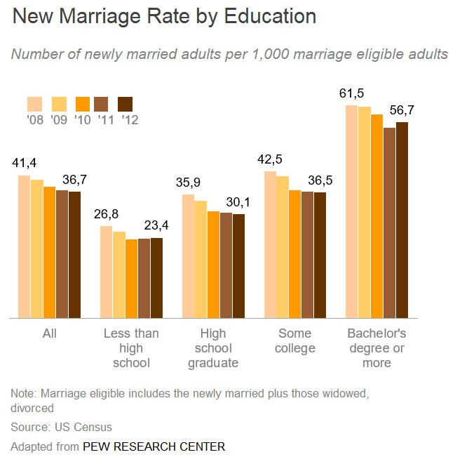
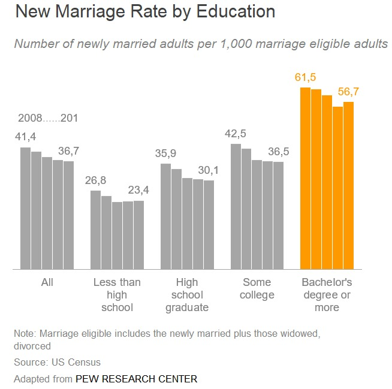
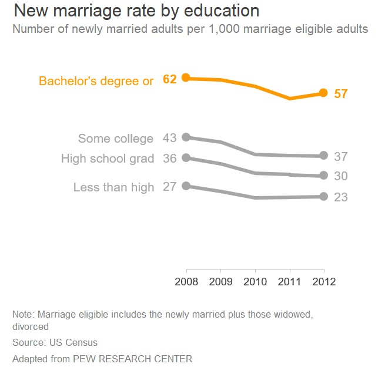
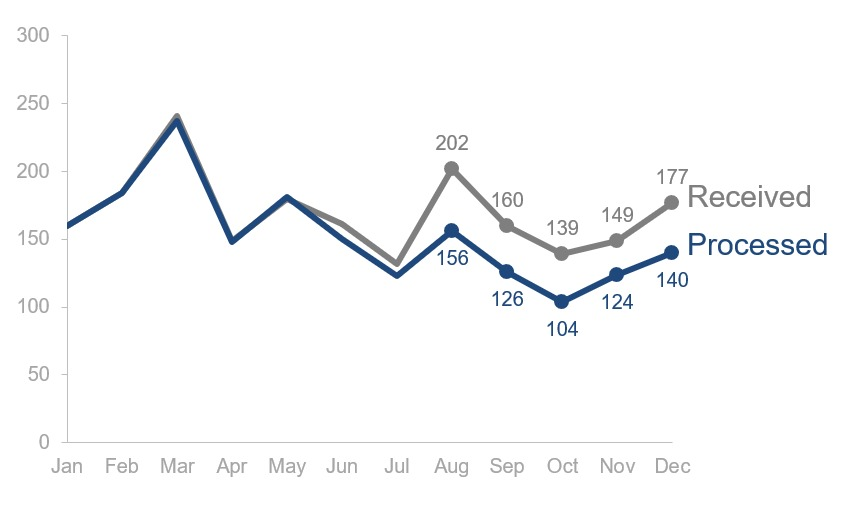
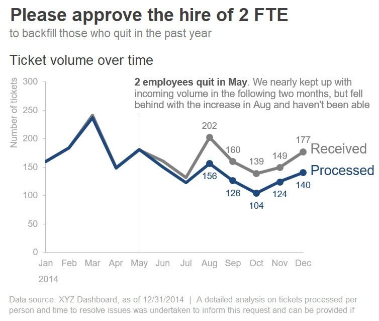
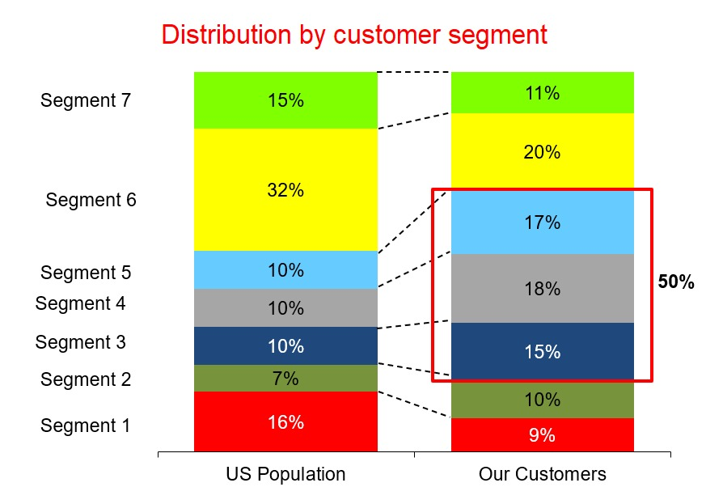
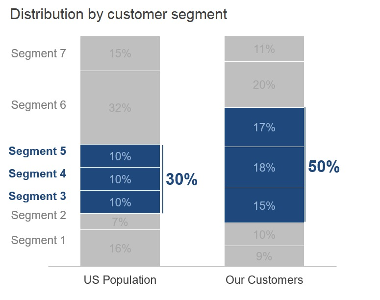

# Konsep Berkomunikasi dengan Data

Pada Preattentive Attributes yang kita pelajari sebelumnya kita telah belajar bagaimana memusatkan perhatian audiens terhadap informasi yang kita berikan. Namun, untuk membuat visualisasi kita lebih menarik maka kita memerlukan beberapa fundamental desain. Oleh karena itu setidaknya mari kita berpikir sebagai desainer.

Pada bagian ini kita akan belajar bagaimana cara berpikir sebagai seorang desainer dan bagaimana konsep desain tradisional dapat diterapkan untuk berkomunikasi dengan data. Terdapat 4 poin utama dalam desain yang akan kita bahas yaitu affordances, accessibility, aesthetics, dan acceptance. Seorang desainer dapat membedakan mana desain yang baik dan tidak dengan membiasakan diri dengan beberapa aspek umum dan contoh-contoh desain yang ada. Kita akan belajar dan menanamkan kepercayaan diri pada insting visual dengan mempelajari beberapa tips untuk diikuti dan disesuaikan ketika hal-hal dirasa kurang tepat pada sebuah visual.

## Affordances

Dalam istilah desain, semua benda memiliki fungsinya masing-masing. Seperti halnya ketika kita melihat tombol, kita tahu bahwa guna mengaktifkan tombol, kita perlu menekannya. Karakteristik ini menunjukkan bagaimana objek harus berinteraksi. Nah bagaimana kita menerapkan konsep affordances ke dalam visualisasi data?

1. Highlight hal yang penting

Pada pembelajaran sebelumnya kita mengetahui bagaimana menggunakan preattentive attributes untuk menarik perhatian audiens. Ada beberapa hal cara highlighting yaitu:

- Bold/italic/underline : Biasanya digunakan untuk judul, caption, ataupun kata pendek yang membedakan elemen. Bold umumnya lebih disukai daripada huruf miring dan garis bawah karena menambah sedikit kebisingan pada desain sambil secara jelas menyoroti elemen yang dipilih.
- CASE : Kita bisa menggunakan huruf kapital untuk menarik perhatian dari audiens karena huruf kapital mudah untuk dipindai oleh mata.
- Color : efektif bila digunakan bersamaan dengan teknik highlighting lainnya. Karena menambahkan nilai estetika dan menarik perhatian audiens.
- Inversing Element : Cara ini sangat menarik perhatian mata, namun beberapa orang tidak nyaman ketika melihat inversing.
- Size : Hal ini paling biasa kita lakukan untuk membedakan mana judul, sub-judul, atau lainnya yang juga merupakan sinyal untuk memberitahu hal yang harus difokuskan audiens.

Ketika kita memiliki hal yang sangat penting dan ingin kita tampilkan maka kita bisa memberikan bold, memperbesar ukuran font, atau bahkan mewarnainya.

Perhatikan gambar di atas dan bagaimana ia membawa fokus audiens terhadap hal yang ingin ia sampaikan. Tentu kita fokus melihat Bachelor’s degree or more karena warna mencolok. Sementara bagian kirinya tidak mencolok dengan warna standar abu-abu. Sampai di sini, paham? Highlighting memberikan sinyal yang jelas ke mana kita harus memusatkan perhatian kita.

2. Eliminasi distraksi

Ketika kita melihat tulisan di kertas yang bernoda maka kita akan ikut melihat noda di kertas tersebut. Tapi apakah noda tersebut merupakan hal yang harusnya kita lihat? Bandingkan dengan kita melihat tulisan di atas kertas putih bersih. Maka kita akan langsung fokus pada tulisan tersebut. Dalam sebuah bukunya Antoine de Saint‐Exupery berkata “Anda tahu Anda telah mencapai kesempurnaan, bukan ketika Anda tidak memiliki apa-apa lagi untuk ditambahkan, tetapi ketika Anda tidak memiliki apa pun untuk diambil”. Oleh karena itu kita butuh untuk mengeliminasi distraksi dari grafik kita. Beberapa hal yang bisa membantu kita dalam mengeliminasi distraksi.

- Tidak semua data setara informasinya. Seperti clutter yang kita pelajari pada modul sebelumnya maka informasi tersebut bisa dihilangkan.
- Ketika detail tidak dibutuhkan maka rangkumlah. Mungkin menurut kita detail itu penting, tapi apakah audiens perlu dan akan membaca semua detail tersebut?
- Tanya diri sendiri, apabila kita hapus sesuatu apakah merubah informasinya? Apabila jawabannya tidak, maka Anda dapat menghapusnya. Jangan biarkan rasa estetika ataupun rasa “sebaiknya harus ada” menghalangi kita untuk menghapus data tersebut.
- Ketika tidak terlalu penting namun dibutuhkan, samarkan dengan warna latar. Gunakan ilmu preattentive attributes mu dan gunakan warna abu-abu untuk menyamarkannya.

Banyak hal yang kita ubah pada grafik tersebut. Seperti yang kita tahu bahwa grafik garis lebih mudah memperlihatkan tren waktu. Kita juga mengurangi informasi dengan merubah 25 bar menjadi 4 garis. Kita juga dapat melihat perbedaan secara lebih jelas karena hanya perlu melihat dalam satu garis vertikal. Karena yang kita ingin tunjukan adalah perbandingan dan perbandingannya sudah jelas terlihat, kita tidak memerlukan bentuk desimal.

## Accessibility

Konsep ini membicarakan bahwa desain seharusnya bisa digunakan oleh orang dari berbagai latar belakang atau kemampuan. Apakah termasuk penyandang disabilitas? Ya, disabilitas juga termasuk. Namun hal yang dimaksud lebih luas. Apabila kita seorang sarjana ekonomi, maka hasil analisis dan visual yang kita buat harus dapat dimengerti orang yang bukan sarjana ekonomi. Ada beberapa hal yang dapat membantu Anda mendapatkan Accessibility.

1. Jangan mempersulit sesuatu

Ketika kita membuat sebuah visual terkadang kita ingin menampilkan sesuatu yang unik dan beda dari yang lain. Contohnya kita membuat presentasi dengan font huruf sambung atau untuk alasan estetika kamu memperkecil teks agar terlihat rapi. Hal tersebut akan menyulitkan audiens dalam menyerap informasi dari visualisasi yang Anda buat. Beberapa hal yang perlu Anda ingat yaitu:

- Gunakan font yang tegas dan mudah dibaca oleh orang lain;
- Bersihkan dari setiap clutter dan buat visualisasi data kita sesuai dengan visual affordances;
- Gunakan bahasa yang umum dan to the point;
- Simplicity is the best.

2. Teks adalah temanmu

Teks membantu kita dalam mengkomunikasikan visualisasi sehingga dapat dimengerti audiens. Anda selalu bisa menggunakan teks sebagai penjelasan suatu visual. Mulai dari judul, deskripsi, atau bahkan memanfaatkan teknik highlighting pada sebuah teks.

Seperti gambar di atas kita dapat menunjukan pemahaman dari grafik dengan menambahkan teks. Gambar pertama merupakan grafik yang bagus, tapi apa maksud dari grafik tersebut? Ketika sebuah grafik belum dapat menyampaikan maksud kita, maka tambahkanlah teks pada grafik kita seperti halnya gambar kedua.

## Aesthetics

Estetika mungkin terlihat berlawanan dengan apa yang disampaikan pada pembelajaran sebelumnya. Namun, yang dimaksud dengan estetika di sini bukanlah menambahkan sesuatu sehingga membuat visual lebih menarik. Tapi bagaimana kita membuat pilihan warna, spacing, alignment, dan layout menjadi satu kesatuan yang menarik. Apakah estetika itu penting? Ya tentu saja, seperti kebiasaan kita apabila melihat sesuatu yang kurang menarik atau tidak indah maka kita cenderung memberikan kesan negatif walaupun belum mengerti secara lebih detail.

Lihat kedua gambar di atas. Pada gambar pertama kita melihat penggunaan banyak warna yang sangat mencolok sehingga mengurangi nilai estetika. Bahkan alignment yang tidak rata, kotak merah yang menunjukan persentase, dan memiliki warna yang sama dengan salah satu elemen lainnya. Pada gambar kedua kita merapikan beberapa hal mulai dari pemilihan warna, menghilangkan garis-garis, dan perbaikan alignment. Dengan adanya sedikit perubahan sedemikian rupa, tampilan visual jadi jauh lebih baik.

## Acceptance

Agar suatu desain menjadi efektif, ia harus diterima oleh audiens yang dituju. Pepatah desain ini juga berguna dalam visualisasi data. Seperti contohnya jika kita memilih visual yang kompleks maka tidak dapat diterima oleh audiens karena sulit dipahami maksud visualisasinya. Beberapa hal yang dapat kita gunakan untuk meningkatkan penerimaan visual oleh audiens. 

1. Mengartikulasikan manfaat dari pendekatan baru atau berbeda. Kadang-kadang jika kita transparan pada audiens tentang kenapa hal-hal terlihat berbeda, akan membantu audiens mereka merasa lebih nyaman. Apakah ada pengamatan baru dan lebih baik dengan melihat data dengan cara yang berbeda? Atau apa manfaat lain yang dapat Anda artikulasikan untuk membantu meyakinkan audiens Anda terbuka terhadap perubahan?

2. Tes A/B. Pasangan pendekatan awal dan pendekatan baru dengan menunjukkan sebelum dan sesudah serta menjelaskan mengapa kita ingin mengubah cara kita melihat sesuatu.

3. Siapkan beberapa opsi desain untuk Anda bandingkan.

**Referensi : Knaflic, Cole. Storytelling With Data: A Data Visualization Guide for Business Professionals, Wiley, © 2015**
